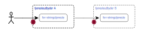

# Referencearkitektur for brugerstyring

## Summary in English

Recently a number of common public sector identity and access management solutions have been established in collaboration between various public parties. These solutions ensure coherence within defined areas, but there is still an opportunity to improve the overall cohesiveness in common public digital initiatives and solutions.

The purpose of this reference architecture is thus to target and structure the public sector identity and access management to create cohesive, efficient, secure and user friendly solutions across domains, nationally and transnationally.

In addition to identity and access management of persons, this version of the reference architecture also demonstrates how the principles of the reference architecture are used in the management of software robots as separate identities with their own identification means. Likewise, the reference architecture has been expanded with descriptions of how the principles can be applied in identity and access management of apps and devices (IoT).

In this reference architecture, identity and access management is defined as administration and control of users, identification means and access to services. It is ensured, that the right users have access to the right IT systems and data, and that everyone else are rejected. Thus, the reference architecture affects a significant part of the information security effort in the joint public sector cooperation.

### Identity and access management activities

The activities in identity and access management can be broadly divided into administration and access control. Access management is performed based on access policies, which are based on the decided level of information security, and which regulate access to own systems and external parties.

The main activities in managing users’ digital identities are:

* **Registration and issuing of identification means** used to authenticate and verify a user’s digital identity.
* **Registration of attributes** in the form of characteristics associated with a digital identity such as username, roles and access rights.

The main activities in access control are:

* **Authentication**, where at user’s digital identity is approved and verified
* **Attribute attestation**, which exhibits and verifies the properties of a digital identity (attributes)
* **Performing access control**, which determines which features and data a user is granted access to

### Principles of identity and access management

The reference architecture of identity and access management establishes a number of principles that support the overall visions and goals of userfriendly, coherent and secure digitization. The principles of this reference architecture elaborate on the architecture principles of the White Paper on a common public sector digital architecture \[[2](/node/1098#bilag-1-kilder-og-baggrundsmateriale)\] with regard to identity and access management:

1. [Users experience a relevant and coherent identity and access management.](#princip-1-brugerne-oplever-en-relevant-og-sammenh-ngende-adgangsstyring)
2. [Access control solutions respect the privacy of users.](/node/1098#princip-2-brugerstyringsl-sninger-respekterer-brugernes-privatliv)
3. [The service provider is responsible for enforcing the access policy.](/node/1098#princip-3-tjenesteudbyder-har-ansvaret-for-at-adgangspolitikken-h-ndh-ves)
4. [Identity and access management is separate from business services.](/node/1098#princip-4-brugerstyring-er-adskilt-fra-forretningstjenester)
5. [Identity and access management is achieved through loosely linked and standardized trust services.](/node/1098#princip-5-brugerstyring-realiseres-via-l-st-koblede-og-standardiserede-komponenter)
6. [Service providers participate in federations.](/node/1098#princip-6-tjenesteudbydere-indg-r-i-f-derationer)

Business needs and the mentioned principles point to an architecture, where identity and access management is handled separately from the business solutions. The separation means, that multiple business solutions can use the same solution for user management within or across organizations and domains. Furthermore, the business solutions do not have to handle the administration of users themselves. 

Therefor an identity and access management model based on security tokens has been chosen. This means that users are issued a security token that is presented to the solution that provides data or functionality that they want to access. A security token contains information about the user’s identity, e.g. username and role as well as access rights. It is also digitally signed to prevent it from being falsified or tampered with.

### Architectural patterns

The reference architecture describes five architectural patterns of increasing complexity starting with a scenario where all identity and access management functions belong to the same organization to a scenario with loosely linked ecosystems where many parties work together on identity and access management:

1. [Business service with its own authetification service.](/node/1098#mnster-1-forretningstjenester-med-egen-autentifika)
2. [Shared, internal authentification service.](/node/1098#mnster-2-delt-intern-autentifikationstjeneste)
3. [Federation with central authentification service.](/node/1098#mnster-3-fderation-med-central-autentifikationstje)
4. [Shared broker for decentralized authentification services within a domain.](/node/1098#mnster-4-flles-domnebroker-for-decentrale-autentif)
5. [Interfederation across domains.](/node/1098#mnster-5-interfderation-mellem-domner)

The first two patterns are quite common, but have a number of challenges in terms of coherence, usability, scalability and security. Therefore, it is recommended not to use them but instead handle identity and access management using one of the three other patterns.

The reference architecture refers to a number of standards for registering users, identification means and attributes. In addition, further areas are pointed out where standards are needed to ensure uniform, coherent solutions.  
 

## Resume

Der er de senere år etableret en række fælles løsninger for brugerstyring i samarbejde mellem forskellige offentlige parter. Disse løsninger sikrer sammenhæng inden for afgrænsede områder, men der er fortsat mulighed for at forbedre den overordnede fællesoffentlig digitale sammenhæng i initiativer og løsninger.

Formålet med referencearkitekturen er således at målrette og strukturere brugerstyringen i det offentlige for at skabe sammenhængende, effektive, sikre og brugervenlige løsninger på tværs af domæner, nationalt og transnationalt.

Foruden brugerstyring af personer beskriver denne version af referencearkitekturen også hvordan, referencearkitekturens principper for brugerstyring anvendes ved håndtering af softwarerobotter som separate identiteter med egne identifikationsmidler. Tilsvarende er referencearkitekturen udvidet med beskrivelser af, hvordan principperne kan anvendes ved brugerstyring af apps og apparater (IoT).

Brugerstyring defineres i denne arkitektur som administration og kontrol af brugere, identifikationsmidler og adgang til forretningstjenester. Det sikres, at de rette brugere får adgang til de rette it-systemer og data, og at alle andre afvises. Dermed berører referencearkitekturen en væsentlig del af den samlede informationssikkerhedsindsats i det fællesoffentlige samarbejde.

### Aktiviteter i forbindelse med brugerstyring

Aktiviteterne, der indgår i brugerstyring, kan overordnet opdeles i **administration** og **adgangskontrol**. Brugerstyringen udføres på baggrund af adgangspolitikker, der bygger på det besluttede informationssikkerhedsniveau, og som regulerer adgang til egne systemer og eksterne parter.

Hovedaktiviteterne i administration af brugernes digitale identiteter er:

* **Registrering og udstedelse af identifikationsmidler**, der anvendes til at godkende og verificere en brugers digitale identitet.
* **Registrering af attributter** i form af egenskaber, der knyttes til en digital identitet fx brugernavn, roller og adgangsrettigheder.

Hovedaktiviteterne i adgangskontrol er:

* **Autentifikation**, hvor en brugers digitale identitet bliver godkendt og verificeret.
* **Attributattestation**, som udstiller og verificerer en digital identitets egenskaber (attributter).
* **Udførelse af adgangskontrol**, hvor det afgøres hvilke funktioner og data, en bruger får adgang til, hvis der gives adgang.

### Principper for brugerstyring

Referencearkitekturen for brugerstyring fastlægger en række principper, der understøtter de overordnede visioner og mål for brugervenlig, sammenhængende og sikker digitalisering. Principperne i denne referencearkitektur uddyber arkitekturprincipperne fra Hvidbog om fællesoffentlig digital arkitektur \[[2](/node/1098#bilag-1-kilder-og-baggrundsmateriale)\] mht. brugerstyring:

1. [Brugerne oplever en relevant og sammenhængende adgangsstyring.](/node/1098#princip-1-brugerne-oplever-en-relevant-og-sammenh-ngende-adgangsstyring)
2. [Brugerstyringsløsninger respekterer brugernes privatliv.](/node/1098#princip-2-brugerstyringsl-sninger-respekterer-brugernes-privatliv)
3. [Tjenesteudbyder har ansvaret for at adgangspolitikken håndhæves.](/node/1098#princip-3-tjenesteudbyder-har-ansvaret-for-at-adgangspolitikken-h-ndh-ves)
4. [Brugerstyring er adskilt fra forretningstjenester.](/node/1098#princip-4-brugerstyring-er-adskilt-fra-forretningstjenester)
5. [Brugerstyring realiseres via løst koblede og standardiserede tillidstjenester.](/node/1098#princip-5-brugerstyring-realiseres-via-l-st-koblede-og-standardiserede-komponenter)
6. [Tjenesteudbydere indgår i føderationer.](/node/1098#princip-6-tjenesteudbydere-indg-r-i-f-derationer)

Forretningsbehov og de nævnte principper peger på en arkitektur, hvor brugerstyring håndteres adskilt fra fagsystemer. Adskillelsen betyder, at flere fagsystemer kan anvende samme løsning til brugerhåndtering inden for eller på tværs af organisationer og domæner. Desuden skal fagsystemerne som udgangspunkt ikke selv håndtere administration af brugerne.

Der er derfor valgt en model for brugerstyring, der er baseret på adgangsbilletter. Det betyder, at brugere får udstedt en adgangsbillet, der præsenteres over for den løsning, som leverer data eller funktionalitet, der ønskes adgang til. En adgangsbillet indeholder information om brugerens identitet fx brugernavn og rolle samt tildelte adgangsrettigheder. Den er desuden digitalt signeret, så den ikke kan forfalskes eller manipuleres.

### Arkitekturmønstre

Referencearkitekturen beskriver 5 arkitekturmønstre i stigende kompleksitet startende med et scenarie, hvor alle funktioner vedrørende brugerstyring ligger i den samme organisation til et scenarie med løst-koblede økosystemer, hvor mange parter arbejder sammen om brugerstyring:

1. [Forretningstjeneste med egen autentifikationstjeneste.](/node/1098#mnster-1-forretningstjenester-med-egen-autentifika)
2. [Delt, intern autentifikationstjeneste.](/node/1098#mnster-2-delt-intern-autentifikationstjeneste)
3. [Føderation med central autentifikationstjeneste.](/node/1098#mnster-3-fderation-med-central-autentifikationstje)
4. [Fælles domænebroker for decentrale autentifikationstjenester.](/node/1098#mnster-4-flles-domnebroker-for-decentrale-autentif)
5. [Interføderation mellem domæner.](/node/1098#mnster-5-interfderation-mellem-domner)

De to første mønstre forekommer mange steder, men har en række udfordringer med hensyn til sammenhæng, brugervenlighed, skalerbarhed og sikkerhed. Derfor anbefales det, at man ikke anvender dem, men i stedet håndterer brugerstyring via de 3 øvrige mønstre.

I referencearkitekturen henvises til en række standarder for registrering af brugere, identifikationsmidler og attributter. Der peges desuden på yderligere områder, hvor der er behov for standarder for at sikre ensartede, sammenhængende løsninger.

## Introduktion til læseren

### Formål, anvendelse og målgrupper

Den fællesoffentlige referencearkitektur for brugerstyring skal målrette og strukturere indsatsen for at skabe sammenhængende, effektive, sikre og brugervenlige løsninger på tværs af domæner, nationalt og transnationalt. Fokus er på det tværgående dvs. adgang til tjenester på tværs af organisationer, herunder føderationer på tværs af sikkerhedsdomæner med gensidig tillid. Referencearkitekturens formål er at skabe en arkitekturmæssig ramme for, hvordan man skal indrette løsninger, så systemer understøttet af forskellige sikkerhedsløsninger kan kommunikere med hinanden. Herved bliver løsninger enklere at etablere og drive, brugerne undgår at skulle logge på flere gange, og oplysninger om brugere skal ikke vedligeholdes flere steder.

Referencearkitekturen skal kunne anvendes til at udpege standarder, der understøtter arkitekturen og dermed understøtte udarbejdelse af løsningsarkitektur i konkrete projekter. Arkitekturen anviser ikke i detaljer, hvordan myndigheder og virksomheder skal bygge løsninger, men fastlægger rammer og anviser standarder for løsninger, jfr. Hvidbog om fællesoffentlig digital arkitektur \[[2](/node/1098#bilag-1-kilder-og-baggrundsmateriale)\], hvor det fremgår, at fællesoffentlige referencearkitekturer "... definerer genbrugelige arkitekturbyggeblokke, som projekterne skal tage bestik af." Referencearkitekturen kan anvendes i sammenhæng med andre fællesoffentlige referencearkitekturer, enten direkte eller ved domænearkitekturer, der bygger på de fællesoffentlige.

Den primære målgruppe for denne referencearkitektur er it-arkitekter, men andre med interesse for området vil også have udbytte af at læse især de indledende afsnit.

Dette kapitel henvender sig til alle læsere. Det omfatter en generel introduktion til referencearkitekturens formål, afgrænsning, de centrale begreber vedrørende brugerstyring, samt beskrivelse af dokumentets kontekst og tilblivelse.

De følgende kapitler om Styring og Strategi giver et uddybende indblik i forretningsmål, udfordringer, principper og den værdiskabelse, referencearkitekturen kan understøtte. Tilsvarende giver kapitlerne Jura og Sikkerhed et overblik over væsentlige hensyn og begrænsninger, der skal tages i betragtning i arbejdet med brugerstyring. Disse kapitler henvender sig til alle interesserede læsere.

Kapitlerne Opgaver og Information henvender sig til forretningsarkitekter med information om den forretningsmæssige arkitektur, mens kapitlerne Applikation og Infrastruktur henvender sig til læsere med interesse for den tekniske arkitektur.

### Omfang og afgrænsning

Referencearkitekturen for brugerstyring er målrettet offentlige tjenester, men referencearkitekturen kan desuden med fordel anvendes til ikke-offentlige tjenester og til at understøtte tværgående brugerforløb med det offentlige. En række af de forretningsbehov og udfordringer, som kan løses med referencearkitekturen, er almengyldige og optræder således også inden for den private sektor.

Arkitekturen omfatter rollerne som leverandør af tillidstjenester - udstedere af identifikationsmidler, autentifikationstjenester, identitetsbrokere, attributtjenester mv. Arkitekturen omfatter desuden private virksomheders mulighed for at indgå som brugerorganisation og tjenesteudbyder.

Arkitekturen omhandler både brugeradministration og adgangskontrol, herunder det der på engelsk betegnes Credential and Identity Management (CIM), Identity Rights Management (IRM), Access Control (AC) og Identity and Access Management (IAM/IdAM).

Referencearkitekturen definerer, hvad en føderation omhandler i rammerne af brugerstyring, og den beskriver de opgaver, en føderation løser i denne ramme.

2017-udgaven af referencearkitekturen (version 1.0) \[[3](/node/1098#bilag-1-kilder-og-baggrundsmateriale)\] fokuserer primært på brugerstyring af personer. I denne udgave af referencearkitekturen (version 1.1) beskrives det endvidere hvordan, referencearkitekturens principper for brugerstyring anvendes ved håndtering af softwarerobotter som separate identiteter med egne identifikationsmidler. Da brugerstyring for apps på mobile enheder indebærer særlige udfordringer, beskrives håndtering af mobil-apps mere udførligt i denne udgave end tidligere. Juridiske aspekter vedr. anvendelse af softwarerobotter ligger dog udenfor scope af denne referencearkitektur. Tilsvarende er referencearkitekturen udvidet med beskrivelser af, hvordan principperne kan anvendes ved brugerstyring af apparater (IoT). Endvidere er beskrivelsen af føderationer og tillidstjenester uddybet.

Siden første udgave af referencearkitekturen er De fællesoffentlige regler for begrebs- og datamodellering \[[4](/node/1098#bilag-1-kilder-og-baggrundsmateriale)\] blevet godkendt og udgivet. Derfor er begreberne i denne udgave opdateret og modelleret jfr. disse regler. Figurerne nr. 1-4 viser centrale dele af begrebsmodellen og Bilag 2 indeholder hele begrebsmodellen i diagrammer samt en ordliste, der indeholder definitioner af fagudtryk, der anvendes i referencearkitekturen. Både dem, der indgår i begrebsmodellen og andre. Øvrige figurer, der illustrerer referencearkitekturen, følger med få undtagelser begrebsmodellen mht. anvendelse af begreber, men indgår ikke som en del af begrebsmodellen.

Den første udgave af referencearkitekturen omfattede krav og anbefalinger, der var styrende for fælles og tværoffentlige brugerstyringsløsninger og tjenester, der anvender disse, samt andre offentlige løsninger. Disse var angivet i en liste i Bilag D og opmærket med kan, bør og skal. Denne udgave følger en ny skabelon for referencearkitekturer, der ikke i samme grad definerer egentlige krav, men i højere grad beskriver best practice, som man bør forholde sig til i den offentlige sektor. Den konkrete anvendelse af arkitekturen fastlægges i de relevante beslutningsfora, som tværoffentlige brugerstyringsløsninger refererer til og udmøntes bl.a. i fællesoffentlige strategier.

Med udspring i Digitaliseringspagten \[[5](/node/1098#bilag-1-kilder-og-baggrundsmateriale)\] er der parallelt med opdateringen af denne referencearkitektur igangsat en analyse af håndtering af samtykke på tværs af den offentlige sektor med henblik på at afdække behov og muligheder inden for dette område. Samtykkeområdet er af denne årsag kun overordnet behandlet i nærværende udgave af referencearkitekturen.

Endelig er denne version af referencearkitekturen opdateret jfr. aktuelle standarder og lovgivning samt i forhold til udviklingen af den fællesoffentlige infrastruktur.

### Centrale begreber

Referencearkitekturen beskriver administrationen af og kontrollen med brugeres adgang til digitale tjenester. Tjenester udbydes af private og offentlige organisationer, og anvendes af borgere eller andre organisationer og deres ansatte.

Figur 1: Aspekter af brugerstyring

De primære aspekter af brugerstyring er:

* **Brugeradministration** aspekt af brugerstyring hvor digitale identiteter og deres attributter administreres.
* **Adgangskontrol** proces, der afgør hvilke, om nogen, funktioner og data en _bruger_ får adgang til på baggrund af brugerens _attributter_ og _tjenestens_ _adgangspolitik_.
* **Forretningstjeneste**, _tjeneste_ der understøtter forretningskapabiliteter gennem en eksplicit defineret snitflade, og som er eksplicit styret af en _organisation_.

Ved siden af _forretningstjenester_ findes _tillidstjenester_, der udfører betroede funktioner, der understøtter _brugerstyring_ i forretningstjenester. I denne referencearkitektur beskrives hvordan forskellige tillidstjenester og forretningstjenester samarbejder, typisk i sammenslutninger i form af _føderationer_.

**Tillidstjeneste** tjeneste der udfører betroede funktioner, der understøtter _brugerstyring_ i _forretningstjenester_.

**Føderationer** sammenslutning af _tillids- og forretningstjenester_ med gensidig tillid.

#### Brugere og identiteter

I en digital sammenhæng defineres _brugere_ som den rolle, en _entitet_ optræder i, når den tilgår en _tjeneste_ eller et system. Rollen som _bruger_ binder entiteter til digitale identiteter.

Figur 2: Entitet, identitet og identifikationsmiddel 

**Entitet:** noget der har en selvstændig eksistens. Entiteter er i denne kontekst en _person_, _organisation_, _apparat_ eller _applikation_, som ønsker adgang til en _tjeneste_. En entitet kan have flere identiteter - for eksempel kan en fysisk person både have en privatidentitet og en eller flere erhvervsidentiteter. Endvidere kan man have transaktions- og sessionsspecifikke identiteter af hensyn til privatlivsbeskyttelse.

**Bruger:** den rolle en _entitet_ har, når den tilgår en tjeneste eller et system. Kan også benævnes som en tjenestekonsument eller Web Service Consumer.

**Digital identitet:** digital repræsentation af en _entitet_ i rollen som _bruger_ ved hjælp af et sæt _attributter_. En digital identitet kan indeholde data, der identificerer en bestemt person (personidentifikationsdata), men kan også være pseudonym.

**Identifikationsmiddel:** middel som en _entitet_ får udstedt til brug for _autentifikation_, og som benytter en eller flere _autentifikationsfaktorer_. Midlet vil typisk basere sig på faktorer, som er svære at efterligne, fx viden som kun brugeren har (kodeord), noget kun brugeren er (biometri), eller noget kun brugeren er i besiddelse af (enhed).

Det er vigtigt at være opmærksom på dynamikken og fleksibiliteten i ovenstående model. Eksempelvis kan en fysisk person (entitet) have mange forskellige _digitale identiteter_ og mange forskellige _identifikationsmidler_. Et bestemt identifikationsmiddel er ikke nødvendigvis koblet til en bestemt identitet og omvendt.

#### Typer af brugere

I forbindelse med brugerstyring kan _brugere_ være personer, herunder borgere, erhvervsbrugere og medarbejdere eller _organisationer_ med rettigheder og pligter, og mulighed for at delegere rettigheder. Det kan i praksis være relevant at skelne mellem forskellige typer af brugere i en konkret kontekst. Dette kan dog ofte afhjælpes ved at beskrive brugertypen i et attributsæt. Brugere kan også være _apparater_ eller _applikationer_, der ikke i sig selv har juridiske rettigheder eller pligter, men som kan arve rettigheder via delegation og dermed agere på vegne af personer eller organisationer.

Figur 3: Typer af brugere 

**Person** fysisk person, der kan være levende eller død, men ikke imaginær. Fysiske personer kan have _digitale identiteter_ som borger, medarbejder eller deltage i fællesskaber, som for eksempel Facebook.

**Organisation** en organisation, der -især i juridisk forstand- er bredt anerkendt og har tilhørende rettigheder og ansvar. Adgange og rettigheder kan delegeres til medarbejder, _apparat_ eller _applikation_.

**Apparat** fysisk konstruktion med indlejret logik, fx software, der kan udføre specifikke funktioner. Apparater har typisk en eller flere fast indbyggede funktioner. Et apparat, der kan agere som _bruger_, optræder med sin egen identitet. I denne arkitektur behandles kun apparater eller IoT, som direkte optræder som bruger eller _tjeneste_. Apparater, der virker i lukkede kredsløb og som tilgås via et system, betragtes som enten en tjeneste eller en _applikation_.

**Applikation** software entitet med specifik forretningsfunktion[\[1\]](#Fodnote 1), der er løst koblet fra den underliggende fysiske enhed. Applikationer kan optræde som brugere med en _digital identitet_, der autentificerer sig med et _identifikationsmiddel_.

**IoT-apparat** apparat, der interagerer med den fysiske verden gennem sensorer eller aktuatorer, og hvis metadata og grænseflade er tilgængelige via _IoT_.

Som det fremgår af figur 3 kan apparater og applikationer ikke have rettigheder og pligter, men disse (særligt rettigheder) kan nedarves fra de personer eller organisationer, som ejer eller anvender dem.

Et fællestræk ved apparater og applikationer er, at de skal konfigureres med en _digital identitet_ og et _identifikationsmiddel_, før de kan optræde som brugere. Konfigureringen (eller personaliseringen) foretages ofte af en _person_ eller _organisation_, som ejer eller har anden relation til apparatet / applikationen ved fx at installere et certifikat med tilhørende privatnøgle, konfigurere et password etc. Derudover vil en fysisk person, der interagerer med en applikation, kunne give applikationen rettigheder til at kunne agere som bruger af eksterne tjenester på sine vegne i et bestemt tidsrum. Dette er eksempelvis udbredt inden for mobile apps, der både agerer som tjeneste over for slutbrugeren, men som også kan agere som (applikations)bruger ved at kalde eksterne tjenester på vegne af slutbrugeren. En sådan model kan opfattes som en delegering snarere end at applikationen optræder med en ny digital identitet. En mobilapplikation er en særlig type _applikation_, der har mange instanser, og hvor hver instans ofte kun servicerer og agerer på vegne af én fysisk person, mens andre typer applikationer (fx web applikation) servicerer og agerer på vegne af mange fysiske personer.

#### Begrebsoverblik

I arkitekturen benyttes termen _adgangsbilletter_ som en abstraktion for en samling af _attributter_ vedr. en bestemt bruger, der benyttes i _adgangskontrollen_ for en given _tjeneste_. Attributterne kan beskrive både _digital identitet_, rettigheder og andre oplysninger om brugeren.

Figur 4: Begrebsoverblik

* **Digital identitet** digital repræsentation af en entitet i rollen som bruger ved hjælp af et sæt attributter.
* **Identifikationsmiddel** middel som en entitet får udstedt til brug for autentifikation og som benytter en eller flere autentifikationsfaktorer.
* **Attribut**, egenskaber der kan knyttes til en digital identitet.
* **Adgangsbillet** beskyttet elektronisk objekt udstedt af tillidstjeneste, der beskriver en digital identitets attributter og som giver adgang til en forretningstjeneste.
* **Adgangspolitik** politik der beskriver hvilke kriterier og sikringsniveauer der er krævet at opnå for adgang til en forretningstjeneste.

#### Relationer imellem brugere

Brugere kan have indbyrdes relationer af betydning for brugerstyring i forbindelse med tildeling og delegering af adgangsrettigheder. Rettigheder, og hvordan de tildeles, er ikke indeholdt i denne referencearkitektur, hvorfor nedenstående blot er eksempler på relationer af betydning for brugerstyring:

* **Fuldmagt** der gives fra person til person. Afhængigt af fuldmagten, kan alle eller dele af en persons rettigheder videregives til den person der har fuldmagt.
* Tilknytning til **organisation**. Tilknytningen kan afhængigt af typen give en række adgangsrettigheder - eksempelvis kan en lærer tilknyttet en bestemt skoleklasse automatisk få tildelt en række rettigheder i visse systemer, og en ansat i en organisation kan automatisk få tildelt rettigheder fx form af adgang til intranet, e-mail mv.
* Eksplicit **adgangsrettighed** der gives fra en _organisation_ til en _person_. Dette kan være adgang til systemer eller steder, eller prokura til at handle på organisationens vegne.
* Bruger af et **apparat**. Fx brugeren af en mobiltelefon eller en blodtryksmåler. I begge tilfælde er det en mulighed, at apparatet som bruger arver adgangsrettigheder fra personen der bruger det.
* Delegering af **adgangsrettigheder** fra en person eller organisation til en _applikation_. Fx en automatiseringsrobot, der får delegeret rettigheder til at håndtere en givet sagsforløb.

### Tilblivelse, styring og andre referencearkitekturer

Denne version 1.1 af Referencearkitektur for brugerstyring er udarbejdet i Center for teknologi og datastrategi (CTD) i Digitaliseringsstyrelsen med konsulentbistand fra IT Crew og Capgemini.

En følgegruppe af arkitekter fra den offentlige sektor har bidraget til opdateringen gennem en række af workshops og reviews. Følgende organisationer har været repræsenteret i gruppen: Kommunernes Landsforening, Danske Regioner, Styrelsen for Dataforsyning og Effektivisering, Styrelsen for It og Læring, Naturstyrelsen, Miljøstyrelsen, KOMBIT, Energistyrelsen, Energinet, Sønderborg Kommune og Københavns Kommune.

Inden godkendelse er referencearkitekturen blevet reviewet i regi af Den fællesoffentlige digitale arkitektur (FDA) \[[6](/node/1098#bilag-1-kilder-og-baggrundsmateriale)\] ligesom der har været en offentlig høring af dokumentet med inddragelse af relevante offentlige og private interessenter.

Referencearkitektur for brugerstyring godkendtes i version 1.1 af Udvalg for arkitektur og standarder under Den fællesoffentlige digitaliseringsstrategi 2016-2020 \[[1](/node/1098#bilag-1-kilder-og-baggrundsmateriale)\] den første oktober 2020. Udvalget er herefter ejer af dokumentet, med CTD som ansvarlig for vedligehold af referencearkitekturen, der indgår i FDA.

Referencearkitekturen publiceres på arkitektur.digst.dk, hvor man kan finde beslægtede dokumenter vedrørende FDA.

### Anvendt metode, notation og signaturforklaring

Metodemæssigt er referencearkitekturen udarbejdet inden for rammerne af FDA og følger så vidt muligt den fælles skabelon for referencearkitekturer, som er udarbejdet i sekretariatet for Udvalget for arkitektur og standarder (UAS) under Den fællesoffentlige digitaliseringsstrategi 2016-2020 \[[1](/node/1098#bilag-1-kilder-og-baggrundsmateriale)\].

I forhold til ejerskab af de elementer, der indgår i dokumentets figurer og definitioner, markerer:

* Rød tekst: At et element eller en relation ejes og defineres i denne referencearkitekturs begrebsmodel
* Blå tekst: At et element eller en relation er kendt, men ejes og defineres et andet sted, fx i andre referencearkitekturer
* Grå tekst: At et element eller en relation er identificeret, men ikke nærmere defineret i denne referencearkitektur.

## Styring

Dette kapitel indeholder en overordnet oversigt over de væsentligste organisatoriske rammer, interessenter og forretningsmål for brugerstyring.

### Styringsrammer

Brugerstyring er underlagt forskellige overordnede organisatoriske styringsrammer.

Grundlæggende er ansvaret for brugerstyring placeret hos den enkelte organisation og dennes systemejer og dataansvarlige. I praksis indgår flere og flere digitale løsninger i dag i føderationer, hvor forskellige dele af opgaverne vedrørende brugerstyring varetages af forskellige offentlige eller private aktører og deres respektive tjenester. Føderationer findes både inden for og på tværs af domæner og landegrænser.

* I EU regi stiller eIDAS-forordningen \[[7](/node/1098#bilag-1-kilder-og-baggrundsmateriale)\] krav til, at relevante onlinetjenester kan tilgås med et eID (elektronisk identifikation) fra andre EU-/EØS-lande, og at medlemsstaterne anerkender hinandens eID-løsninger. Det sker via en såkaldt national eID-gateway, som myndighederne kan integrere deres selvbetjenings-løsninger til. Digitaliseringsstyrelsen er ansvarlig for den danske eID-gateway.
* Nationalt er der med udgangspunkt i dansk lovgivning en række statslige aktører, som har ansvar for fælles infrastrukturløsninger, som fx Digitaliseringsstyrelsen med NemID/MitID og NemLogin.
* Inden for en række domæner finder man fx Styrelsen for it og læring med Unilogin infrastrukturen og WAYF – Where Are You From, som er Danmarks identitetsføderation for forskning og uddannelse. Andre eksempler er sundhedsområdet, miljøområdet og det kommunale område, som alle har egne infrastrukturer til at understøtte tværgående processer, datadeling og fælles løsninger. Indenfor enkelte domæner er der desuden aftalt fælles rammer på internationalt niveau det gælder fx for forsvaret i relation til Nato.

### Interessenter

Dette afsnit beskriver de vigtigste interessenter og interesser i forhold til brugerstyring.

| Interessent                                 | Interesse                                                                                                                                                                                                                                                                                                                                                                                                                                                                                                                                                                                                                                                                                                                                                                                                                                                                                                                                                                                                                         |
| ------------------------------------------- | --------------------------------------------------------------------------------------------------------------------------------------------------------------------------------------------------------------------------------------------------------------------------------------------------------------------------------------------------------------------------------------------------------------------------------------------------------------------------------------------------------------------------------------------------------------------------------------------------------------------------------------------------------------------------------------------------------------------------------------------------------------------------------------------------------------------------------------------------------------------------------------------------------------------------------------------------------------------------------------------------------------------------------- |
| Borgere (voksen, barn, udlænding)           | Har interesse i at kunne tilgå offentlige tjenester nemt, sikkert og trygt og have tillid til, at deres data behandles med respekt for deres privatliv. Har interesse i at kunne logge ind, så vidt muligt med single sign on, signere dokumenter, give fuldmagt og samtykke og administrere disse. Borgere er interesserede i at brugerstyring fylder så lidt som muligt i deres samarbejde med det offentlige, og at der ikke forventes at de anvender ressourcer på at huske unødigt mange forskellige brugeridentiteter eller adgangskoder.                                                                                                                                                                                                                                                                                                                                                                                                                                                                                   |
| Virksomheder (ejer, ansvarlig, medarbejder) | Har interesse i at kunne tilgå offentlige tjenester nemt, sikkert og trygt. Virksomheder vil kunne have tillid til, at deres data behandles med respekt for deres privatliv og krav til fortrolighed. Virksomheder har desuden interesse i at kunne indgå i tillidsføderationer ved at anvende offentlige infrastrukturløsninger, og har særlig interesse i løsninger der understøtter delegering via fuldmagt, og løsninger der kan integrere med egne løsninger til understøttelse af Single Sign On.                                                                                                                                                                                                                                                                                                                                                                                                                                                                                                                           |
| Myndigheder                                 | De enkelte myndigheder og offentlige virksomheder har ansvar for egne løsninger, herunder for brugerstyring på tværs af egne løsninger. På tværs af stat, kommuner og regioner er der interesse i at understøtte sammenhængende brugerrejser og adgang til data for borgere, virksomheder og medarbejdere, også når opgaverne går på tværs af myndigheder, domæner og it-systemer. Desuden er der behov for ensartede funktioner som fx signering, fuldmagt og samtykke. En række statslige styrelser har ansvar for nationale infrastruktur- og brugerstyringsløsninger, herunder særligt Digitaliseringsstyrelsen (NemID/MitID, NemLogin, eID-gateway), Styrelsen for it og læring (Unilogin), Sundhedsdatastyrelsen (National Sundheds Platform). Desuden er der samarbejdsorganisationer på bl.a. uddannelses og forskningsområdet (WAYF) og miljøområdet (Miljøportalen). KL/KOMBIT har ansvar for fælleskommunal infrastruktur. Regionernes Sundheds IT (RSI) har fx ansvar for Active Directory Federation Services (ADFS) |
| EU                                          | Har interesse i at Danmark kan indgå i trans europæiske føderationer baseret på eIDAS forordningen og fælleseuropæiske løsningsbyggeblokke.                                                                                                                                                                                                                                                                                                                                                                                                                                                                                                                                                                                                                                                                                                                                                                                                                                                                                       |
| Standardiseringsorganisationer              | Har interesse i opbakning til udvikling og anvendelse af internationale, åbne standarder.                                                                                                                                                                                                                                                                                                                                                                                                                                                                                                                                                                                                                                                                                                                                                                                                                                                                                                                                         |

### Forretningsmål

Dette afsnit beskriver de overordnede forretningsmål, som referencearkitekturen skal fremme. Forretningsmålene hænges her op på de strategiske initiativer referencearkitekturen bidrager til at realisere.

Digitaliseringsstrategien 2016-2020 \[[1](/node/1098#bilag-1-kilder-og-baggrundsmateriale)\], er et af de primære strategiske ophæng for FDA og derfor også for denne referencearkitektur. Digitaliseringsstrategien har tre, overordnede målsætninger:

* Det digitale skal være let, hurtigt og sikre god kvaliteten
* Offentlig digitalisering skal give gode vilkår for vækst
* Tryghed og tillid skal i centrum

De tre målsætninger er understøttet af en række, specifikke initiativer, hvoraf Initiativ 7.3 Digitale identiteter og rettighedsstyring er opsummeret i strategien i nedenstående citat:

Systemer og data skal kun kunne tilgås af de rette personer. Det skal sikres via korrekt tildeling af digitale identiteter (e-identiteter) og rettigheder. Den fælles metode til tildeling af korrekte digitale identiteter fx til personer og virksomheder, der flytter til Danmark, skal forbedres. Muligheden for at afgive digital fuldmagt og samtykke skal understøttes. Og øgede krav fra EU om blandt andet gensidig anerkendelse af e-identiteter på tværs af landegrænser skal imødekommes.

Referencearkitekturen skal med baggrund i ovenstående initiativ konkretisere den fælles metode til tildeling af digitale identiteter, og understøtte løsninger for at afgive fuldmagt og samtykke, med udgangspunkt i digitale identiteter. Derudover skal referencearkitekturen hjælpe danske myndigheder til at understøtte gensidig anerkendelse af internationale, og særligt europæiske, digitale identiteter, blandt andet ved at sikre en ensartet og systematisk brugerstyring i den digitale offentlige sektor.

Referencearkitekturen indgår desuden i opfyldelsen af Initiativ 3.8 i Den nationale strategi for cyber- og informationssikkerhed \[[19](/node/1098#bilag-1-kilder-og-baggrundsmateriale)\], der beskrives i nedenstående citat:

Med henblik på at støtte myndighederne i at udvikle it-løsninger, der øger myndighederne evne til at sikre fortrolighed, integritet, tilgængelighed og robusthed af systemer og -tjenester, udarbejdes en fællesoffentlig arkitektur for informationssikkerhed bestående af principper, standarder, fælleskomponenter og vejledninger.

Som en den af arbejdet med at etablere en arkitektur for informationssikkerhed præsenteres der i denne referencearkitektur en samlet metode, et fælles begrebsapparat og en række udpegede standarder, der tilsammen skal hjælpe myndighederne med at etablere og vedligeholde sikker, tilgængelig og robust brugerstyring på tværs af domæner og myndigheder i det fællesoffentlige samarbejde.

## Strategi

Dette afsnit beskriver de overordnede forretningsbehov forstået som de strategiske kapabiliteter, der skal realiseres og væsentlige udfordringer (problemer og muligheder), som arkitekturen skal adressere.

### Vision

Digitaliseringsstyrelsen udgav i april 2017 "Fællesoffentlig strategi for brugerstyring" \[[9](/node/1098#bilag-1-kilder-og-baggrundsmateriale)\], efter at den var blevet godkendt i Styregruppen for udbud af fællesoffentlige komponenter. Her blev fastlagt en vision, som også er gældende for denne version af referencearkitekturen:

Borgere, virksomheder og myndigheder har adgang til en let og effektiv brugerstyring på tværs af løsninger. Løsningerne bindes sammen på tværs af domæner. Brugerstyring sker på en måde, som fremmer sikkerhed, tillid, privatlivsbeskyttelse, valgmuligheder, innovation, og som øger anvendelsen af tjenester.

Visionen er at skabe fælles rammer for brugerstyring og dermed grundlag for, at de fællesoffentlige parter kan udvikle brugerstyring inden for fælles arkitekturmæssige rammer. På den måde vil organisationer og brugere opleve en lettilgængelig brugerstyring, der kan anvendes på tværs af løsninger, og fx minimere gentagende logins i samme brugerrejser. Det er centralt i visionen, at den omfatter både borgere, virksomheder, myndigheder og ansatte brugere i offentlige myndigheder samt anvendelsen af autonome softwarerobotter. Brugerstyringen skal understøtte enkel administration og rettighedsstyring på tværs af løsninger. Den danske brugerstyring skal lægge sig i forlængelse af internationale initiativer som fx eIDAS-forordningen \[[7](/node/1098#bilag-1-kilder-og-baggrundsmateriale)\] og den internationale teknologiske udvikling, som Danmark har store fordele ved at udnytte og være en del af. Derudover skal brugerstyringsløsninger have tilstrækkelig høj sikkerhed i balance med effektivitet og brugervenlighed. Både sikkerhed, effektivitet og brugervenlighed fremmes ved, at brugerstyring er sammenhængende på tværs af den offentlige sektor.

### Kapabiliteter og udfordringer

Fokus for referencearkitekturen er især understøttelse af behov vedrørende sammenhængende, effektive, sikre og brugervenlige løsninger på tværs af domæner, nationalt og transnationalt. Dette peger i retning af, at referencearkitekturen skal understøtte en række strategiske kapabiliteter og behandle en række udfordringer.

#### Lettilgængelige sammenhængende tjenester

Borgere og medarbejdere forventer, at tjenester er let tilgængelige og sammenhængende. Let tilgængelige hvor tjenester kan nås med samme identifikation og med samme login. Ekstra login giver kun mening for brugeren, hvis sikkerhedsniveauet skal hæves i forhold til et tidligere login. Hvis en tjeneste gør brug af en anden tjeneste, er der behov for nem og sikker adgang til denne tjeneste. Da brug af tjenester fra andre tjenester er stigende, er der behov for ensartede metoder til at tilgå disse tjenester. eIDAS forordningen \[[7](/node/1098#bilag-1-kilder-og-baggrundsmateriale)\] stiller krav om, at hvis en myndighed stiller en digital service til rådighed for borgerne og virksomhederne med anvendelse af en såkaldt notificeret eID-løsning, skal det være muligt at autentificere sig med notificerede eID-løsninger fra andre EU-lande med samme eller højere sikringsniveau. I praksis gælder kravet i eIDAS kun muligheden for at kunne autentificere sig over for tjenesten, og der er således ikke krav om, at forretningsfunktionen kan tilvejebringes efter autentifikationen, hvis der eksempelvis mangler nødvendige attributter om brugeren.

#### Retten til privatliv

Der skal være mulighed for en højere grad af kontrol over, hvilke data tjenester får adgang til og indsigt i, hvilke aktiviteter der udføres med en elektronisk identitet og mulighed for anonymitet, hvor det er muligt og relevant. En tjeneste har ikke altid behov for at kende den fysiske identitet for brugeren (fx CPR-nummer) for at kunne afgøre dennes adgang til en service. Kun relevante attributter sendes til tjenesten i henhold til dataminimeringsprincippet.

* Ved et køb af billet til bus eller tog er der, et behov for at levere et bevis for betaling, men ikke for kundens identitet.
* Nogle tjenester har blot brug for oplysninger om hvorvidt brugeren er myndig (alder>18) eller vedkommendes bopælskommune, men ikke fødselsdato, CPR eller navn.

I NemLog-in3 løsningen kan private identifikationsmidler anvendes i erhvervsmæssig sammenhæng med henblik på at reducere mængden af identifikationsmidler, der skal administreres og anvendes for den enkelte. For at sikre retten til privatliv og mulighed for at adskille privatsfæren fra arbejdssfæren for den enkelte medarbejder, er denne funktionalitet underlagt det såkaldte 'dobbelte frivillighedsprincip' \[[8](/node/1098#bilag-1-kilder-og-baggrundsmateriale)\] som sikrer, at private identifikationsmidler kun kan bruges i erhvervsmæssig sammenhæng, hvis _både_ medarbejder _og_ virksomhed siger god for det.

#### Sikkerhed og tillid

Tjenester skal til enhver tid bygge på tilstrækkelig sikkerhed, så borgernes data ikke kompromitteres eller tjenesterne misbruges. Mange offentlige tjenester rummer fortrolige data (herunder følsomme personoplysninger), som kræver høj sikkerhed, mens andre er mindre kritiske og derfor har lavere sikkerhedsbehov. Det er helt centralt for realiseringen af en effektiv digitalisering, at brugerne har tillid til de tjenester, der udbydes, og den sikkerhed, de beskyttes med. Når tjenester bliver mere sammensatte, skal denne tillid kunne opfyldes af alle tjenester, der er omfattet.

#### Delegering og fuldmagt

En del borgere og virksomheder har behov for at kunne give andre fuldmagt til at løse opgaver for sig. Myndigheder er omfattet af reglerne om partsrepræsentation, og deres digitale tjenester skal derfor understøtte anvendelse af fuldmagt. Ellers skal myndigheden etablere manuelle løsninger til partsrepræsentation. I forhold til autonome softwarerobotter er der et behov for, at en person eller en organisation kan delegere rettigheder for et it-system til en robotidentitet, således at den kan agere på et veldefineret grundlag.

#### Effektivitet

Offentlige tjenester skal leve op til kravene om forvaltningsrevision, hvor det vurderes om systemer og processer understøtter sparsommelighed, produktivitet og effektivitet. Også private tjenester vil være underlagt et ønske om god ressourceanvendelse. Alle tjenester har derfor et behov for at være effektive, hvilket kan udtrykkes i behov som:

* Enkel og samlet administration af brugere.
* Sammenhæng imellem brugerstyring i forskellige organisationer både private og offentlige.
* En sammenhængende brugerstyring, så tjenester kan implementeres effektivt.
* Kontrol af medarbejdernes anvendelse af elektronisk identitet på virksomhedens vegne, da det både juridisk og kommercielt kan være forpligtende for brugerorganisationen.

Når man bygger en forretningstjeneste, er det ofte dyrt og komplekst selv at bygge brugerstyring. Det er derfor en positiv business case at udvikle forretningstjenesten for sig og tilgå brugerstyring som en fælles tjeneste.

### Principper

Den overordnede strategi kan udtrykkes i et sæt principper for brugerstyring. Myndigheder og leverandører bør tage stilling til disse i forbindelse med overordnet it-styring og konkret løsningsudvikling. Principperne beskriver de væsentligste egenskaber i forhold til brugerstyring, som har betydning for at understøtte de overordnede fællesoffentlige visioner og mål for brugervenlig, sammenhængende og sikker digitalisering. Principperne har et snævert fokus på emnet brugerstyring og supplerer de overordnede arkitekturprincipper i Hvidbog om fællesoffentlig digital arkitektur \[[2](/node/1098#bilag-1-kilder-og-baggrundsmateriale)\]. For hvert princip er angivet de væsentligste relationer til disse. Brugerstyringsprincipperne bør tillige anvendes i samspil med emnespecifikke principper, der beskrives i andre FDA-referencearkitekturer. Principper er retningslinjer og de kan i nogle tilfælde være modstridende. I de tilfælde afvejes det hvilke principper, der skal vægtes tungest. For eksempel kan brugervenlighed og sikkerhed være modstridende, hvorfor man må finde det bedste kompromis så begge principper tilgodeses så godt som muligt. Der kan også være forretningsbehov, der strider mod et eller flere principper, hvor der igen må findes et afvejet kompromis.

#### Principper for brugerstyring

1. Brugerne oplever en relevant og sammenhængende adgangsstyring.
2. Brugerstyringsløsninger respekterer brugernes privatliv.
3. Tjenesteudbyder har ansvaret for at adgangspolitikken håndhæves.
4. Brugerstyring er adskilt fra forretningstjenester.
5. Brugerstyring realiseres via løst koblede og standardiserede tillidstjenester.
6. Tjenesteudbydere indgår i føderationer.

#### Princip 1: Brugerne oplever en relevant og sammenhængende adgangsstyring

Brugere vil i deres opgaveløsning og dialog med det offentlige skulle betjene sig af en række forretningstjenester og disse bør opleves sammenhængende, uanset hvor mange tjenester eller myndigheder, der er involveret i et (selvbetjenings)forløb.

Princippet understøtter særligt FDA arkitekturprincip 4: Sikkerhed, privatliv og tillid sikres, princip 5: Processer optimeres på tværs, samt princip 6: Gode data deles og genbruges.

##### Rationale

* Brugerne vil være mere tilfredse og effektive, hvis de oplever en bedre og mere gnidningsfri løsning af deres opgaver, der involverer tjenester og forretningsprocesser på tværs af organisationer og sektorer.
* Brugerne får nemmere ved at anvende delegation af opgaver via fuldmagt, hvis det sker på en ensartet måde på tværs af offentlige myndigheder og relevante private aktører.

##### Implikationer

* Brugerne skal i offentlige digitale løsninger have brugergrænseflader, hvor krav til sikkerhed og privatliv forenes med krav om brugervenlighed.
* Brugerne skal opleve sammenhæng mellem autentifikation og evt. senere signering
* Brugerne skal kunne tilbydes single sign-on i brugerforløb, der krydser flere tjenester, også når de går på tværs af domæner.
* Brugere skal, hvor det er relevant, kunne afgive samtykke til brugen af deres oplysninger.
* Brugerne skal kunne delegere fuldmagt til andre elektroniske identiteter.
* Brugerne skal have et samlet overblik over afgivne og modtagne fuldmagter på tværs af tjenester.
* Brugerne skal opleve en sammenhængende administration af oprettelse af identiteter, brugere, administration af fuldmagter og administration af rettigheder.
* Kravene til sikringsniveau i digitale forløb skal svare til det sikkerhedsniveau, der kræves af de enkelte tjenester, der indgår i forløbet.

#### Princip 2: Brugerstyringsløsninger respekterer brugernes privatliv

Brugerstyringsløsninger skal beskytte information om brugerne og sikre fortrolighed, og bør indhente og udveksle så lidt information som muligt ud fra princippet om dataminimering.

Princippet understøtter særligt FDA arkitekturprincip 4: Sikkerhed, privatliv og tillid sikres.

##### Rationale

* Databeskyttelsesloven \[[13](/node/1098#bilag-1-kilder-og-baggrundsmateriale)\] og Databeskyttelsesforordningen \[[12](/node/1098#bilag-1-kilder-og-baggrundsmateriale)\] om beskyttelse af personoplysninger, stiller en række krav til beskyttelse af borgernes privatliv.
* Tjenester der respekterer brugernes privatliv er nemmere at have tillid til.
* Dataminimering kan understøtte risikominimering i forhold til informationssikkerhed.

##### Implikationer

* I forbindelse med brugerstyring skal der ikke registreres og videresendes overflødige informationer om brugerne. Det vil fx sige, at standardsamlinger af attributter fra brugerstyring ikke bør anvendes.
* Danske offentlige tjenester må fortsat bruge CPR-nummeret, men bør kun anvende det, hvor det er nødvendigt.
* Det skal være tydeligt for brugeren, hvad anvendelseskonteksten er, dvs. hvad oplysningerne anvendes til.
* Brugere skal, hvor der ikke er anden hjemmel, kunne afgive samtykke til, at deres oplysninger anvendes til angivne formål, og at oplysningerne er grundlag for handlinger inden for en føderation i forbindelse med brugerstyring.

#### Princip 3: Tjenesteudbyder har ansvaret for at adgangspolitikken håndhæves

Tjenesteudbyder har ansvaret for at specificere reglerne for adgang i en adgangspolitik og dernæst at håndhæve reglerne i adgangspolitikken i forbindelse med at bruger gives adgang til tjenesten.

Princippet understøtter særligt FDA arkitekturprincip 4: Sikkerhed, privatliv og tillid sikres.

##### Rationale

* Tjenesteudbyder har dataansvaret og dermed det juridiske ansvar.
* Tjenesteudbyder har viden om konsekvenserne af at give adgang.

##### Implikationer

* Tjenesteudbyder skal sikre at adgangskontrollen sker i henhold til adgangspolitikken, uanset hvor og hvordan adgangskontrollen implementeres.
* Der kan inden for føderationer være en gevinst i at vedligeholde fælles adgangspolitikker og i sammenhæng hermed et sæt fælles attributter på tværs af aktører og tjenester.

#### Princip 4: Brugerstyring er adskilt fra forretningstjenester

Historisk har forretningstjenester selv varetaget brugerstyring med det resultat, at den samme bruger kan have mange forskellige identiteter, og at en identitet ikke kan anvendes på tværs af tjenester. Forretningstjenester skal i stedet benytte tværgående brugerstyring baseret på tillidstjenester adskilt fra forretningstjenesten.

Princippet understøtter særligt FDA arkitekturprincip 4: Sikkerhed, privatliv og tillid sikres og princip 7: It-løsninger samarbejder effektivt

##### Rationale

* Det giver større brugervenlighed, når samme digitale identitet kan benyttes til flere tjenester, med mulighed for adgangsstyring på tværs af løsninger og domæner.
* Brugeradministrationen effektiviseres, idet brugerne ikke skal vedligeholdes flere steder og det øger sandsynligheden for korrekt oprydning i brugere og rettigheder.
* Det giver mindre overlap og dublering, når brugerstyring kan anvendes til mange tjenester, hvilket sparer penge ved udvikling og drift af applikationerne og resulterer i mere effektive løsninger.
* Sikkerheden øges når brugerstyring foregår i dedikerede tjenester, hvor fokus er på brugerstyring.

##### Implikationer

* Forretningstjenesten skal kunne samarbejde med tillidstjenester, der leverer brugerstyring.
* Brugerstyring skal baseres på fælles standarder således at samarbejde imellem forretningstjenester og tillidstjenester kan etableres enkelt, sikkert og effektivt.
* Der skal etableres aftaler imellem udbyderne af forretningstjenesterne og udbyderne af tillidstjenesterne, således at den nødvendige tillid for samarbejdet er til stede.

#### Princip 5: Brugerstyring realiseres via løst koblede og standardiserede komponenter

Brugerstyring er som fagligt domæne præget af stigende arbejdsdeling og opdeling i løst koblede komponenter, der kan kombineres efter behov. For at sikre et effektivt samarbejde imellem tillidstjenesterne og forretningstjenesterne såvel som mellem tillidstjenesterne indbyrdes og for at kunne kombinere tillidstjenester på nye måder er det en fordel, når tillidstjenesterne lever op til standardiserede krav.

Princippet understøtter særligt FDA arkitekturprincip 2: Arkitektur fremmer sammenhæng, innovation og effektivitet, princip 4: Sikkerhed, privatliv og tillid sikres og princip 7: It-løsninger samarbejder effektivt.

##### Rationale

* En opdeling i logisk adskilte komponenter reducerer den samlede kompleksitet af den fællesoffentlige brugerstyring.
* Standardiserede krav til funktionalitet og snitflader giver større fleksibilitet og bedre udnyttelse af udvikling og innovation i markedet.
* En åben og modulær arkitektur giver større agilitet og forandringsparathed i forhold til at udskifte eller variere delløsninger, integrere nye teknologier og implementere ændrede regler og politikker.

##### Implikationer

* Tillidstjenester bør overholde fællesoffentlige aftaler og krav til egenskaber og anvendelse af standarder.
* Anvendelse af åbne, løst koblede komponenter håndteret af flere aktører forudsætter, at der er tillid mellem parterne.
* Standarderne for informationsoverførsler mellem de løst koblede komponenter tager udgangspunkt i internationalt anerkendte standarder inden for EU eller globalt (med danske profiler, hvor det er nødvendigt).
* Når brugerstyringsopgaven løses af forskellige aktører bygget på en kæde af tillid og aftaler mellem parterne, er sikkerheden afhængig af den enkelte aktørs interne sikkerhed samt af sikkerheden i samspillet mellem aktører.
* Den fællesoffentlige arkitektur for brugerstyring indeholder et overordnet sæt arkitekturbyggeblokke og en række realiserede løsningsbyggeblokke, herunder tjenester og standarder for, hvordan disse udveksler adgangsbilletter og attributter. Enhver løsning inden for brugerstyring bør tage udgangspunkt i disse arkitektur- og løsningsbyggeblokke.

#### Princip 6: Tjenesteudbydere indgår i føderationer

For at effektivisere samarbejdet imellem udbydere af forretningstjenester og anvendte tillidstjenester, kan disse indgå i føderationer. Inden for føderationen aftales fælles standarder, samt tillids- og adgangspolitikker. Deltagere i føderationen kan omfatte både myndigheder og virksomheder i rollerne som organisationer, tjenesteudbydere og udbydere af tillidstjenester.

Princippet understøtter særligt FDA arkitekturprincip 3: Arkitektur og regulering understøtter hinanden, princip 4: Sikkerhed, privatliv og tillid sikres og princip 7: It-løsninger samarbejder effektivt.

##### Rationale

* Brugen af føderationer forenkler samarbejdet imellem udbydere og man kan samle mange ens bilaterale aftaler til samlede aftaler i føderationen.
* Der er klare regler for den enkelte aktørs ansvar for sikkerheden, og tilsynet hermed kan varetages af overliggende myndigheder (fx Datatilsynet) og revision (fx Rigsrevisionen).

##### Implikationer

* Der er behov for definition af samspillet mellem aktørerne i føderationer.
* Der er behov for præcisering af, hvilket ansvar den enkelte aktør har, når denne aktør er afhængig af og påvirker sikkerheden hos andre aktører.
* I en føderation skal der udøves kontrol og defineres sanktionsmuligheder.
* De risici, der beror på arbejdsdeling mellem aktørerne, skal håndteres ved, at hver enkelt aktør vurderer samspillet med andre aktører i sin sikkerhedsmæssige risikovurdering i henhold til fx ISO/IEC 27001 \[[15](/node/1098#bilag-1-kilder-og-baggrundsmateriale)\].
* Aktører i føderationer skal i relevant omfang informere andre aktører i føderationen om risikovurderinger og sikkerhedshændelser.

### Værdiskabelse

Etablering af brugerstyring, der håndteres i en selvstændig løsning uden for de enkelte fagsystemer, er en forudsætning for, at borgere og medarbejdere kan opleve sammenhængende, effektive og sikre forløb på tværs af de forskellige systemer.

I mange tilfælde kan der være tale om en investering for at nå dertil, men ved at efterleve principper og mønstre i denne referencearkitektur opnås værdiskabelse på en række områder:

* Risikoen for tab som følge af svindel og misbrug nedbringes, når sikkerheden øges gennem professionelle, dedikerede tillidstjenester.
* Brugerne anvender mindre tid på at udføre deres opgaver i forretningstjenester, når skift mellem disse kan ske sømløst (fx via single sign on) og identifikationsmidler kan genbruges på tværs. Brugerne vil således opleve færre barrierer for udførelse af deres egentlige arbejde, de vil få en bedre brugeroplevelse, og de kan dermed være mere effektive.
* Systemintegrationen bliver mindre kompliceret, når de underliggende forretningstjenester er baseret på de samme arkitektoniske principper for brugerstyring. Ofte er uheldigt udformet brugerstyring et stort praktisk problem for integration af systemer og processer.
* Administration af brugere bliver mere rationel og effektiv, når de kan administreres samlet frem for i adskilte siloer.
* Det bliver lettere at etablere forretningstjenester med en høj grad af sikkerhed, fordi kompleks håndtering af brugerstyring tilvejebringes som en service af tillidstjenester, der er specialiserede i området, og som ofte finansieres i fællesskab.

Krav til sikkerhed i organisationer kommer ofte udefra (eksempelvis fra lovgivning). Referencearkitekturen har ikke fokus på at opnå et bestemt sikkerhedsniveau men snarere at give værktøjer til at efterleve krav til brugerstyring på en effektiv måde, som muliggør sammenhæng på tværs. En høj sikkerhed kan principielt godt opnås i siloer med lav brugervenlighed og uden sammenhæng, men når en organisation indgår i føderationer og sammenhængende forløb, er det afgørende, at brugerstyringen indrettes efter nogle fælles principper, arkitektur og standarder.

Erfaringen viser, at decentral brugerstyring giver større risiko for sikkerhedsbrud med udgangspunkt i brugerstyringen, idet medarbejdere kan have rettigheder til mange løsninger, hvor brugerne ved decentral styring skal administreres hvert sted. Når brugere styres i flere forskellige løsninger, kan der fx lettere opstå en situation, hvor en medarbejder, der ophører med at arbejde i en organisation, ikke konsekvent bliver deaktiveret i samtlige løsninger. Derved kan der opstå risiko for, at ophørte medarbejdere fortsat har adgang til data og funktionalitet i interne systemer.

## Jura

Foruden de forretningsmæssige, strategiske behov, der er beskrevet i det foregående kapitel, stiller lovgivningen en række krav til fx sikkerhed og policy. De mest relevante love og forordninger, der har særligt fokus på brugerstyring og adgangskontrol, er:

* eIDAS forordningen \[[7](/node/1098#bilag-1-kilder-og-baggrundsmateriale)\] (electronic IDentification, Authentication and trust Services) som regulerer tillidstjenester og elektroniske identifikationsordninger.
* Lov om supplerende bestemmelser til forordning om elektronisk identifikation og tillidstjenester \[[11](/node/1098#bilag-1-kilder-og-baggrundsmateriale)\], der er den supplerende lov for eIDAS forordningen i Danmark.
* Databeskyttelsesforordningen (GDPR) \[[12](/node/1098#bilag-1-kilder-og-baggrundsmateriale)\] stiller krav om, at dataansvarlige træffer relevante sikkerhedsforanstaltninger ved behandling af persondata på baggrund af en risikovurdering.
* Databeskyttelsesloven \[[13](/node/1098#bilag-1-kilder-og-baggrundsmateriale)\] som i dansk kontekst supplerer GDPR.
* Forvaltningsloven \[[14](/node/1098#bilag-1-kilder-og-baggrundsmateriale)\] stiller krav om at den, der er part i en sag med det offentlige, skal kunne lade sig partsrepræsentere. Dette kan betyde, at en myndighed, som udstiller digitale løsninger, også bør kunne håndtere digitale fuldmagter.
* Lov om udstedelse af NemID \[[10](/node/1098#bilag-1-kilder-og-baggrundsmateriale)\], der regulerer borgeres og virksomheders retsstilling gennem et klart lovgrundlag for forvaltningen NemID. Loven vil blive erstattet af den kommende Lov om MitID og Nemlog-in.
* NIS direktivet \[[39](/node/1098#bilag-1-kilder-og-baggrundsmateriale)\] er en EU-regulering der har til formål at styrke cybersikkerhedsområdet. Reguleringen stiller krav til medlemsstaternes kapabiliteter, til samarbejde på tværs af medlemslande, og til supervision af kritiske sektorer i medlemslandene (fx forsyningsvirksomheder, transport, finansielle virksomheder mv.). Formålet med er bl.a. at harmonisere og skærpe medlems­staternes regler om sikkerhed for kritisk infrastruktur i erkendelse af, at sikker­hedshændelser udgør en hyppig trussel for net- og informations­systemer, og at disse sikkerheds­hændelser kan få afgørende økonomiske og samfunds­mæssige konsekvenser. Implementeringen af NIS-direktivet er gennemført i dansk ret via flere love og bekendt­gørelser fra maj 2018 med forskellige administrerende myndigheder.

Dertil kan der være særregulering inden for visse domæner som fx sundhedsområdet.

Som eksempler på hvordan ovennævnte regulering påvirker brugerstyring kan nævnes:

* eIDAS-forordningen \[[7](/node/1098#bilag-1-kilder-og-baggrundsmateriale)\] stiller i artikel 6 krav om, at en række tjenester udstillet af offentlige myndigheder skal kunne tilgås af borgere og virksomheder i andre EU-lande ved brug af de elektroniske identifikationsmidler, som det enkelte EU-land har udstedt. Uden brug af føderationer og eksterne tillidstjenester ville det være en helt uoverskuelig opgave for den enkelte forretningstjeneste, at skulle integrere med alle øvrige EU-landes nationale identifikationsordninger.
* Databeskyttelsesforordningen \[[12](/node/1098#bilag-1-kilder-og-baggrundsmateriale)\] stiller krav om, at dataansvarlige træffer relevante sikkerhedsforanstaltninger ved behandling af persondata på baggrund af en risikovurdering.
* Forvaltningsloven \[[14](/node/1098#bilag-1-kilder-og-baggrundsmateriale)\] stiller krav om at den, der er part i en sag med det offentlige, skal kunne lade sig partsrepræsentere. Dette kan betyde, at en myndighed, som udstiller digitale løsninger, også bør kunne håndtere digitale fuldmagter.

## Sikkerhed

Fastlæggelse af niveau for og håndtering af informationssikkerhed skal foretages af alle offentlige organisationer og tage udgangspunkt i ISO/IEC 27001-standarden \[[15](/node/1098#bilag-1-kilder-og-baggrundsmateriale)\] for styring af informationssikkerhed. Med udgivelse af den danske oversættelse af ISO 27001 standarden i januar 2014 blev det obligatorisk for de statslige myndigheder at følge ISO 27001 standarden. Kommunerne er også forpligtet til at følge principperne, ligesom alle regionsråd har besluttet, at regionerne skal følge dem.

Realiseringen skal ske gennem et ledelsessystem for informationssikkerhed (Information Security Management System, ISMS). Digitaliseringsstyrelsen har i samarbejde med Erhvervsstyrelsen udarbejdet vejledninger, værktøjer og skabeloner hertil på sikkerdigital.dk \[[16](/node/1098#bilag-1-kilder-og-baggrundsmateriale)\].

Hovedindholdet i ISO/IEC 27001 \[[15](/node/1098#bilag-1-kilder-og-baggrundsmateriale)\] er, at niveau for og håndtering af informationssikkerhed tager udgangspunkt i en risikovurdering. Organisationens ledelse fastlægger på baggrund af en risikovurdering et sikkerhedsniveau, som svarer til den forretningsmæssige betydning af de aktiver (fx informationer), som organisationen ejer, vedligeholder og har dataansvaret for, og de tjenester som den stiller til rådighed for andre organisationer af alle typer. Organisationen skal gennemføre en afbalanceret risiko- og konsekvensvurdering under hensyntagen til de økonomiske forhold og herudfra fastlægge:

* Retningslinjer
* Forretningsgange og instrukser
* Sikkerhedsforanstaltninger, som beskytter organisationen på de risikoniveauer, der er valgt. De vil ofte være forskellige, afhængigt af de konkrete informationer og tjenester.

ISO/IEC 27001 standarden \[[15](/node/1098#bilag-1-kilder-og-baggrundsmateriale)\] er opdelt i 14 domæner. For brugerstyring er domænet 'Access Control' særligt relevant, og managementdelen indgår i domænet 'Information Security Policies'.

På Sikkerdigital.dk finder man desuden Center for Cybersikkerheds vejledning til styring af passwords \[[42](/node/1098#bilag-1-kilder-og-baggrundsmateriale)\]. Vejledningen indeholder grundlæggende viden om passwords, password-adfærd og en række tips og tjeklister man kan læne sig om af, når man skal udarbejde ens passwordpolitik. På det mest overordnede generelle niveau anbefaler CFCS følgende udgangspunkt for overvejelserne om den bedste passwordpolitik:

* Stil ikke krav om password kompleksitet, men rådgiv om valg af sikre passwords.
* Vurder om tvunget passwordskift øger eller forringer sikkerheden.
* Anvend single-sign-on for at gøre det nemt for brugerne at tilgå organisationens systemer.
* Anvend flerfaktor-autentifikation hvor muligt, og som minimum på al fjernadgang og alle privilegerede konti.
* Tillad ikke ofte anvendte eller allerede lækkede passwords.
* Hjælp brugerne til sikker håndtering af passwords, gennem regelmæssige awareness-tiltag.

### Risici vedr. brugere

Inden for domænet 'brugerstyring' er det særligt relevant at beskæftige sig med risici knyttet til håndtering af digitale identiteter, adgangsrettigheder og identifikationsmidler - herunder risikoen for, at 'forkerte' brugere tilgår en forretningstjeneste eller opnår forkerte adgange.

National Standard for Identiteters Sikringsniveauer (NSIS) \[[17](/node/1098#bilag-1-kilder-og-baggrundsmateriale)\] er her et afgørende element i den samlede risikostyring, som gør det muligt at udtrykke graden af tillid til en autentificeret identitet på en tretrins skala: Lav, Betydelig, Høj. Ved at benytte NSIS sikringsniveauer aktivt opnås en kvantificering af risici vedr. brugeridentiteter.

NSIS kan benyttes både af brugerstyringstjenester, som leverer autentificerede digitale identiteter, og af forretningstjenester som aftager identiteter. NSIS er en standard, som er udarbejdet og aftalt fællesoffentligt efter en bred offentlig høring, og den er en dansk pendant til eIDAS forordningens retsakt om sikringsniveauer.

Der er naturligvis andre aspekter af risici vedr. brugere, som kan adresseres, herunder fx brug af 'identity analytics', som bygger på en risikobaseret tilgang til håndtering af identiteter og adgang frem for statiske regler. Målet er at identificere risikofyldte identiteter og adgange eksempelvis gennem machine-learning mv.

## Opgaver

Brugerstyring dækker opgaver og funktioner i forbindelse med administration og kontrol af brugere, identifikationsmidler og adgang til forretningstjenester. Det er således en fælles betegnelse for de foranstaltninger, som sikrer, at de rette brugere får adgang til de rette it-systemer (herunder data) - og at alle andre afvises. Brugerstyring involverer dels administration af brugernes digitale identiteter (før de tilgår it-systemer), herunder registrering og udstedelse af identifikationsmidler, beskrivelse af attributter i form af egenskaber, roller, relationer mv. og dels en adgangsstyring, når brugere tilgår it-systemer, som bl.a. involverer autentifikation og udførelse af adgangskontrol.

Figuren herunder viser de væsentligste elementer i brugerstyringsdomænet (markeret med rød skrift) sammen med konteksten (blå og grå skrift).

Figur 5: Oversigt over brugerstyringsdomænet 

**Ledelse af informationssikkerhed** er det øverste lag i figuren. Her godkender ledelsen en organisations sikkerhedspolitikker, og giver mandat til det sikkerhedsniveau, der skal opnås, hvordan identificerede risici skal håndteres, og hvordan persondata skal beskyttes. Organisationen er dels underlagt lovgivning og regulering (som fx Databeskyttelsesforordningen \[[12](/node/1098#bilag-1-kilder-og-baggrundsmateriale)\]) og dels egne forretningsmæssige vurderinger af risici, risikoappetit mv.

**Administration af tjenester** er den forretningsfunktion der definerer dels adgangspolitikker for adgang til egne tjenester, med kriterier og sikkerhedsniveauer for adgang, og dels politikker for anvendelse af eksterne parter i forbindelse med brugerstyring (tillidspolitikker), på baggrund af det besluttede informationssikkerhedsniveau. For at realisere politikkerne opereres der med en række tillidstjenester, der udfører betroede funktioner i brugerstyringen. Disse omfatter udstedelse af elektroniske identifikationsmidler, som brugerne kan autentificere sig med, beskrivelse af attributter ved brugerne (fx navn, egenskaber, roller, relationer, bemyndigelser osv.) og autentifikation af brugere. Tillidstjenester udfører funktioner, der understøtter forretningstjenesterne - herunder særligt den adgangskontrol, som forretningstjenesterne skal varetage, før der gives adgang til systemer og data. I den tekniske arkitektur beskrives en række supplerende funktioner (fx billetudstedelse og anvendelse af brokere), som ikke optræder på forretningsniveau. En tjeneste er i denne kontekst et systemelement, der leverer en specifik information, der understøtter brugerstyring i forretningstjenester. En tjeneste kan optræde både som leverandør og samtidig i sin udførelse af tjenesten optræde som bruger over for andre tjenester. Bemærk at en tillidstjeneste også kan optræde som forretningstjeneste, og herunder udføre adgangskontrol, hvor forretningsområdet omhandler brugerstyring.

### Forretningsmæssig kontekst

Et helt centralt tema i denne referencearkitektur er, at forretningstjenester og tillidstjenester arbejder sammen om at udføre brugerstyring - såkaldt shared use cases. Her kan tillidstjenesterne opfattes som infrastruktur, der muliggør en sikker forretningsmæssig anvendelse af en forretningstjeneste. Grundlaget for samarbejdet er baseret på tillid, som gør det muligt for forretningstjenesten at uddelegere betroede funktioner til en tillidstjeneste udbudt af tredjepart. Tilliden kan være rodfæstet i lovgivning, i standarder og rammeværk med indbygget kontrol og styring eller i aftaler - herunder databehandleraftaler. Et vigtigt eksempel er National Standard for Identiteters Sikringsniveauer (NSIS) \[[17](/node/1098#bilag-1-kilder-og-baggrundsmateriale)\], som gennem krav og kontrol via revisionserklæringer gør det muligt at have tillid til og kvantificere risici for autentificerede identiteter, der er håndteret af en ekstern part i form af en tillidstjeneste.

Nedenstående figur viser et funktionelt overblik med fokus på samarbejdet mellem udbydere af tillidstjenester og forretningstjenester.

Figur 6: Samarbejde mellem tillidstjenester og forretningstjenester 

Figuren viser de forskellige typer brugere, som anvender forretningstjenester. Tillidstjenester autentificerer og attesterer attributter om brugerne over for forretningstjenesten, så brugerne kan passere adgangskontrollen og anvende forretningstjenesten. Grundlaget for tillidstjenester, som autentificerer og attesterer på anvendelsestidspunktet, er en forudgående registrering af attributter om brugerne og udstedelse af identifikationsmidler. Uddelegeringen af opgaver til tillidstjenester fordrer tillid fra forretningstjenesteudbydere.

Bemærk at figurerne ovenfor er udtryk for abstrakte forretningsbeskrivelser, og at man i en konkret arkitektur fx kan have flere forskellige parter, som udfører fx attributregistrering i et konkret scenarie. Det kan således variere, hvilke attributter forskellige tjenester har behov for, når de håndhæver deres adgangspolitik.

I kapitel 6 om Information beskrives det mere konkret, hvordan attributter kan håndteres i brugerstyring.

### Tillidstjenester

I dette afsnit beskrives funktionaliteten i tillidstjenesterne fra ovenstående figurer i lidt større detaljer, samt hvordan denne arkitekturs brug af tillidstjenester hænger sammen med definitionen i eIDAS. I beskrivelsen tages udgangspunkt i, at tillidstjenester udgøres af separate og specialiserede tjenester, som er er adskilt fra forretningstjenester. Tjenestebegrebet indikerer med andre ord, at funktionalitet udbydes til eksterne parter, og at der er rammer, som sikrer tillid til tjenesten. I praksis kan der naturligvis forekomme arkitekturer, hvor forretningstjenester selv udfører funktioner, der ideelt set burde leveres af en tillidstjeneste, hvilket kan lede til en række udfordringer. Disse beskrives nærmere i [afsnittet om arkitekturmønstre](/node/1098#logiske-arkitekturmnstre) nedenfor. 

#### Om tillidstjenester og eIDAS

I denne referencearkitektur anvendes betegnelsen 'tillidstjeneste' i bred forstand om en tjeneste, der udfører betroede funktioner, der understøtter brugerstyring i forretningstjenester. Med denne terminologi opnås et tydeligt skel til forretningstjenester. Anvendelsen af termen 'tillidstjeneste' er dermed væsentligt bredere her end i eIDAS-forordningens kapitel 3 \[[7](/node/1098#bilag-1-kilder-og-baggrundsmateriale)\], som regulerer nogle specifikke former for tillidstjenester, hovedsageligt indenfor PKI (Public Key Infrastructure)-området:

* Certifikatudstedere (CA)
* Tidsstemplingsservices
* Valideringstjenester for validering af elektroniske signaturer, elektroniske segl og tidsstempler
* Tjenester til bevaring af signaturer, segl og certifikater
* Elektroniske registrerede leveringstjenester.

 eIDAS-forordningens stiller en række krav til udbydere af ovennævnte (PKI)-tillidstjenester, som ikke skal forveksles med tillidstjenesterne i denne referencearkitektur. For eIDAS tillidstjenesterne findes et niveau af kvalificerede tillidstjenester, som er underlagt særlige krav og tilsyn - men også har særlige privilegier. Eksempelvis vil en kvalificeret signatur udstedt på baggrund af et kvalificeret certifikat have samme retsvirkninger som en papirbaseret underskrift (eIDAS artikel 25).

De forskellige typer af tillidstjenester er illustreret på nedenstående figur:

Figur 7: Oversigt over de forskellige typer af tillidstjenester

Som det fremgår af figuren benytter denne referencearkitektur også begrebet 'tillidstjeneste' om elektronisk identifikation, som er beskrevet i eIDAS kapitel 2, samt en række øvrige tjenester, som slet ikke er beskrevet i eIDAS.

#### Udstedelse af identifikationsmidler

Formålet med at udstede identifikationsmidler til brugerne er, at de kan autentificere sig som en entydig digital identitet, når de interagerer med forretningstjenester og eventuelt tillidstjenester. National Standard for Identiteters Sikringsniveau (NSIS) \[[17](/node/1098#bilag-1-kilder-og-baggrundsmateriale)\] beskriver og stiller krav til delprocesserne under udstedelse:

* Ansøgning og registrering.
* Verifikation af identitet.
* Levering og aktivering af identifikationsmidler.
* Suspendering, spærring og genaktivering.
* Fornyelse og udskiftning.

I brugerstyring er det en forudsætning, at brugerne registreres og tildeles en identitet, som forbindes til et identifikationsmiddel. Registreringen af identiteten kan varetages af en underfunktion (registreringstjeneste), som også verificerer identiteten (identitetssikring). Eksempelvis agerer banker & borgerservice som registreringstjenester for NemID/MitID løsningerne. Processen for udstedelse af identifikationsmidler kan variere betydeligt i kvalitet i forhold til hvilke attributter, der valideres, og grænserne for den efterfølgende anvendelse.

I forbindelse med registreringen eller efter denne kan identitetens karakteristika og egenskaber beskrives i form af attributter, fx køn, adresse, alder, et nummer i form af fx personalenummer. For medarbejderidentiteter foretages en del af registreringen typisk af en administrator, der er udpeget af virksomhedens ledelse. En central del af registreringen består i at sikre relationen mellem virksomheden, som organisation, og medarbejderen, som fysisk person. For apparater kan en del af registreringen foretages af brugeren eller ejeren - fx når en person tilknytter en elektronisk blodtryksmåler til sin profil på en sundhedstjeneste og giver den adgang til at indberette til denne.

I NSIS opereres der med, at identiteten kan valideres på tre forskellige sikringsniveauer, fx i forhold til om brugeren har gennemført en online registrering, er mødt fysisk op, har præsenteret pas/kørekort osv. Kvaliteten af en identitetssikring betegnes ofte Identity Assurance Level.

Personer registrerer selv deres Facebook-identitet, hvor kun e-mail adressen verificeres, mens NemID/MitID-identiteter får valideret navn og evt. CPR-nummer.

Efter oprettelse af den elektroniske identitet skal et identifikationsmiddel tilknyttes til identiteten, fx kodeord, PIN, fingeraftryk. Identifikationsmidler anvendes til at autentificere identiteten i modsætning til attributter, som beskriver identiteten. En udsteder af identifikationsmidler skal dels sikre sammenhængen mellem identifikationsmidlet og identiteten, og dels stå inde for identifikationsmidlets tekniske styrke - se næste afsnit. Udstederen kan knytte allerede udstedte identifikationsmidler til identiteten eller udstede et nyt identifikationsmiddel og tilknytte dette til identiteten. Styrken af identifikationsmidler er ligeledes klassificeret i NSIS og tager afsæt i bl.a. antallet af autentifikationsfaktorer, hvor resistent det er mod angreb, samt andre sikkerhedsmæssige egenskaber.

Det er centralt i denne referencearkitektur, at der opereres med en løs kobling mellem identiteter og identifikationsmidler. Eksempelvis kan et identifikationsmiddel benyttes til at autentificere flere forskellige digitale identiteter hørende til samme entitet. Et eksempel på dette i fællesoffentlig kontekst er, når samme private NemID/MitID kan bruges til at autentificere både en privatperson og en ejer (fuldt ansvarlig deltager) af en enkeltmandsvirksomhed. Brugeren skal altid i brugssituationen være oplyst om, hvilken elektronisk identitet vedkommende optræder med.

CPR-nummeret er en attribut, som desværre også historisk er brugt som identifikationsmiddel - dvs. som bevis for identitet. Denne anvendelse af CPR-nummeret er imod regler fra CPR-kontoret og bør altså ikke finde sted, men anvendes desværre stadig i et vist omfang, særligt i ældre systemer. 

#### Autentifikation

Autentifikation er en proces, som genkender og verificerer en identitet gennem anvendelse af et identifikationsmiddel, der er koblet til identiteten som beskrevet ovenfor. Ved flerfaktor autentifikation forstås en autentifikationsproces, hvor det anvendte elektroniske identifikationsmiddel er baseret på flere autentifikationsfaktorer fra forskellige kategorier, hvoraf mindst en autentifikationsfaktor er noget som kun brugeren kender eller har adgang til. Et eksempel her på findes i NemID/MitID, hvor brugerne kan logge på med en kombination af et hemmeligt kodeord og 'swipe' i en app.

Autentikationsfunktionen varetages i nogle tilfælde af den part, der har udstedt identifikationsmidlet da udstederen kan verificere det, men den kan også være separat for udstederen. eksempelvis kan man i PKI-baseret autentifikation verificere brugerens kontrol over den private nøgle op mod det tilhørende certifikat.

Styrken af en autentifikationsproces klassificeres i NSIS \[[17](/node/1098#bilag-1-kilder-og-baggrundsmateriale)\] som AAL (Authenticator Assurance Level) og indplaceres på den sædvanlig tretrins skala (Lav, Betydelig, Høj), og kan dermed indgå i adgangspolitikker for tjenester.

I praksis kombineres autentifikationsfunktionen ofte med attributregistrering, således at den identitet, som formidles til tjenesten, er beriget med yderligere oplysninger og den kombinerede funktion betegnes ofte som broker eller identitetsbroker. En anden vigtig egenskab ved autentifikationstjenester er, at de afkobler forretningstjenester fra at kende til detaljerne i validering af brugernes identifikationsmidler. I føderationer er det bærende princip, at forretningstjenester ikke må udføre autentifikation selv. Ved at delegere denne funktion til en ekstern tillidstjeneste opnås en lang række fordele som fx en mere sammenhængende, sikker og skalerbar arkitektur, hvor brugerne kan genbruge deres identifikationsmidler på tværs af forretningstjenester. 

#### Registrering af attributter

Termen attributter bruges i denne referencearkitektur om egenskaber ved en digital identitet og kan dække over en lang række forskellige typer egenskaber. Funktionerne, som omhandler attributter, opdeles typisk i registrering og attestering.

Eksempler på opgaver inden for området kan være:

* Administration af brugere i et brugerkatalog, fx et AD med navn, titel, e-mail, afdeling osv. underlagt ledelse i en organisation.
* Tildeling og udstilling af roller og fuldmagter til brugere.
* Udstilling af autoritative data der beskriver brugere som fx CPR-registret, CVR-registret, Sundhedsstyrelsens autorisationsregister mv.
* Autoritativ beskrivelse af relationer mellem en bruger og andre brugere (ansat i, forælder til, tegningsberettiget for, ejer af, værge for).

Der er som tidligere nævnt både et aspekt, som vedrører administration, og et aspekt vedrørende udstilling. Førstnævnte handler fortrinsvis om datakvalitet \[[38](/node/1098#bilag-1-kilder-og-baggrundsmateriale)\] og autoritative kilder, hvor sidstnævnte handler om at gøre attributter tilgængelige for forretningstjenesters adgangskontrol samt sikre deres integritet, mens de kommunikeres i en infrastruktur.

Traditionelt har ordet 'autorisation' også været anvendt i brugerstyring i forskellige betydninger om det at have rettigheder til en tjeneste og/eller til data i tjenesten. I denne referencearkitektur benyttes attributregistrering som en bredere og mere generel term end 'autorisation' for bedre at kunne dække den mangfoldighed af adgangspolitikker, der eksisterer. Eksempelvis kan man tildele en person en (værdi af en) attribut i et attributregister, hvilket kan give adgang til en forretningstjeneste, hvis adgangspolitik er baseret på denne attributværdi - uden at der eksplicit er sket en autorisation direkte til forretningstjenesten. Eksempelvis vil en person, der i Erhvervsstyrelsens registre angives med mulighed for at kunne tegne et selskab alene, automatisk få nogle rettigheder dels i NemLog-in løsningen og dels i en række forretningstjenester.

Formålet med attributregistreringen er i sidste ende at tilvejebringe grundlaget for den adgangskontrol, der udføres i en forretningstjeneste. En forretningstjeneste kan således have brug for at kende brugerens alder, køn og bopælskommune for at kunne afgøre, hvilket adgang der skal gives. Udførelse af adgangskontrol beskrives nedenfor. 

#### Attestation af attributter

Termen attributattestation dækker over, at attributter ikke blot udstilles som almindelige data, men at en tillidstjeneste står på mål for dem, således at forretningstjenester kan fæstne lid til dem og anvende dem til beslutninger i deres adgangskontrol. På engelsk benyttes ofte betegnelsen 'verified claims'. Ved attributattestation forstås en proces, som udstiller og verificerer en digital identitets attributter.

Tillidsbegrebet er således vigtigt for attributter, idet de indgår som væsentligt input til beslutninger i adgangskontrollen. I en adgangspolitik bør man derfor forholde sig til hvilke kilder til attributter, der er tillid til, og i hvilken grad. I visse tilfælde kan attributter endda være oplyst af brugeren selv (self-asserted claims), hvilket kan være helt på sin plads, forudsat at dette er beskrevet i adgangspolitikken, og dermed har været genstand for en risikovurdering.

### Forretningsfunktioner hos tjenesteudbydere

I nedenstående afsnit beskrives funktioner og processer relateret til brugerstyring, der ofte udføres internt i en forretningstjeneste, og som derfor umiddelbart ikke falder ind under tillidstjenestebegrebet. Grænserne mellem de to kan dog i praksis være flydende fx kan adgangskontrol i en forretningstjeneste i større eller mindre grad trække på eksterne tjenester. 

#### Udformning af adgangspolitik

Tjenesteudbydere skal udarbejde en adgangspolitik for deres forretningstjenester, som definerer betingelser for adgang til funktioner og data. En adgangspolitik kan fx udtrykke, at en tjeneste kun må tilgås af identiteter autentificeret på NSIS sikringsniveau Høj, som er tilknyttet et bestemt CVR-nummer, og er tildelt en bestemt rolle. Adgangspolitikker kan i praksis være formuleret mere eller mindre eksplicit (og adskilt fra implementeringen). Eksempelvis kan en borgerrettet selvbetjeningsløsning have en meget simpel politik om, at hver borger (udpeget ved CPR) får adgang til egne data. Det afgørende er, at adgangspolitikken er i overensstemmelse med ledelsens anvisninger i form af informationssikkerhedspolitik, risikovurderinger mv.

For at sikre overensstemmelse mellem adgangspolitik og den efterfølgende adgangskontrol, som håndhæver politikken, kan adgangspolitikken med fordel udtrykkes i termer af attributter, der er tilgængelige via attributregistreringen. Dette er fx særligt relevant i token-baserede realiseringer, hvor adgang opnås på baggrund af attributter registreret i et security token. Jo mere standardiserede adgangspolitikker er på tværs af tjenester, jo lettere er det for brugere og brugerorganisationer at administrere i overensstemmelse med adgangspolitikkerne. Fællesoffentligt er visse attributter standardiseret (fx i OIOSAML profilerne \[[18](/node/1098#bilag-1-kilder-og-baggrundsmateriale)\]), ligesom nogle domæner har standardiseret en række attributter (dette gælder fx på sundhedsområdet).

Figur 8: Adgangsrettigheder – Samspil mellem bruger og tjenesteudbyder 

Adgangspolitikker kan benytte roller som grundlag (Role Based Access Control – RBAC), hvor en bestemt adgang betinges af tildeling af en eller flere roller, eller man kan arbejde direkte med attributter (Attribute Based Access Control - ABAC). I begge tilfælde vil en fælles forståelse kunne udtrykkes med en klassifikation, der systematisk beskriver roller eller andre attributsæt, evt. i form af et hierarki. I praksis vil en rent rollebaseret model ofte være for simpel til tjenester med behov for en kompleks eller granulær adgangspolitik, hvilket i værste fald kan lede til en eksplosion i antallet af roller. Derfor kombinerer mange modeller for adgangspolitikker brugen af roller med dataafgrænsninger; et velkendt eksempel på dette er den fælleskommunale infrastruktur, hvor den enkelte kommune kan definere egne forretningsroller (benævnt jobfunktionsroller) og restringere disse med et sæt af dataafgrænsninger som fx emner udtrykt ved KLE numre, følsomhed udtrykt ved en klassifikation samt andet. I den fælleskommunale model oversættes forretningsrollerne til nogle mere systemnære roller af infrastrukturen, således at der skabes en bro mellem det forretningsmæssige og tekniske niveau. 

#### Udformning af tillidspolitik

Udformning af tillidspolitikker handler om at gøre det eksplicit, hvilke tillidstjenester der vurderes som troværdige til forskellige anvendelser ud fra en risikovurdering. En forretningstjeneste kan fx beslutte, at den kun vil anvende autentifikationstjenester, som er NSIS anmeldte på et givet sikringsniveau, mens en anden forretningstjeneste kan beslutte, at den stoler på autentifikationer fra en bestemt broker, der ikke er NSIS anmeldt fx på baggrund af en aftale eller kontrakt med den pågældende broker. Et andet eksempel på en tillidspolitik kan være, hvorvidt en cloud baseret tillidstjeneste anerkendes af en bestemt forretningstjeneste.

Det er vigtigt, at til- og fravalg af tillidstjenester sker ud fra en informeret stillingtagen og forretningsmæssig vurdering af sikkerhed, tillid og andre former for garantier (SLA, lovkrav, revisionserklæringer). 

##### Tillid gennem NSIS

I National Standard for Identiteters Sikringsniveauer (NSIS) \[[17](/node/1098#bilag-1-kilder-og-baggrundsmateriale)\] skal elektroniske identifikationsordninger (udstedere af identifikationsmidler) og identitetsbrokere anmeldes til Digitaliseringsstyrelsen, før de må benytte NSIS, herunder påstemple NSIS sikringsniveauer på en brugerautentifikation. Kravene til dokumentation for compliance stiger gennem sikringsniveauerne:

* På niveau Lav kan man benytte ‘selvdeklarering’, hvor anmelder selv indestår for opfyldelse af krav.
* På niveau Betydelig og Høj skal der vedlægges en ISAE 3000 revisionserklæring fra en uafhængig, statsautoriseret revisor. Erklæringens formål er at konkludere, hvorvidt en anmelder samlet set har etableret alle relevante kontroller og procedurer for sin løsning.

Revisionen er dermed en tillidsskabende foranstaltning, som gentages årligt, og derudover skal der afgives en ledelseserklæring første gang ved anmeldelsen.

Digitaliseringsstyrelsen gennemgår anmeldelsen og publicerer herefter denne på sin hjemmeside med angivelse af anmeldt sikringsniveau. Styrelsen er kun forpligtet til at kontrollere formalia, idet revisor skal verificere implementeringen. Digitaliseringsstyrelsen kan desuden afmelde en tjeneste, som ikke lever op til kravene.

NSIS stiller ikke krav til forretningstjenesten, men standarden stiller sikringsniveauerne til rådighed for deres adgangspolitikker og -kontroller. Det anbefales at forretningstjenester på baggrund af en risikovurdering fastlægger hvilket sikringsniveau, der som minimum kræves for at få adgang til tjenesten. 

#### Adgangskontrol

Adgangskontrol er den proces, der afgør hvilke, om nogen, funktioner og data, en bruger får adgang til på baggrund af brugerens attributter og tjenestens adgangspolitik. Man taler også om håndhævelse af adgangspolitikken og nogle tekniske standarder (XACML \[[24](/node/1098#bilag-1-kilder-og-baggrundsmateriale)\]) opererer med begrebet 'Policy Enforcement Point'. Adgangskontrollen kan endvidere benytte attributter om den aktuelle brugerkontekst (fx brugerens IP-adresse, geolokation, tidspunktet på dagen, data om brugerens enhed osv.) til yderligere kvalificering af risikoen ved at tillade adgang.

Adgangskontrol er altid forretningstjenestens ansvar (herunder den dataansvarliges ansvar, hvis tjenesten giver adgang til personoplysninger), men dele af den kan udføres af hjælpefunktioner. 

#### Forebyggelse og kontrol

Forebyggelse af svindel og kontrol med brugeres digitale identiteter er relevant i alle systemer, både i forretningstjenester og i tillidstjenester. Aftaler om og standarder for kontrol og audits kan være beskrevet i lovgivning, standarder (fx NSIS \[[17](/node/1098#bilag-1-kilder-og-baggrundsmateriale)\]), vilkår, aftaler, regler i føderationers grundlag mv. Tjenesteudbyderen skal løbende sikre, at forebyggelse og kontrol svarer til de definerede sikkerhedspolitikker og det gældende trusselsbillede.

Regeringen har i april 2018 udgivet en ny version af National strategi for cyber- og informationssikkerhed \[[19](/node/1098#bilag-1-kilder-og-baggrundsmateriale)\], som har til formål at professionalisere statens arbejde med informationssikkerhed yderligere og øge samfundets robusthed mod cyberangreb. Strategien omfatter 25 konkrete initiativer, der skal bidrage til at øge informationssikkerheden og styrke beskyttelsen mod cyberangreb.

Strategiens initiativer falder indenfor 3 pejlemærker:

1. Tryg hverdag
2. Bedre kompetencer
3. Fælles indsats

Med den stadigt stigende hackeraktivitet kloden over bliver arbejdet med at sikre kvaliteten af kontrol og forebyggelse af sikkerhedsbrud mere og mere vigtigt. Det skal ske i forbindelse med den registrering, autentifikation, billetudstedelse og adgangskontrol, der er kernen i brugerstyring. Dermed er det også et emne for informationssikkerhedspolitikken og dennes udmøntning i en tværgående fællesoffentlig føderation.

Flere af de angreb mod organisationers it-infrastruktur som opleves, er rettet mod at forfalske identiteter, identifikationsmidler og adgangsbilletter, eller at give sig ud for at være den rette ihændehaver af identiteter, identifikationsmidler og adgangsbilletter. Det centrale i forhold til brugerstyring er derfor hurtigt at kunne reagere ud fra den mest aktuelle viden gennem sikkerhedsforanstaltninger.

Til at styrke området har staten samlet kræfterne i Center for Cybersikkerhed CFCS, og nogle private organisationer udstiller deres Computer Emergency Response Team - CERT eller Computer Security Incident Response Team - CSIRT. Disse organisationer håndterer sikkerhedshændelser og arbejder på at forebygge sikkerhedshændelser:

* Net sikkerhedstjenesten i CFCS rummer statens Computer Emergency Response Team (CERT)
* NC3 er statens National Cyber Crime Center under Rigspolitiet
* DKCERT er Danmarks akademiske Computer Emergency Response Team under Danish e-Infrastructure Cooperation - DeIC, der overvåger net sikkerheden på forskningsnettet
* Finanssektoren har etableret en nordisk FinansCERT, der deler oplysninger om cybertrusler på tværs af de nordiske banker.
* Flere større virksomheder har deres eget Computer Security Incident Response Team CSIRT.

Der stilles desuden i højere grad krav om notifikation til relevante myndigheder i forbindelse med sikkerhedshændelser. Fx skal tillidstjenesteudbydere, jf. eIDAS \[[7](/node/1098#bilag-1-kilder-og-baggrundsmateriale)\], notificere Digitaliseringsstyrelsen, og i medfør af Databeskyttelsesforordningen (GDPR) \[[12](/node/1098#bilag-1-kilder-og-baggrundsmateriale)\], skal dataansvarlig notificere Datatilsynet ved sikkerhedshændelser. Som led i et beredskab skal man således sikre sig, at man kan informere de rette myndigheder inden for fastlagte tidsrammer.

En af de forebyggende aktiviteter, en tjenesteudbyder kan udføre, er at sikre en solid logning af al aktivitet, og herefter kan en kontrol kontinuerligt monitorere for angrebsforsøg med automatiserede værktøjer suppleret med menneskelig, analytisk kapacitet. Et andet eksempel er anvendelsen af 'risk data' i MitID-løsningen, som ud fra en række data om brugerens udstyr, adfærd, geolokation, netværk og andet forsøger at identificere risikofyldte transaktioner på tværs af tjenesteudbydere og brokere i infrastrukturen. Eksempelvis vil en bruger, der logger på fra to forskellige lande inden for et kort tidsrum, kunne give udslag i en høj risikoscore, som forretningstjenesten herefter kan reagere på. 

### Logiske arkitekturmønstre

De ovenfor beskrevne funktioner kan udføres af forskellige parter i forskellige konstellationer med varierende kompleksitet. I simple scenarier kan alle funktionerne ligge inden for samme organisation, og tilliden følger af, at der er en fælles ledelse, mens der i komplekse scenarier kan være mange forskellige parter (tillidstjenester) i spil i et økosystem, hvor der er brug for at håndtere tillidskæder i flere led, discovery og orkestrering af services mv.

Dette giver anledning til en række arkitekturmønstre, som er temaet for dette afsnit. Der bliver beskrevet 5 mønstre i stigende kompleksitet men også med stigende skaleringsevne og sammenhæng. De første mønstre er ikke anbefalede, da der en række udfordringer relateret til sammenhæng, brugervenlighed, skalerbarhed og sikkerhed. Ikke desto mindre er de hyppigt forekommende, og det er derfor vigtigt at eksplicitere deres begrænsninger og vise, hvordan disse kan håndteres i de mere generelle mønstre. 

#### Mønster 1: Forretningstjenester med egen autentifikationstjeneste

Dette mønster er karakteriseret ved en forretningstjeneste med sin egen applikationsspecifikke brugerdatabase, hvor alle brugere vedligeholdes både i forhold til identifikationsmidler, typisk brugernavn og kodeord og i forhold til adgangsrettigheder.

I dette mønster håndterer forretningstjenesten de fleste funktioner i brugerstyring selv, herunder udstedelse af identifikationsmidler, autentifikation, vedligehold af attributter og adgangskontrol. Tjenesteudbyder og brugerorganisation er med andre ord samme organisation, men det kan være forskellige organisatoriske enheder, som er ansvarlige for hhv. at forvalte applikationen og administrere brugerne. Tilliden mellem disse følger som oftest af, at der er en fælles ledelse og derfor ikke behov for tillid til eksterne parter.

Figur 9: Mønster 1 -Forretningstjeneste med egne autentifikationstjenester 

Der er en række udfordringer knyttet til dette mønster bl.a.:

* Brugerne får typisk tildelt et nyt brugernavn og kodeord, som ikke kan benyttes til andre applikationer - og med sin egen cyklus for fornyelse, nulstilling af kodeord osv. Dette leder til en usammenhængende brugeroplevelse.
* Brugeradministratorer får endnu et administrationsinterface, hvor roller og rettigheder manuelt skal vedligeholdes med heraf følgende risiko for, at de ikke holdes ajour når en medarbejder stopper, skifter afdeling osv. Administrationsbyrden stiger uforholdsmæssigt med antallet af applikationer.
* Alle brugere oprettes i samme brugerdatabase, hvilket er meget lidt skalérbart. Når en applikation skal udbredes fra én organisation til flere bryder arkitekturen ofte sammen. Det kan også ske, når applikationer fordrer samarbejde mellem flere organisationer.
* Forretningsapplikationer har typisk ikke fokus på sikkerhed og har heller ikke dette som kernekompetence. Fokus er rettet mod, at brugerne har adgang til funktionaliteten. Det er derfor ofte dyrt at opgradere sikkerheden fx med to-faktor autentifikation eller bedre overvågning, når det skal håndteres applikation for applikation.

På baggrund af ovenstående kan mønstret ikke anbefales. 

#### Mønster 2: Delt, intern autentifikationstjeneste

Dette mønster er karakteriseret ved, at en brugerorganisation har etableret et fælles directory (brugerkatalog og autentifikationstjeneste), som benyttes af flere interne applikationer – evt. med synkronisering mellem brugerkataloget og legacy applikationer (mønster 1), der ikke kan håndtere brugerstyring, via et IdM-system. Der er stadig tale om, at tjenesteudbyder og brugerorganisation er inden for samme organisation.

Figur 10: Mønster 2 - Intern de lt autentifikationstjeneste 

I forhold til mønster 1 opnås der en række fordele:

Brugerne skal kun vedligeholdes ét sted – i det fælles brugerkatalog.

Brugerne kan med ét identifikationsmiddel tilgå alle applikationer, der anvender den fælles autentifikationstjeneste.

Der er dog stadig nogle centrale begrænsninger i mønster 2:

* Mønstret skalerer stadig ikke til scenarier, hvor tjenesteudbyder og brugerorganisation ikke tilhører én og samme organisation. Der er stadig kun én autentifikationstjeneste og ét administrationsinterface.
* Mønstret håndterer ikke scenarier med borgere som slutbrugere.
* Mønstret fordrer en homogenitet i de adgangspolitikker, der kan understøttes (typisk snævert baseret på attributter fx om medlemskab af grupper i brugerkataloget). Al viden om brugerne, der er relevant for adgangskontrol, skal således findes i brugerkataloget.
* Mulighederne for håndtering af forskellige identifikationsmidler og differentierede sikringsniveauer er typisk begrænset.

På baggrund af ovenstående kan mønstret kun anbefales i mindre og strengt interne applikationer, hvor der ikke forventes interaktion med eksterne organisationer. 

#### Mønster 3: Føderation med central autentifikationstjeneste

Dette mønster er det første, hvor bruger og tjenesteudbyder kan tilhøre forskellige organisationer, og der er derfor behov for mere eksplicit tillid, end når alle parter er under samme ledelse. Der er tale om en såkaldt ’3-corner model’, hvor brugeren har et identifikationsmiddel, der er udstedt til en autentifikationstjeneste, som tjenesteudbyderen kender og har tillid til – dvs. bruger og tjeneste har et fælles ’trust-anker’. Udstederen af identifikationsmidlet kan være sammenfaldende med udbyderen af autentifikationstjenesten (som det fx kendes fra NemID), men funktionerne kan også være adskilt. Det væsentlige er her, at forretningstjenesten stoler på autentifikationstjenesten.

Mønstret er kendt fra NemLog-in, der som fællesoffentlig log-in tjeneste kan autentificere danske borgere og virksomheder til (stort set) alle offentlige tjenester med behov for sikker autentifikation – herunder alle tjenester på Borger.dk og Virk.dk. Som følge heraf betegnes dette også som ’den fællesoffentlige føderation’, og grundlaget for tillid i denne er National Standard for Identiteters Sikringsniveauer (NSIS) \[[17](/node/1098#bilag-1-kilder-og-baggrundsmateriale)\] og i en vis udstrækning OCES certifikatpolitikkerne \[[20](/node/1098#bilag-1-kilder-og-baggrundsmateriale)\], der med krav til sikkerhed, revision og andet sætter et veldefineret kvalitetsniveau.

Figur 11: Mønster 3 -Central autentifikationstjeneste 

Fordele:

* Forretningstjenesterne afkobles teknisk fra at kende til detaljerne i validering af brugernes identifikationsmidler, idet dette sker i autentifikationstjenesten. Med et fælles tillidsrammeværk (som fx NSIS \[[17](/node/1098#bilag-1-kilder-og-baggrundsmateriale)\]) kan autentifikationstjenesten blot oplyse det opnåede sikringsniveau til forretningstjenesten, som herefter kan reagere på dette i henhold til sin adgangspolitik. Dette gør det let at indføre nye identifikationsmidler eller ændre på eksisterende uden at påvirke forretningstjenesterne, og generelt giver afkoblingen en fleksibilitet i arkitekturen, som i praksis er meget værdifuld.
* Mønstret kan skalere til nationalt plan og understøtte forretningstjenester, der skal tilgås af samtlige borgere eller samtlige virksomheder i landet. Dette skyldes bl.a., at de centrale autentikationstjenester i Danmark etableres og finansieres fællesoffentligt, og dermed får de national udbredelse. I mange andre lande er situationen langt mere broget med en række overlappende autentifikationstjenester og som følge deraf en mere kompleks arkitektur (se fx mønster 5).
* Autentifikationstjenesten er enkel at udvide med attributregistrering (fx roller, rettigheder, fuldmagter) og kan dermed give ekstra funktionalitet til samtlige, tilsluttede tjenester. 

#### Mønster 4: Fælles domænebroker for decentrale autentifikationstjenester

Et andet velkendt mønster (særligt for medarbejderidentiteter) optræder, når alle forretningstjenester anvender en fælles autentifikationstjeneste, der agerer som broker for et antal bagvedliggende og decentrale autentifikationstjenester (IdP’er) inden for et bestemt domæne. Dette betegnes ofte som en ’hub-and-spoke’ føderation og er naturligt, når brugerorganisationer ønsker (og er i stand til) at agere som autentifikationstjeneste for egne medarbejdere.

Mønstret anvendes bl.a. i den fælleskommunale infrastruktur etableret af KOMBIT, hvor en såkaldt ContextHandler agerer som central broker/hub, og hvor hver kommune udstiller en autentifikationstjeneste (kaldet IdP) for egne medarbejdere. Mønstret er ligeledes kendt fra WAYF-føderationen på forsknings- og uddannelsesområdet, hvor den enkelte institution er IdP for egne medarbejdere/studerende.

Figur 12: Mønster 4 - Fælles broker for decentrale autentifikationstjenester

Fordele:

* Der er kun ét integrationspunkt for forretningstjenester og ét integrationspunkt for en brugerorganisation med egen IdP, hvilket gør det enkelt at tilslutte sig føderationen og samtidig opnå adgang til et stort økosystem.
* Brugere i en brugerorganisation kan genbruge et lokalt log-in til både in- og eksterne tjenester – og endda opnå single sign-on på tværs af disse.
* Brokeren kan indkapsle variationer i lokale IdP’er, så de er usynlige for tjenesterne – fx ved at foretage protokoltransformation, attributomveksling og berigelse af tokens.
* Den centrale hub giver ofte mulighed for stærk styring herunder fastlæggelse af attributter, protokoller mv., der kan give en stor homogenitet og et økosystem med rige tjenester. Som eksempel kan nævnes, at både det kommunale domæne og sundhedsområdet har defineret egne attributprofiler, som beskriver særlige karakteristika ved domænet: på sundhedsområdet er det fx attributter vedr. sundhedsfaglige autorisationer, og på det kommunale område er det anvendelse af den fælles kommunale emnesystematik (KLE) \[[30](/node/1098#bilag-1-kilder-og-baggrundsmateriale)\], der er en taksonomi til at beskrive kommunale fagområder.

Ulemper:

* Mønstret er begrænset til situationer, hvor alle relevante tjenester for brugerne er koblet til samme ’hub’. Anvendelsen er derfor ofte begrænset til specifikke domæner – som fx det kommunale område. Hvis man skal på tværs af domæner / føderationer er det i stedet relevant at anvende mønster 5.
* Brugerne kan komme ud for at skulle angive deres lokale IdP i en liste blandt mange (såkaldt home realm discovery), første gang de logger på, således at brokeren kan finde ud af, hvilken lokal IdP der skal anvendes til autentifikation.

Variationer over mønstret kan optræde, ved at attributregistrering kobles på forskellige steder i tillidskæden. 

#### Mønster 5: Interføderation mellem domæner

Det femte og sidste mønster er karakteriseret ved, at brugerorganisation og forretningstjeneste er koblet til hver deres broker/føderation (som beskrevet i mønster 4) hørende til hver deres domæne. Der er med andre ord tale om interføderation mellem to domæner. Brugerorganisation og forretningstjeneste forbindes således via de to brokere, der på ’bagsiden’ forbinder og oversætter mod deres eget domæne. Mønstret er uden for brugerstyringsverdenen kendt som ’four-corner’ modellen og anvendes grundet sin skalérbarhed i en lang række store infrastrukturer som fx OpenPEPPOL, ved indløsning af kreditkort mv.

Inden for brugerstyring er mønstret bl.a. kendt fra eIDAS-føderationen, der har til formål at gøre det muligt at foretage autentikation på tværs af landegrænser i EU. Her etablerer hvert land en såkaldt ’eID-gateway’, der dels er broker og opkoblingspunkt for nationale autentifikationstjenester og dels broker for nationale forretningstjenester. Herved kan en bruger med et identifikationsmiddel fra ét EU-land autentificere sig over for tilsluttede tjenester i alle andre EU-lande, forudsat at identifikationsmidlet er klassificeret på det nødvendige sikringsniveau.

Mønstret kendes også på nationalt niveau, når eksempelvis en kommunal bruger via den kommunale ContextHandler tilgår en national sundhedstjeneste, der er udstillet gennem sundhedsområdets broker (SEB). Her etableres forbindelsen således mellem brokere fra to forskellige domæner.

Figur 13: Mønster 5 - Interføderation mellem domæner 

Fordele:

* Mønstret kan håndtere store føderationer uden centrale ankre. Der er m.a.o. stor skalérbarhed.
* Brokerne håndterer kompleksiteten i infrastrukturen for forretningstjenesten og brugerorganisationen.

Ulemper:

* Der kan være stor kompleksitet med flere lag af discovery.
* Governance er typisk noget svagere på tværs af føderationer og domæner.
* Det fælles forståede attributsæt er typisk mere begrænset, når tillidskæden er lang:
  * Dette er fx en kendt udfordring i eIDAS føderationen, hvor det garanterede minimumsæt af attributter for en fysisk person på tværs af EU er meget fattigt og kun rummer navn, fødselsdato, og en unik ID (ikke meningsbærende). Det er således en udfordring for mange forretningstjenester at levere en meningsfuld tjeneste til brugerne baseret på dette attributsæt. Enten fordi der ikke kan laves et sikkert match til en lokal repræsentation af brugeren, eller fordi en tjeneste er konstrueret til at kræve flere oplysninger som fx et dansk CPR-nummer.
  * Et mere simpelt eksempel på dette er, at tjenester på sundhedsområdet som regel kræver CPR nummer for brugeren, da sundhedsfaglige autorisationer er knyttet til dette, mens det i den kommunale verden ikke er sædvanligt at benytte CPR numre som grundlag for brugerstyring. Dette betyder konkret, at der er behov for ekstra opslag og omvekslinger, når en kommunal bruger skal tilgå en tjeneste under sundhedsdomænet. 

## Information

Dette kapitel fokuserer på udvalgte aspekter af de informationer, som indgår i forbindelse med brugerstyring. Fokus i dette kapitel er lagt på områder for standardisering. Desuden behandles emnet attributter særskilt, da det vurderes at have en særlig betydning i forhold til tværgående brugerstyring i føderationer med fokus på sikkerhed og privacy.

### Områder for standardisering

#### Eksisterende standarder

En vigtig del af referencearkitekturens rolle er at udpege hvilke områder, der skal være omfattet af standarder, for at referencearkitekturen fungerer. Der er gennem de seneste 12 års arbejde med fællesoffentlig brugerstyring etableret fællesoffentlige standarder og profiler inden for en række områder, som succesfuldt har bidraget til interoperabilitet, øget modenhed og fælles løsninger. De væsentligste eksisterende standarder er:

* National Standard for Identiteters Sikringsniveauer \[[17](/node/1098#bilag-1-kilder-og-baggrundsmateriale)\], som definerer et tillidsrammeværk for digitale identiteter som dækker fysiske personer, juridiske enheder og fysiske personer associeret med en juridisk enhed.
* OCES certifikatpolitikkerne og deres afløsere \[[32](/node/1098#bilag-1-kilder-og-baggrundsmateriale)\], som definerer formater og sikkerhedskrav til certifikater dækkende privatpersoner (POCES), medarbejdere (MOCES), juridiske enheder (VOCES) og systemer (FOCES).
* OIOSAML Web SSO profilerne \[[18](/node/1098#bilag-1-kilder-og-baggrundsmateriale)\] som definerer protokol og billetformat i forbindelse med browserbaseret adgang til web applikationer, herunder single sign-on.
* OIO Basic Privilege Profile \[[37](/node/1098#bilag-1-kilder-og-baggrundsmateriale)\] som definerer hvordan rettigheder og roller kan udtrykkes i en adgangsbillet herunder ved brug af delegering (fx til brug i fuldmagter) og dataafgrænsninger.
* OIO IDWS familien af profiler \[[22](/node/1098#bilag-1-kilder-og-baggrundsmateriale)\], som definerer protokol og billetformat til brug ved udstilling og kald af identitetsbaserede web services.

#### Behov for nye fællesoffentlige standarder

Der er en række områder, hvor der fællesoffentligt er behov for yderligere profiler og standarder med henblik på at sikre synergi og interoperabilitet. Der er behov for:

* Yderligere standarder til beskrivelse af attributters kvalitet, så adgangsbeslutninger som tages på baggrund af attributter kan kvalificeres yderligere. Jfr. [afsnittet om attributter](/node/1098#attributter) nedenfor.
* Fælles arkitektur, standarder og datamodeller for håndtering af samtykke, herunder så samtykker kan udveksles på tværs.
* Profilering af mobilegnede adgangsbilletter baseret på JWT eller tilsvarende samt protokoller til billetudstedelse baseret på fx OpenID Connect \[[26](/node/1098#bilag-1-kilder-og-baggrundsmateriale)\]. De nuværende OIO SAML profiler \[[18](/node/1098#bilag-1-kilder-og-baggrundsmateriale)\] er baseret på XML og SOAP og ikke velegnede til mobile anvendelser.
* En model til at udtrykke rettigheder (‘OAuth2.0 scopes’) i adgangsbilletter på en interoperabel måde i JSON baserede tokens svarende til OIO BPP profilen.

Derudover kan der i takt med fremkomsten af nye autentifikationstjenester blive behov for yderligere arbejde med discovery og orkestrering af tillidstjenester. Dertil kommer naturligvis behov for en række domænespecifikke standarder og underprofiler. Et eksempel på sidstnævnte er IDWS XUA profilerne udviklet til sundhedsområdet, som bl.a. definerer en række attributter for sundhedsfaglige personers autorisationer, roller, patientrelationer mv.

Endelig vurderes det, at der kan blive behov for yderligere vejledning og standarder for kommunikation mellem føderationer, når erfaringerne med interføderation udbredes et eksempel kunne være best practice for billetomveksling. Der er allerede arbejdet i EU regi (STORK \[[33](/node/1098#bilag-1-kilder-og-baggrundsmateriale)\] og eIDAS \[[7](/node/1098#bilag-1-kilder-og-baggrundsmateriale)\]) med interføderation baseret på SAML, og i dansk regi er der planlagt piloter mellem kommunerne (KOMBIT’s adgangsstyring \[[34](/node/1098#bilag-1-kilder-og-baggrundsmateriale)\]) og Sundhedsvæsenets Elektroniske Brugerstyring (SEB) \[[35](/node/1098#bilag-1-kilder-og-baggrundsmateriale)\].

Figur 14: Kommunikation mellem føderationer

#### Igangværende standardisering internationalt

En række internationale standardiseringsorganisationer er i gang med at udarbejde nye standarder, som kan påvirke denne referencearkitektur. I dette afsnit gives en introduktion til nogle få af disse, uden at oversigten på nogen måde kan siges at være udtømmende. Der er i gennemgangen prioriteret standarder, som ikke er domæne- eller industrispecifikke, og som vil have potentiale til at blive anvendt eller profileret fællesoffentligt, når behov og modenhed er tilstrækkelig udtalt.

##### Decentraliseret brugerstyring og ID’er

Standardiseringsorganisationen W3C, som er kendt fra en række internetstandarder, har en arbejdsgruppe, som arbejder med såkaldte decentralized identifiers eller DIDs. Gruppen har udgivet et udkast til en standard, som specificerer datamodel og syntaks for DIDs \[[36](/node/1098#bilag-1-kilder-og-baggrundsmateriale)\], som har status som ‘W3C Working Draft’.

Standarden er en central brik i forhold til skabe standardisering og interoperabilitet inden for den bredere bevægelse som kan kaldes decentraliseret brugerstyring (‘decentralized identity management’), som ikke bygger på centrale autoriteter (fx tillidstjenester eller centrale registre), men i stedet benytter en mere decentral arkitektur ofte baseret på blockchains, distributed ledger technology (DLT) og lignende teknologier. Her bruges alternative mekanismer til at skabe tillid, herunder de egenskaber som en blockchain tilvejebringer. En anden karakteristisk egenskab er, at brugerne tager en mere aktiv rolle i håndtering af deres identiteter (‘brugercentrisk identity management’ eller selfsovereign identity (SSI)), herunder kan skabe så mange uafhængige identiteter som ønskes af fx privatlivshensyn.

En DID er basalt set en URL som relaterer et ‘DID subject’ til et ‘DID dokument’ på en måde der giver mulighed for troværdige interaktioner med subjektet (brugeren). Et DID dokument kan fx beskrive offentlige nøgler, som DID subjektet (og tilhørende services) kan bruge til at autentificere sig med, og beskrive serviceendepunkter, som kan benyttes til at interagere med DID subjektet. Hensigten med standardiseringen er at specificere syntaks (DID scheme) og et generisk sæt af operationer på DID dokumenter. Ved at publicere et DID dokument på en blockchain kan brugere på en generisk måde specificere, hvordan en bestemt identitet kan autentificeres.

Generelt har den fællesoffentlige brugerstyring tilhørt den traditionelle skole baseret på centrale autoriteter og tillidstjenester, som sammenbindes gennem føderationer. Den decentrale brugerstyring er dog et interessant nyt paradigme, som vil blive observeret efterhånden som området modnes og standarderne færdiggøres. De to paradigmer kan godt forenes, eksempelvis kan klassiske identiteter og identifikationsmidler fra en centraliseret model udstilles som decentrale identifiers.

### Attributter

Som tidligere nævnt spiller attributter en vigtig rolle i brugerstyring. Dels som grundlag for beskrivelse af brugerne, deres egenskaber og deres kontekst, dels som grundlag for håndhævelse af adgangskontrol. I dette afsnit fokuseres på attesterede attributter, hvor en tillidstjeneste udtaler sig om attributter, der er underlagt en eller anden form for kontrol.

Nedenfor gives eksempler på forskellige, vigtige kategorier af attributter:

* Identificerende attributter (eller identifikatorer), som beskriver identiteten entydigt i en bestemt kontekst (fx CPR, PID, RID, UUID osv.).
* Beskrivende attributter om identiteten (fødselsdag, øjenfarve, navn).
* Attributter, der beskriver relationer (fx ‘repræsentant for virksomhed xyz’, ‘forælder til’, ‘ejer af’).
* Rettighedsrelevante attributter (roller, rettigheder eller indhold af dataafgrænsninger, autorisation af læge/sygeplejerske/andre sundhedsprofessionelle).
* Fuldmagter eller samtykker udtrykt som attributter.

Derudover anvendes i nogle sammenhænge informationer om konteksten for en autentifikation som grundlag for adgangskontrol (fx IP-adresse, devicetype, tidspunkt for login, geolokation).

I forbindelse med anvendelse af attributter i adgangskontrol er det vigtigt at forholde sig til attributternes kvalitet. Dette gælder særligt, når attributter anvendes som grundlag for beslutninger om adgang til følsomme data. I dag er der kun fælles rammer for visse attributters kvalitet i form af sikringsniveauerne LoA, IAL, AAL og FAL i National Standard for Identiteters Sikringsniveau (NSIS) \[[17](/node/1098#bilag-1-kilder-og-baggrundsmateriale)\], mens kvaliteten for øvrige attributter ofte er underforstået af den aktuelle sammenhæng.

En simpel (men primitiv) mekanisme kan være at associere attributkvaliteten med den tillidstjeneste, der har attesteret den. Men her kan der opstå udfordringer, når attributter formidles gennem kæder med flere led og omveksles mellem adgangsbilletter, idet det for slutmodtageren bliver mere uklart, hvem der oprindeligt udtalte sig om en bestemt attribut. I stedet er det bedre eksplicit at påstemple yderligere oplysninger om attributtens kvalitetsegenskaber fx ved henvisning til en klassifikation eller lignende mekanisme, så denne information bevares gennem tillidskæden. Som inspiration kan henvises til vejledningen ‘fælles sprog for datakvalitet’ \[[38](/node/1098#bilag-1-kilder-og-baggrundsmateriale)\].

Det er ligeledes vigtigt, at den fulde livscyklus for attributter kan håndteres, idet værdierne kan ændre sig over tid. Det skal med andre ord være muligt dynamisk at tilføje attributter eller ændre deres værdier. Historisk har det eksempelvis vist sig problematisk at anvende X.509 certifikater til attributformidling, fordi et certifikat ikke kan ændres – og derfor skal der udstedes et nyt, hvis de underliggende attributter ændres.

I det fremadrettede arbejde med fællesoffentlig brugerstyring vurderes der at være behov for at analysere fælles standarder for attributters kvalitet yderligere (ud over dem, som er beskrevet i NSIS \[[17](/node/1098#bilag-1-kilder-og-baggrundsmateriale)\]). Attributter defineres ofte inden for en bestemt sektor, men det kunne være relevant fællesoffentligt at specificere fælles mekanismer til at udtrykke og formidle kvalitetsinformation, så dette kan udveksles på en interoperabel måde.

Det kræver ofte en vis modenhed og veldefineret governance at bygge klassifikationer og semantiske modeller. Som et eksempel på dette kan nævnes den kommunale emnesystematik (KLE) \[[30](/node/1098#bilag-1-kilder-og-baggrundsmateriale)\], der er en taksonomi til at beskrive kommunale fagområder. Ved at benytte KLE er det muligt at berige en rolletildeling til en bruger med en dataafgrænsning til et bestemt emneområde, der angives ved en eller flere KLE værdier på rolletildelingen. Tilsvarende kan nævnes for FORM \[[31](/node/1098#bilag-1-kilder-og-baggrundsmateriale)\], der er et opgavekatalog over det offentliges opgaver.

#### Attributkontrakter

Forskellige forretningstjenester har behov for at modtage bestemte attributter for at kunne fungere, mens forskellige tillidstjenester kan levere forskellige sæt af attributter for bestemte digitale identiteter. En konkret aftale eller specifikation af hvilke attributter der skal leveres til en bestemt tjeneste, kaldes i flere sammenhænge for en attributkontrakt. Beskrivelse af attributsæt inden for bestemte domæner sker ofte i profiler af standarder som fx SAML:

* Den fællesoffentlige OIOSAML profil \[[18](/node/1098#bilag-1-kilder-og-baggrundsmateriale)\] definerer et attributsæt for private og professionelle med dels en række obligatoriske og dels en række frivillige attributter.
* KOMBIT har defineret en attributprofil som underprofil af OIOSAML, der definerer særlige attributter for kommunale medarbejdere.
* Sundhedsdatastyrelsen har ligeledes defineret en underprofil af OIOSAML med attributter, der er relevante for sundhedsområdet.

Ofte vil en forretningstjeneste ved tilslutning til en broker deklarere hvilke attributter, den pågældende forretningstjeneste har behov for (og ofte med henvisning til attributter defineret i en profil for domænet). Det er fx sædvanligt at definere attributsæt i SAML metadatafiler.

En anden mulighed, som dog sjældent ses implementeret i praksis, er at beskrive attributter som en del af snitfladen (fx som et forventet sæt af claims i WS-Security Policy \[[23](/node/1098#bilag-1-kilder-og-baggrundsmateriale)\]), så sikkerhedsinfrastrukturen kan foretage en automatisk orkestrering. Via en policy fil med deklaration af attributter kan en identitetsbroker evaluere forretningstjenestens attributbehov og herefter kontakte et antal tillidstjenester, som tilsammen kan levere de ønskede attributter (i rette kvalitet), hvorefter brokeren udsteder en samlet adgangsbillet mod tjenesten med foreningsmængden af attributter.

Endelig er der en velkendt fællesoffentlig udfordring i håndtering af CPR-nummeret. Mange forretningstjenester har en hård binding til dennes nuværende form, hvilket gør det vanskeligt at skifte den ud, grundet det kommende udløb af numre. I den forbindelse definerer OIOSAML 3.0 profilen \[[18](/node/1098#bilag-1-kilder-og-baggrundsmateriale)\] i stedet brug af CPR UUID'er, således at tjenester kan påbegynde migrering til disse.

## Applikation

I dette afsnit beskrives tekniske og praktiske forhold, der er relevante for realisering af forretningsfunktioner og mønstre for tillidstjenester. Dette omhandler eksempelvis støttefunktioner som discovery og billetomveksling, håndtering af apps på mobile enheder, softwarerobotter og identitetsbaserede services.

De strategiske temaer, principper og forretningsbehov, der er beskrevet i kapitel 2, peger frem mod en løst koblet arkitektur, hvor forretningstjenester understøttes af tillidstjenester og hvor forretnings- og tillidstjenester indgår i en føderation. Her vil de enkelte forretningstjenester håndhæve adgang, der er baseret på oplysninger attesteret af tillidstjenester. Forretningstjenesterne undgår selv at realisere en lang række funktioner vedr. registrering, udstedelse af identifikationsmidler, attributregistrering, autentifikation osv.

Der gives endvidere nogle eksempler fra det fællesoffentlige domæne i form af MitID og NemLog-in3 løsningerne. For andre domæner som fx det kommunale område og sundhedsområdet henvises til specifikke domænearkitekturer og målbilleder udarbejdet i de respektive domæner.

### Attestation via push/pull

En forretningstjeneste kan få adgang til attesterede oplysninger om en bruger fra en tillidstjeneste på forskellige måder:

* Ved selv at foretage opslag hos tillidstjenesterne (pull) eller evt. i autoritative registre med grunddata af relevans for brugerstyring (fx CPR- og CVR-data).
* Ved at få leveret en adgangsbillet (security token) (push), hvor oplysninger om brugeren (inkl. dennes autentifikation) er samlet og signeret (typisk af en broker). Bemærk at adgangsbilletter bør være specifikke og målrettede mod den aktuelle tjeneste. I OIOSAML standarden \[[18](/node/1098#bilag-1-kilder-og-baggrundsmateriale)\] er dette eksempelvis understøttet af Audience elementet.

De to tilgange kan sagtens kombineres.

Figur 15: Attestation via pull 

Figur 16: Attestation via push 

Fordelen ved at få de attesterede oplysninger om brugeren leveret i en adgangsbillet via push modellen er, at forretningstjenesten får en løsere kobling til tillidstjenesterne, idet forretningstjenesten typisk ikke skal bekymre sig om, hvilke tillidstjenester der er relevante for den aktuelle bruger, hvor de findes, hvordan der integreres med dem osv. Brokeren vil ofte påtage sig opgaven med at sikre afkobling for forretningstjenester og orkestrere tillidstjenesterne i et domæne (eller mod andre domæner) gennem opslag og omvekslinger af adgangsbilletter. Hermed lægges kompleksiteten i tillidstjenesterne (infrastrukturen) og den reduceres for hver enkel forretningstjeneste. Det gør det ikke blot lettere/hurtigere/billigere at etablere forretningstjenester. Forretningstjenesten bliver mere driftseffektiv og driftsstabil, hvis den spares for eksterne opslag og antallet af kald af attributservices kan reduceres gennem adgangsbilletomveksling og caching i tillidstjenesterne. Der kan også nogle gange skabes bedre beskyttelse af privatlivet, hvis forretningstjenestens behov for at kende brugerens sande identitet reduceres. Hvis identitetsoplysninger (fx cpr-nummer) eksempelvis kun er vigtige for forretningstjenesten for at den kan forespørge i attributkilder, så kan tjenesten pseudonymiseres eller anonymiseres, hvis der kan styres ud fra de i adgangsbilletten medsendte attributter.

Omvendt kan det i nogle sammenhænge være vanskeligt at vide, hvilke attributter en forretningstjeneste på forhånd har behov for, idet det kan afhænge af brugerens ageren i fx en applikation. Derfor kan der opstå et naturligt behov for dynamiske opslag, mens brugeren anvender forretningstjenesten. Det kan hertil bemærkes, at det normalt ikke er god praksis at samle for mange oplysninger i en adgangsbillet, som en forretningstjeneste eventuelt kunne få brug for, da dette kan stride mod dataminimeringsprincippet i Databeskyttelsesforordningen (GDPR) \[[12](/node/1098#bilag-1-kilder-og-baggrundsmateriale)\], hvor kun nødvendige oplysninger behandles. Dette gælder særligt, hvis der er tale om attributter med personoplysninger, men i mindre grad når attributter indeholder brugerens rettigheder til en tjeneste. 

#### Brugerkataloger

Et brugerkatalog indeholder digitale identiteter med tilhørende attributter og i mange tilfælde også information til brug for validering af identifikationsmidler for en brugerkonto. Et velkendt eksempel er LDAP Directories (som fx Active Directory), der både udstiller services til brugerautentifikation, til at hente attributter, og som har en veldefineret administrationsmodel.

Brugerkataloger etableres i mange kontekster som fx:

* Et brugerkatalog til en bestemt applikation (applikationens brugerdatabase).
* Et brugerkatalog for en organisation eller virksomhed.
* Brugerkataloger knyttet til et bestemt domæne (fx som i UNI•Login).
* Fællesoffentlige brugerkataloger (fx brugerdatabasen i NemLogin).

Traditionelt har enterprise directories været en del af centralnervesystemet i større virksomheders systeminfrastrukturer, og i de senere år er der opstået en stigende tendens til at etablere brugerkataloger i skyen med henblik på at understøtte økosystemet af cloud applikationer.

I referencearkitekturen indgår brugerkataloger ikke som selvstændige tjenester, men de udstilles gennem veldefinerede snitflader som logintjenester/identitetsbrokere eller attributtjenester med henblik på at etablere den ønskede løse kobling. Brugerkataloger opfattes med andre ord som en privat implementering af disse typer af tjenester, og der bør ikke i udgangspunktet skabes tætte koblinger til brugerkataloger gennem brug af deres leverandørspecifikke snitflader. En tydelig tendens mod den mere løst koblede model kan observeres med Active Directory (AD), hvor man for år tilbage ofte koblede organisationer sammen via proprietære mekanismer, der kunne forbinde AD’er. I dag anvendes i langt højere grad Federation Services, hvor sammenkoblingen sker via føderationsprotokoller som SAML, OpenID Connect \[[26](/node/1098#bilag-1-kilder-og-baggrundsmateriale)\] mv.

Referencearkitekturen kommer ikke med specifikke anbefalinger til, hvilke brugerkataloger der skal etableres – men fokuserer hovedsageligt på, hvordan de udstilles.

Som en god praksis, og som det fremgår af Princip 4: Brugerstyring er adskilt fra forretningstjenester, bør brugere i en organisation i udgangspunktet oprettes i så få brugerkataloger som muligt med henblik på at effektivisere brugeradministrationen og sikre et centralt overblik. Dette gælder løsninger, der finansieres og fungerer inden for den offentlige sektor.

Som eksempel på imødegåelse af problemstillingen med mange, adskilte brugerkataloger, etablerer mange organisationer såkaldte Identity Management løsninger, som kan skabe sammenhæng mellem mange brugerkataloger gennem processer, teknisk provisionering og adapters. Herved kan man oprette, administrere og nedlægge brugere centralt og automatisk få de nødvendige opdateringer kommunikeret til applikationer og infrastruktur. Dette er dog i mange sammenhænge udtryk for applikationernes manglende modenhed inden for brugerstyring, da de fastholder et lokalt brugerkatalog som deres eneste verdensbillede. Løsningen med provisionering og applikationsspecifikke adapters fastholder den tætte binding frem for at løse det underliggende problem og skabe en åben, løst koblet arkitektur.

I den fællesoffentlige brugerstyring findes et centralt brugerkatalog for virksomheder i form af NemLog-in/Brugeradministration, der i NemLog-in3 erstattes med en samlet komponent til erhvervsidentitetsadministration (EIA). Hensigten med dette er at garantere danske virksomheder adgang til mindst ét brugerkatalog, da særligt mindre virksomheder ikke kan forventes selv at kunne etablere en sådan infrastruktur. Med NemLog-in3 får større virksomheder mulighed for at vælge at bruge deres eget lokale brugerkatalog, også i forbindelse med administration af adgang til offentlige løsninger. 

### Discovery-tjenester

En støttefunktion, som ofte ses i større føderationer, er discovery-tjenester, som er søgetjenester, der hjælper med at lokalisere de tilllidstjenester (fx autentifikation og attributtjenester), der kan tilvejebringe oplysninger om brugeren. Ofte er discovery-funktionen en integreret del af en broker, særligt i føderationer med en central broker.

Kendte eksempler på discovery-tjenester er fx:

* WAYF føderation (Where Are You From), hvor en bruger angiver hvilken institution, vedkommende kommer fra og dermed hvilken autentifikationstjeneste, som kan autentificere brugeren og levere attributter.
* En tilsvarende funktion findes i KOMBIT's ContextHandler, som kan afgøre hvilken kommune, en bruger kommer fra, for derved at lokalisere den relevante lokale (kommunale) autentifikationstjeneste (IdP).
* I eIDAS føderationen findes en obligatorisk "landevælger", hvor brugeren vælger det EU-land, som kan autentificere ham.

Der findes forskellige mekanismer til discovery hver med fordele og ulemper, herunder nævnes en række eksempler:

* I mange føderationer foregår discovery ved, at brugeren første gang må vælge sin IdP (autentifikationstjeneste) fra en liste af kendte IdP'er, hvor valget så efterfølgende gemmes i en browser cookie. Hvis brugeren sletter sine cookies eller skifter browser/device, skal han således vælge IdP igen, næste gang der skal logges på.
* I en række cloud-tjenester (fx hos Microsoft) sker valg af IdP indirekte ved, at brugeren skal taste sin e-mailadresse, som så kan oversættes til en relevant IdP baseret på registreringer om domænet. - I nogle tilfælde etablerer man dybe links til tjenester med indlejret information om, hvordan brugeren skal logge på. Fx kan en kommune udstille en portal til sine medarbejdere med links til fagsystemer, der i URL'en angiver hvilken kommune, medarbejderen kommer fra.
* En anden kendt teknik er at basere discovery på brugerens IP adresse, men dette virker sjældent godt med mobile enheder.
* I SAML standarden findes der en discovery mekanisme benævnt 'common domain cookie', som går ud på, at en IdP i forbindelse med etablering af en session sætter en cookie med sin egen ID i en cookie i et fælles domæne, som kan læses af tjenesteudbydere i samme føderation. Herved kan tjenesteudbydere opdage, at brugeren allerede har en session med en IdP og kalde denne. Teknikken virker dog ikke, når brugeren ikke har en session med en IdP i forvejen og så må man ofte prompte brugeren for manuelt valg af IdP.

I visse tilfælde kan man vælge at kombinere flere af disse tilgange således, at der først forsøges automatiseret discovery uden brugerinvolvering, men hvis dette fejler, fordi data ikke er tilgængelige, anvendes en af mekanismerne med brugerinvolvering. 

### Billetudstedelse og omveksling

I praksis vil man ofte realisere attestering af information om autentifikation eller brugerattributter gennem ”billetudstedelse”.

En adgangsbillet er typisk en signeret datastruktur baseret på XML (fx Assertions i SAML standarden \[[18](/node/1098#bilag-1-kilder-og-baggrundsmateriale)\]) eller JSON (JWT standarden \[[21](/node/1098#bilag-1-kilder-og-baggrundsmateriale)\]), hvilket sikrer mod manipulation eller forfalskning. I nogle sammenhænge kan billetter også være krypterede til sikring af fortrolighed under transport. Modtageren kan validere billetten ved at kontrollere signaturen, hvilket forudsætter kendskab til udstederens certifikat. Typisk vil modtagere af billetter derfor være konfigureret med et såkaldt 'trust store' for de billetudstedere og andre tillidstjenester, som skal kunne verificeres. Dette betegnes også som 'trust ankre'.

Typisk udføres billedudstedelse af en broker på grundlag af en forudgående autentifikation, hvor brokeren kan tilføje attributter, der beskriver identiteten, samt anden relevant information som fx tidspunkt for autentifikation, NSIS sikringsniveau for autentifikationen mm. Attributterne udtrykker som tidligere beskrevet kendetegn, roller eller andre typer af attributter som en relation (“repræsenterer og er under instruks af CVR”, “arbejder på vegne af læge X”), eller attributter, der udtaler sig mere specifikt om identitetens funktion (“arbejdsfunktion”, “rolle”).

Et eksempel på dette mønster findes i NemLog-in, der efter autentifikation af en bruger (fx med NemID eller MitID) kan berige den udstedte SAML Assertion med CPR nummer baseret på opslag i CPR, med det aktuelle NSIS sikringsniveau for autentifikationen, samt rettigheder og fuldmagter baseret på opslag i NemLog-in's egen rettigheds- og fuldmagtskomponent. Alle forretningstjenester, der er tilsluttet NemLog-in, har forinden udvekslet SAML metadata med NemLog-in, som indeholder certifikater, der bruges til signering og kryptering, og kan med udgangspunkt heri validere billetter fra NemLog-in.

I større føderationer eller i scenarier med interføderation, hvor to eller flere føderationer forbindes, kan der være flere tillidstjenester, der udsteder og signerer billetter og det kan være urealistisk eller upraktisk at hver forretningstjeneste kender dem alle. Her er der ofte behov for, at brokere foretager en billetomveksling, ved at de udsteder og signerer en ny samlet adgangsbillet, der er baseret på andre billetter udstedt af andre tillidstjenester, som der er en tillidsrelation til. Dvs. en broker, som forretningstjenesten kender og har tillid til, sørger for at håndtere tillidstjenester længere ude i tillidskæden, som forretningstjenesten ikke har direkte kendskab til. Den tekniske omveksling er udtryk for 'transitiv trust', der forstås på den måde, at tillidskæden kollapses over for tjenesten. Udover at foretage 'trust brokering' kan billetomveksling også anvendes til at oversætte attributter eller foretage protokolkonvertering mv. 

#### Autentificeret pseudonymitet

I nogle forretningstjenester er der ikke behov for at kende brugerens identitet (fx cpr-nummer eller lignende) men snarere egenskaber om brugeren udtrykt som attesterede attributter. Et eksempel kunne være et kommunalt system, som alene har behov for at vide, om brugeren er bosat i kommunen, eller et chat-system, som alene skal kende brugerens alder.

I sådanne tilfælde kan det være en fordel at indrette forretningstjenesten, så den modtager en signeret billet fra en tillidstjeneste alene med et pseudonymt ID samt attesterede attributter. Forretningstjenesten kan blot validere signaturen på billetten og stole på, at tillidstjenesten har oplyst korrekte attributværdier om eksempelvis alder eller bopælskommune. Tillidstjenesten kan evt. have et revisionsspor, hvor brugerens bagvedliggende identitet kan tilbageføres til en bestemt billet / pseudonym identitet, hvis der er behov for dette, men det kan også fravælges, hvis der ikke behov, eller når privatlivshensyn vejer tungere.

Ovenstående principper anvendes i den danske ’smittestop’ app, som anvendes til automatisk smittenotificering med henblik på at begrænse udbredelsen Corona-virus. I denne løsning vægter hensynet til borgernes privatliv tungt, men samtidig er der krav til, at kun borgere, der reelt er konstateret positiv med COVID-19 inden for de sidste 14 dage, kan aktivere smittenotificeringen fra deres app med tilhørende publicering af nøgler. Selve databasen, der indeholder de smittede personer, er baseret på CPR-numre, som anvendes overalt i sundhedsvæsenet til at identificere patienter og prøver. Oven på databasen er der etableret en tillidstjeneste (konkret en OAuth 2.0 Authorization Server), hvor en bruger kan logge ind med NemID. Såfremt deres CPR-nummer fremgår med positivt prøvesvar, får de udstedt en pseudonym éngangsbillet, som ikke rummer eller kan henføres til personens identitet (CPR). Engangsbilletten attesterer kun, at vedkommende inden for de sidste 14 dage er testet positiv med COVID-19. Med denne billet kan smittestop app’en over for sin back-end indberette brugerens smittestatus uden at afsløre brugerens identitet, og back-end får verificérbar dokumentation for, at app’ens ejer reelt er testet positiv[\[2\]](#Fodnote 2).

Løsningen er illustreret på nedenstående figur:

Figur 17: Pseudonym smitteautorisering i smittestop app

Princippet er i øvrigt velkendt fra folketingsvalg, hvor stemmeafgivelsen også foregår i to trin: i første trin fremviser borgeren sit valgkort samt legitimation (fx pas eller sundhedskort) for derved at sikre, at personen er tilknyttet valgstedet og ikke har stemt før, og herefter får borgeren i trin 2) udleveret en anonym stemmeseddel, som ikke kan henføres til valgkortet eller personens identitet.

#### Tillidskæder i økosystemer

I et sammenhængende, skalérbart og sikkert økosystem af tillidstjenester og forretningstjenester, skal mange aktører som tidligere beskrevet kunne arbejde sammen i en orkestrering af de forskellige services. For at der kan ske en sådan specialisering og arbejdsdeling, er der behov for regler og aftaler, der gør, at aktørerne kan have tillid til hinanden. De aktører, som indgår i et tillidsforhold, udgør en føderation, som bl.a. bygger på et trust framework som fx NSIS, eIDAS eller aftaler i et domæne.

Nedenstående figur 16 illustrerer den kæde af tillid, der kan optræde mellem tillidstjenester og forretningstjenester i et komplekst scenarie. Denne kæde skal være identificeret og beskrevet i en føderation, hvor der kan være en række tillidstjenester involveret i føderationen. Man skal her være eksplicit om, hvilket sikringsniveau de enkelte tjenester opererer på, for det vil være det laveste sikringsniveau i hele kæden, der er bestemmende for det samlede sikringsniveau. For enkelhed i illustrationen er der her tegnet en føderation med kun én af hver tillidstjeneste repræsenteret.

Figur 18: Kæde af tillid i et tjenestekald 

* Udbyderen af forretningstjenesten skal have tillid til, at adgangskontrollen (engelsk: Policy Enforcement Point, PEP) kun viderestiller identiteter, hvis adgangsbillet matcher adgangspolitikken for forretningstjenesten. Tjenesteudbyderen varetager som hovedregel selv adgangskontrollen, men denne funktion kan varetages af en ekstern tjeneste.
* Adgangskontrollen bygger på tillid til, at den adgangsbillet, en broker har udstedt, indeholder korrekte attributter og er sket på baggrund af en gyldig autentifikation. - Brokeren har tillid til, at autentifikationstjenesten på en sikker måde har kunnet fastslå brugerens digitale identitet (autentificere vedkommende).
* Autentifikationstjenesten har tillid til, at udstederen af identifikationsmidlet, der har tilknyttet og udstedt identifikationsmidlet, har gjort det til de rette entiteter, nemlig de samme entiteter, som registreringstjenesten (eng: Registration Authority, RA) har identificeret og registreret identiteten på.
* I den udstrækning, som tjenesteudbyderen, adgangskontrollen, brokeren eller autentifikationstjenesten anvender et eller flere attributsæt, skal disse have tillid til de attributtjenester, som de anvender. - Attributtjenester skal have tillid til, at identiteterne er tilknyttet og udstedt til de rette entiteter. Dvs. de samme entiteter som registreringstjenesten har identificeret og registreret identiteten på.
* Udstederen af elektroniske identifikationsmidler har tillid til de identifikationsbeviser (fx pas, kørekort) og grunddata, som udstedelsesprocessen er baseret på.
* Hele vejen gennem kæden skal der være tillid til de adgangsbilletter (eng. security token), der udstedes af autentifikationstjenesten og beriges af brokere, og som benyttes som adgangsbillet med tidsbegrænset gyldighed til en eller flere tjenester også når adgangsbilletter omveksles ved overgang mellem sektorer.

Så længe alle tjenester i tillidskæden ligger inden for egen organisation, kan organisationens egen styring sikre tillidskæden. Når en organisation vælger at basere sig på eksterne tillidstjenester, forudsætter det, at tillid er etableret gennem et trust framework, der bl.a. omfatter aftaler og standarder.

I en føderation mellem en række sektorer, der hver har deres sikkerhedsdomæne, skal tilliden udvides til at omfatte komponenter som autentifikationstjenester, attributtjenester og billettjenester fra alle involverede sektorer hos alle deltagere i føderationen. Desuden er det centralt at fastlægge de kombinationer af tillidstjenester, der giver et konkret sikringsniveau, og som alle i føderationen har tillid til. Det er nødvendigt helt specifikt at beskrive den datastrøm gennem tjenesterne, der giver et bestemt sikringsniveau. 

### Identitetsbaserede services

En ofte forekommende problematik er, at en forretningstjeneste har brug for at kalde videre til andre forretningstjenester for at servicere en bruger. Det kan fx være, at en portal som borger.dk, der tilgås af slutbrugere, har brug for opslag i en bagvedliggende service, der kan levere data om en bestemt borger, fx Digital Post. Nedenstående figur illustrerer et simpelt eksempel, hvor der kun er to forretningstjenester i spil:

Figur 19: Kald mellem forretningstjenester 

Begge forretningstjenester udfører som tidligere nævnt brugerstyring (illustreret på figuren med røde stjerner). Det første kald er helt almindelig brugeradgang, men for kaldet til den næste forretningstjeneste er der grundlæggende to måder at håndtere det videre kald på mellem forretningstjenester:

* Enten kalder den første forretningstjeneste videre med sin egen identitet (også kaldet system-trust modellen).
* Alternativt kalder den første forretningstjeneste videre med kontekst af den specifikke bruger, som der ønskes data på vegne af, og handler altså på vegne af brugeren.

Den sidstnævnte model kaldes for identitetsbaserede webservicemodeller, idet den oprindelige brugeridentitet føres med videre i kaldet. Modellen forudsætter, at forretningstjenester er forberedt for en mere kompleks model, der understøtter denne videreføring af brugeridentiteten.

Fordelen ved den identitetsbaserede model er, at tilliden skabes gennem en konkret brugerforespørgsel, fremfor at den kaldende forretningstjeneste får fuld adgang på vegne af alle brugere. Endvidere bliver det enkelte kald sporbart til den konkrete bruger. Til gengæld fordrer det synkronisitet, idet brugeren som regel skal være logget ind i den kaldende forretningstjeneste, før et identitetsbaseret kald er muligt, hvilket er en udfordring i scenarier med batchlignende kørsler. Omvendt kan system trust modellen fungere uafhængigt af, om brugeren er logget ind, men til gengæld vil et sikkerhedsbrud i den kaldende forretningstjeneste (fx kompromitteret privatnøgle) kunne skalere til samtlige brugere hos den anden forretningstjeneste. Som regel anses identitetsbaserede services for at være mere sikre, være bedre til at understøtte privatliv, samt indebære en højere grad af transparens.

Der er fællesoffentligt specificeret en række standarder for identitetsbaserede webservices, der går under betegnelsen OIO IDWS \[[22](/node/1098#bilag-1-kilder-og-baggrundsmateriale)\]. Disse standarder kan eksempelvis benyttes, når en tjenestekonsument skal anmode om et security token på vegne af en bruger, som herefter benyttes til at autorisere et kald til en webservice i et andet domæne. Et eksempel kan være, at en bruger logger ind på en webportal, som herefter har brug for at hente data om brugeren hos en anden tjenesteudbyder.

Profilerne for OIO identitetsbaserede webservices \[[22](/node/1098#bilag-1-kilder-og-baggrundsmateriale)\] består af:

* OIO WS-Trust Profile (protokol til at anmode om Security Token).
* OIO WS-Trust Deployment Profile (konkretisering af ovenstående).
* OIO Profile for Identity Tokens (profil for token udformning i webservice-kald).
* OIO Bootstrap Token Profile (profil for veksling af Web SSO session til token ifm. systemkald).
* Liberty Basic SOAP Binding (profil af WS-Security til sikring af SOAP-baserede webservice-kald med SAML Token).
* OIO IDWS Rest Profile (profil til sikring af REST-baserede webservice-kald med SAML Token).

Disse profiler er endvidere suppleret med open source referenceimplementeringer i Java og .Net for at lette udbredelsen. Profilerne er i dag implementeret i NemLog-in gennem udstilling af en Security Token Service. Underprofiler af disse er endvidere specificeret inden for sundhedsdomænet samt den fælleskommunale rammearkitektur. Bemærk at alle disse profiler (på nær OIO IDWS Rest Profile) er baseret på XML/SOAP, og at der mangler tilsvarende profiler baseret på JSON/REST.

Sundhedsområdet benytter samme arkitekturprincipper og har defineret egne SAML-baserede standarder, suppleret med egne STS’er (Security Token Services) deployet i domænet. En Security Token Service udfylder samme rolle for systemer som en SAML Identity Provider udfylder for personer (autentifikation og udstedelse af adgangsbillet). Endvidere kan man med identitetsbaserede webservices opnå, at et system (fx server eller rig klient) kan agere på vegne af en person, der er logget ind på systemet. Dette er fx relevant, når en bruger logger ind på en portal, som herefter har brug for at kontakte en ny, bagvedliggende tjeneste for at tilgå brugerens data.

I grunddataprogrammet har man valgt en fælles, tværgående sikkerhedsmodel, baseret på udstedelse af Security Tokens for de services, der muliggør opdatering af registre. Dette giver en struktureret model på tværs af programmet frem for et virvar af punkt-til-punkt integrationer, der er baseret på certifikater. Modellen er baseret på, at myndighederne registrerer deres opdateringsservices i NemLog-in med tilhørende roller, og at såkaldte systembrugerklienter kan blive tildelt rettigheder til disse services. Efter tildelingen kan en systembrugerklient anmode NemLogin’s STS om en adgangsbillet til en service, hvor rollerne så vil fremgå af adgangsbilletten. 

#### Identitetsbaseret kald via billetomveksling

I dette afsnit præsenteres et simpelt eksempel på, hvordan et identitetsbaseret kald kan realiseres med OIO IDWS specifikationerne \[[22](/node/1098#bilag-1-kilder-og-baggrundsmateriale)\] og deres implementering i NemLog-in. Eksemplet tager udgangspunkt i, at brugeren logger på en webportal (tjeneste A) via SAML IdP, der agerer autentifikationstjeneste. Når brugeren autentificerer sig overfor IdP'en udstedes en adgangsbillet (T) til portalen, som har indlejret et såkaldt 'bootstrap token' (benævnt b på figuren nedenfor). Dette bootstrap token kan portalen omveksle hos en Security Token Service til et nyt token (T'), der kan anvendes i kaldet til den næste forretningstjeneste. Scenariet er illustreret på nedenstående figur:

Figur 20: Identitetsbaseret kald via tokenveksling 

Scenariet forudsætter, at begge forretningstjenester har tillid til samme IdP/STS men ellers kan det udvides med yderligere omvekslinger af tokens udført af brokere. Desuden skal STS'en på forhånd kende den forretningstjeneste (B), som den udsteder et token til, herunder have defineret en politik for, hvilke omvekslinger, der tillades. I den forstand varetager STS'en en del af forretningstjeneste B's adgangspolitik. 

### Adgangskontrol

Tjenesteudbyderen er som tidligere nævnt den, der forvalter det juridiske ansvar for adgangen til de informationer og funktioner, som forretningstjenesten udstiller som hovedregel i rollen som dataansvarlig i databeskyttelsesreguleringens forstand.

Det sker på grundlag af:

* Adgangspolitikken for tjenesten.
* Adgangskontrollen, som er håndhævelsen af adgangspolitikker, når en bruger anmoder om adgang.

Tjenesteudbyderen fastlægger en adgangspolitik på grundlag af sin sikkerhedspolitik med klassifikationer af sine informationer og funktioner på følgende parametre:

* Fortrolighed, at kun autoriserede personer har ret til at tilgå informationerne, og informationerne skal kun være tilgængelige for autoriserede personer.
* Integritet (pålidelighed), at data er komplette, korrekte og opdaterede, og kun kan ændres af autoriserede brugere.
* Tilgængelighed, at det skal være muligt at tilgå systemer og data for autoriserede personer, når dette er nødvendigt, og kun kan slettes af autoriserede brugere.

Tjenesteudbyderen skal som led i sin adgangspolitik og en risikovurdering fastlægge hvilke sikringsniveauer og attributsæt, der giver adgang til hvilke informationer og funktioner. Disse kan være udmøntet i et struktureret format, der kan læses maskinelt af en funktion, der undersøger betingelserne for at få adgang til tjenestens funktioner og informationer.

Beskrivelsen af adgangspolitikken er desuden grundlaget for brugerens eller brugerorganisationens administration af brugerens rettighedsrelevante attributter. Tjenesteudbydere og brugere/brugerorganisationer skal derfor have fælles forståelse af adgangspolitikken herunder fx hvad konsekvensen af at tildele en bruger en bestemt rolle er. I en standard som WS-Security Policy \[[23](/node/1098#bilag-1-kilder-og-baggrundsmateriale)\] er der specificeret et sprog for at udtrykke en adgangspolitik. Dette giver en billetudstedende tillidstjeneste mulighed for maskinelt at spørge tjenesten, hvilken adgangspolitik der skal opfyldes, for at få adgang til en bestemt funktion eller bestemte informationer. En mere simpel logik findes i OIOSAML standarden \[[18](/node/1098#bilag-1-kilder-og-baggrundsmateriale)\], hvor en tjenestes behov for attributter kan udtrykkes i en såkaldt metadatafil.

Den løbende vedligeholdelse af den adgangspolitik, en given tjeneste kræver, er omfattende, idet den skal realiseres for enhver tjeneste, som tjenesteudbyder stiller til rådighed for brugere. Det samme gælder hvilke identifikationsmidler og attributter, der giver adgangsrettigheder til hvilke informationer og funktioner. De arbejdsprocesser, der foretager al denne vedligeholdelse, er i sin manuelle implementering meget ressourcekrævende. Der er derfor klare gevinster at hente gennem automatisering af administration i form af sparede manuelle ressourcer og sikring af, at personer der forlader organisationen, eller organisationer der forlader føderationen, også meldes ud.

En udbredt model for adgangsrettigheder er rollebaseret adgangskontrol (RBAC), hvor brugerorganisationen kan anvende egne organisatoriske roller i forbindelse med adgangskontrol. I de seneste år har en ny model, attributbaseret adgangskontrol (ABAC), vundet frem. Her kan en regelmotor agere ud fra de attributværdier, en tjeneste præsenteres for gennem adgangsbilletten. RBAC kan opfattes som en delmængde af ABAC, idet roller kan udtrykkes som attributter.

I adgangskontrol kontrolleres de attributter, som er indeholdt i den adgangsbillet, som brugeren medbringer fra autentifikation og billetudstedelse foruden at selve billetten valideres (herunder signatur og tidsstempel på denne). Dette attributsæt skal matche den definerede adgangspolitik for tjenesten for de funktioner og informationer, der ønskes adgang til. Ellers afvises det at give identiteten adgang. I tilfælde af at der er etableret single sign-on funktionalitet, kan dette sæt af attributter (efter den initiale validering) repræsenteres af en session cookie (browser) eller en OAuth token \[[27](/node/1098#bilag-1-kilder-og-baggrundsmateriale)\] (app), der er etableret i forbindelse den initielle autentifikation.

Adgangskontrollen er tjenesteudbyders ansvar, men tekniske funktioner kan leveres af eksterne systemer. Dette er eksempelvis tilfældet i XACML standarden \[[24](/node/1098#bilag-1-kilder-og-baggrundsmateriale)\], der dog i mindre grad er udbredt i praksis. XACML står for 'eXtensible Access Control Markup Language' som definerer et finkornet sprog for adgangspolitikker baseret på attributter. Desuden beskriver standarden en arkitektur med forskellige komponenter bl.a. et 'Policy Decision Point' (PDP), som evaluerer et adgangsønske mod en adgangspolitik, et 'Policy Enforcement Point', som håndhæver PDP'ens adgangsbeslutning, et 'Policy Administration Point' (PAP), hvor adgangspolitikker administreres, et Policy Information Point (PIP) som anvendes til at slå relevante attributter op for adgangsbeslutninger.

Nedenstående figur fra Wikipedia \[[44](/node/1098#bilag-1-kilder-og-baggrundsmateriale)\] viser samspillet mellem de forskellige komponenter i XACML:

Figur 21: XACML standardens arkitektur

### Softwarerobotter

Behovet for softwarerobotter udspringer af et ønske om at automatisere processer, hvor de enkelte procestrin kræver interaktion med et eller flere it-systemer. Det kan fx være processer, hvor opgavekarakteren har en høj grad af repetition. Der er ofte behov for at interagere med systemer, der kun udstiller deres funktionalitet via en brugergrænseflade (GUI) tiltænkt mennesker. Robotter kan derfor have behov for at kunne simulere en menneskebruger ved at interagere med brugergrænsefladen (fx via ‘screen scraping’) for at opnå den ønskede automatisering evt. kombineret med kald af API’er.

I praksis kan brug af softwarerobotter give udfordringer for brugerstyring på flere områder. For at opnå en succes i forhold til automatisering og imødegå tekniske begrænsninger, kan organisationer være fristet til at skære hjørner som fx at overdrage nøglefiler (inkl. password) med medarbejdersignaturer til en robot. Selvom dette giver robotten den umiddelbart ønskede tekniske adgang til et system, kan en sådan praksis give en række udfordringer:

* Certifikatpolitikker omgås idet principperne om egenkontrol ikke overholdes; der brydes også med tilsvarende principper i NSIS og eIDAS.
* Man kan i logs ikke skelne, om det er en person eller robot, som har ageret i et system. Dette giver udfordringer i forhold til sporbarhed, transparens, ansvarlighed mv.
* Man risikerer at åbne nye angrebsvektorer.
* Man kan ikke styre robottens rettigheder særskilt.
* Den juridiske gyldighed af elektroniske signaturer afgivet med certifikatet (og den tilhørende private nøgle) kan drages i tvivl - særligt udfordres uafviseligheden.

#### Robotter og deres egenskaber

I denne referencearkitektur forstås softwarerobotter som de såkaldte autonome softwarerobotter, der agerer selvstændigt og optræder med sin egen digitale identitet, når den fx logger på applikationer og ikke agerer i kontekst af en medarbejder pc. De såkaldte ’Attended robots’, der fungerer på den enkelte medarbejders pc og afvikles i kontekst af den enkelte medarbejders brugerkonto og adgange (dvs. ikke logger ind), er således uden for afgrænsningen, og giver som regel heller ikke udfordringer i brugerstyringen.

Det er ofte en grundlæggende præmis, at forretningsapplikationerne ikke kan skrives om og gøres robot-venlige (herunder acceptere identifikationsmidler som kan anvendes af robotter), men må bruges, som de er. Det kan her bemærkes, at den ideelle løsning formentlig vil være en ’API-first’ tilgang, hvor al funktionalitet i applikationer udstilles som services, således at procesautomatisering let kan opnås ved at orkestrere relevante services. Robot-tilgangen kan med andre ord opfattes som en teknisk work-around, som kompenserer for manglende service-enabling i eksisterende applikationer.

En anden grundlæggende præmis er, at sikkerheden ikke må kompromitteres ved anvendelse af robotter, herunder at menneskebrugere (som tidligere nævnt) ikke må være nødsaget til at udlevere deres identifikationsmidler til robotter i strid med certifikatpolitikker, brugervilkår for NemID/MitID, krav i standarder som NSIS \[17\], lovgivning som eIDAS \[7\] mv. Det betyder i praksis, at robotter skal oprettes som selvstændige brugere i det system, de skal tilgå, med en tydelig angivelse af, at det er en robot, eksempelvis i brugerens attributsæt. Et andet aspekt er, at visse risici i forhold til personhenførbare data kan begrænses gennem anvendelse af robotter i stedet for personer, men omvendt kan robotter også bringe sine egne sårbarheder og angrebsvektorer.

Det er en grundlæggende tese i denne referencearkitektur, at eksisterende principper og værktøjer til brugerstyring også kan anvendes på softwarerobotter med mindre tilpasninger. Robotter kan udstyres med digitale identiteter med tilhørende identifikationsmidler og rettigheder, som svarer de til opgaver, de skal udføre. Robotters rettigheder bør (som ved mennesker) begrænses mest muligt til, hvad der er relevant for deres funktion i henhold til det velkendte princip om ‘least privilege’. Robotidentiteter kan styres af de samme værktøjer (fx IGA) som menneskeidentiteter, og en robot bør fx på samme måde have tilknyttet en ans varlig ejer/leder i organisationen. Robotter er i kraft af deres natur begrænsede til kun at anvende visse typer identifikationsmidler. Eksempelvis har de ikke biometri eller kan håndtere et fysisk identifikationsmiddel som fx et fysisk OTP token eller et smart card. I praksis kan der opstå udfordringer, når applikationer er konstrueret til at forvente autentifikation med et identifikationsmiddel, som alene må anvendes af menneskebrugere – eksempelvis et MOCES medarbejdercertifikat, der er særdeles udbredt. Her kan den autonome robot ikke få adgang – med mindre et menneske bryder reglerne og kompromitterer sikkerheden og vilkårene. Den overvågede robot gives derimod adgang af medarbejderen og dens aktiviteter kontrolleres af medarbejderen eller ved anden kvalitetssikring af opgaveløsningen. I de næste underafsnit præsenteres et forslag til en løsning af denne udfordring baseret på føderationsprincippet.

Der er en klar udvikling på området mod mere og mere avancerede softwarerobotter, som ved brug af maskinlæring og AI kan udføre stadigt mere avancerede opgaver. Fra et brugerstyrings synspunkt er der dog ikke nogen afgørende forskel, da der stadig er tale om en robotidentitet med tilhørende identifikationsmidler og rettigheder, som skal styres. Det er klart, at der kan være forskel på de rettigheder, der i praksis tildeles, men det ændrer ikke på brugerstyringen som sådan.

For at understøtte en bedre og mere eksplicit håndtering af systemidentiteter i den fællesoffentlige infrastruktur, herunder robotidentiteter, har Digitaliseringsstyrelsen igangsat en række aktiviteter. Et første skridt er allerede taget med de nye certifikatpolitikker for VOCES certifikater, som kan anvendes af robotidentiteter.

#### Signering i softwarerobotter

Udover ren autentifikation kan signering også give udfordringer for de autonome softwarerobotter. Det vil således ofte være i strid med certifikatpolitikker og forvaltningsregler at lade en autonom softwarerobot danne en elektronisk signatur på vegne af et menneske.

I mange situationer, hvor softwarerobotter skal agere autonomt, bør man i stedet anvende elektroniske segl. Et eksempel på en sådan use case kunne være et universitet, som efter endt semester skal signere et stort antal digitale eksamensbeviser. Her vil den rigtige løsning være at anvende et elektronisk segl - frem for eksempelvis at en robot anvender rektors eller universitetets elektroniske signatur. Skelnen mellem elektroniske signaturer og segl er funderet bl.a. i eIDAS forordningen, og begge mekanismer understøttes i NemLog-in3-løsningen.

#### Løsning for autonome softwarerobotter via føderation

Til håndtering af autonome softwarerobotter kan man med fordel bygge på føderationsprincippet. Hvis applikationen således ikke selv står for autentifikation af brugere men anvender en ekstern broker eller autentifikationstjeneste, kan der foretages en afkobling, som tillader robotten at simulere et menneske. Et eksempel på dette kunne være en applikation med brugerinterface, som kræver log-in med MOCES-certifikat, og anvender en autentikationstjeneste/broker. Dette vil være tilfældet for mange offentlige tjenester.

Når en applikation beder brokeren om at autentificere en medarbejderidentitet, sker autentifikationen i brokeren, og applikationen får blot en signeret adgangsbillet tilbage (SAML Assertion) med en række attributter. Applikationens binding er således reelt til et forventet attributsæt (attributkontrakten), der beskriver en medarbejderidentitet (fx navn, e-mail, CVR, RID-nummer, rettigheder mv.) snarere end en binding til medarbejderens identifikationsmidler (fx MOCES certifikatet).

Denne afkobling gør det muligt for brokeren/autentifikationstjenesten at udstede en adgangsbillet til en robot med samme attributsæt, som forventes til en medarbejder. Ideen er med andre ord at opfatte robotter som digitale medarbejdere, der blot har nogle andre typer identifikationsmidler, som er mere robotegnede (fx FOCES), men som i øvrigt ellers ligner medarbejdere til forveksling. Det skal i den forbindelse bemærkes, at certifikatpolitikkerne for OCES virksomhedscertifikater \[32\], netop er indrettet med henblik på understøttelse af softwarerobotter. Når en organisation udsteder et certifikat til en softwarerobot, skal man naturligvis være særligt opmærksom på at overholde certifikatpolitikkens krav, herunder sikkerhedskrav til beskyttelse af nøgler mv.

For at understøtte scenariet skal en brugeradministrator kunne oprette en robotidentitet (R) med de samme attributdefinitioner som en almindelig medarbejderidentitet (M) men også med en tydelig markering af, at der er tale om en robotidentitet. Dette indebærer også, at en robotidentitet kan få tildelt rettigheder. Herefter kan en administrator udstede/tilknytte et robotegnet identifikationsmiddel, fx FOCES-certifikat i en krypteret PKCS#12 nøglefil med privat nøgle og certifikat, der kan installeres i en robotinstans. Dette forudsætter, at organisationen på samme måde som med personbrugere sikrer, at kun den relevante og autoriserede robotinstans har adgang til nøglen.

Adgangsprocessen til applikationen kan herefter udspilles på flg. måde:

* Robotten tilgår applikationen ved at simulere en browser.
* Applikationen laver redirect til brokerens autentifikationsservice og anmoder om autentifikation af en medarbejderidentitet via OIOSAML standarden \[18\].
* Robotten autentificerer sig overfor brokeren via sit tilknyttede identifikationsmiddel (her FOCES certifikat). Bemærk at der ikke findes noget rammeværk for robotidentiteter svarende til NSIS, men at certifikatpolitikkerne vil opfylde en væsentlig del af behovet for at regulere sikkerhedskrav.
* Efter autentifikationen fremfinder NemLog-in den medarbejderidentitet (R) i sin brugerdatabase, som er tilknyttet identifikationsmidlet, og danner et autentifikationssvar med de nødvendige attributter til applikationen.
* Applikationen validerer billettens signatur, og giver adgang til applikationen på baggrund af attributterne i billetten i henhold til applikationens adgangspolitik.

Ovenstående kan generaliseres til alle typer applikationer, der via føderation har en kontrakt med en broker om autentificering af medarbejderidentiteter.

Løsningen er illustreret på følgende figur:

Figur 22: Model til brug for brugerstyringstjenester i processer 

Man bør lade billetter for autonome softwarerobotter indeholde en særlig attribut som indikerer, at der er tale om en robot fx analogt til hvordan OIOSAML 3.0 i billetten skelner mellem private og professionelle. Herved kan ’robot-aware’ applikationer, hvis de vil, reagere på en særlig måde over for robotter, mens ’ikke-robot-aware’ applikationer blot ignorerer attributten, og opfører sig på samme måde som hvis der var tale om medarbejderidentitet for en fysisk person.

#### Robotter uden føderation

For forretningstjenester, som ikke understøtter føderationsmodellen men i stedet anvender fx mønster 1 eller 2, som beskrevet i afsnit 5.4 Logiske arkitekturmønstre, må der anvendes en anden tilgang til understøttelse af autonome softwarerobotter. Som tidligere nævnt er mønster 1 og 2 ikke anbefalede, men da der findes stor udbredelse af disse, gives her anvisninger til håndtering af robotter. Her kan en oplagt mulighed være at oprette en særlig ‘robotbruger’ med brugernavn + kodeord, sikringsniveau samt andre relevante attributter i applikationens lokale brugerkatalog (mønster 1) eller i det fælles directory (mønster 2). For organisationer, som har et IdM-system, vil det være oplagt at oprette og administrere robot-identiteter i dette på lige fod med øvrige identiteter. Herved optræder robotten som en selvstændig identitet, kan få egne rettigheder tildelt og autentificerer sig med et selvstændigt identifikationsmiddel, der er adskilt fra personbrugere.

Hvis forretningstjenesten har en hård teknisk binding, der kræver autentifikation med en bestemt type identifikationsmiddel, som kun må udstedes til mennesker (fx NemID medarbejdercertifikater), er der ikke umiddelbart nogen lette løsninger til at give softwarerobotter adgang til forretningstjenesten. Her må forretningstjenestens brugerstyring typisk udvides til at bruge en supplerende ekstern autentifikationstjeneste, således at forretningstjenesten undgår en hård teknisk kobling til bestemte typer identifikationsmidler. Der kan således relativt nemt gives tilladelse til adgang til samme brugerinterface. En sådan udvidelse vil forventeligt give en række kvalitative gevinster, herunder større fleksibilitet i forhold til understøttelse af brugere.

Man bør lade billetter for autonome softwarerobotter indeholde en særlig attribut som indikerer, at der er tale om en robot fx analogt til hvordan OIOSAML 3.0 i billetten skelner mellem private og professionelle. Herved kan ’robot-aware’ applikationer, hvis de vil, reagere på en særlig måde over for robotter, mens ’ikke-robot-aware’ applikationer blot ignorerer attributten, og opfører sig på samme måde som hvis der var tale om medarbejderidentitet for en fysisk person. 

### Brugerstyring for (native) apps

Brugerstyring for apps på mobile enheder bringer sine egne udfordringer. I dette afsnit fokuseres udelukkende på native apps, idet mobile web applikationer som regel håndteres på samme måde som traditionelle web applikationer.

På mobile enheder er der ofte behov for at kunne personalisere en app og lade den agere på brugerens vegne (fx med en delmængde af brugerens rettigheder) efter de tidligere nævnte principper om identitetsbaserede web service eksempelvis give app'en mulighed for at kalde et API i kontekst af brugeren. Der findes endnu ingen færdige, fællesoffentlige profiler eller standarder på dette område, men Digitaliseringsstyrelsen er i skrivende stund i gang med udarbejde sådanne baseret på anvendelse af OAuth 2.0 \[[25](/node/1098#bilag-1-kilder-og-baggrundsmateriale)\] samt OpenID Connect standarderne \[[26](/node/1098#bilag-1-kilder-og-baggrundsmateriale)\]. Det grundlæggende princip i disse standarder er, at brugeren via en mobil browser sendes til en såkaldt autorisationsserver, hvor brugeren logger ind og bekræfter, at app’en må opnå den efterspurgte adgang. Herefter udstedes en eller flere adgangsbilletter (security tokens) til app’en, som kan anvendes til at autorisere kald til back-end services. Herved er såvel app'ens identitet og identifikationsmiddel adskilt fra brugerens, og adgangen er eksplicit godkendt af brugeren, hvilket er i overensstemmelse med principperne i denne referencearkitektur. Udover at en app kan opnå rettigheder på baggrund af et brugersamtykke kan den også få tildelt rettigheder i kraft dens identitet eller type, fx fordi app'en kan bevise, at den kommer fra en bestemt udgiver, eller i kraft af at den er konfigureret/installeret af en bestemt organisation. Et eksempel på sidstnævnte kan være et erhvervsscenarie, hvor en organisation anvender en såkaldt MDM-løsning (Mobile Device Management) til at udrulle og konfigurere apps på enheder under organisationens kontrol herunder konfiguration af identifikationsmidler, rettigheder og anden konfiguration.

Det skal bemærkes, at brugerautentifikationen (indlejret i OAuth eller OpenID Connect flows) sagtens kan være baseret på OIOSAML \[[18](/node/1098#bilag-1-kilder-og-baggrundsmateriale)\], hvorfor eksisterende SAML-baserede autentifikationstjenester og brokere kan genanvendes. Eksempelvis er det fuldt ud muligt at benytte NemLog-in's SAML IdP til at autorisere en app, og brugergrænsefladen er i NemLog-in's implementering responsiv, og den vil dermed tilpasse sig den reducerede skærmstørrelse. Digitaliseringsstyrelsen har i 2011 udgivet en vejledning til OAuth 2.0 \[[25](/node/1098#bilag-1-kilder-og-baggrundsmateriale)\], der viser hvordan standarden kan anvendes.

Et eksempel på, hvordan et udbredt mønster for autorisering af en app med OpenID Connect kunne se ud, er illustreret i den følgende figur:

Figur 23: Eksempel på autorisering af en mobil app via OpenID Connect med en indlejret SAML-baseret brugerautentikation 

Sekvensen i figuren er som følger:

1. Brugeren installerer og åbner app'en.
2. App'en starter log-in flowet ved at åbne en browser på den mobile enhed og medsende et OpenID Connect Authentication Request. Dette specificerer via nogle parametre (i form af scopes), hvilke data, der ønskes adgang til.
3. Browseren sendes med HTTPS redirect (302) til OpenID Connect Authorization Service endepunktet og overleverer herved Authentication Request fra app'en.
4. Authorization Servicen indhenter Brugerens accept til, at app'en kan tilgå de data (scopes), der er angivet i OpenID requestet. Herefter detekterer Authorization Servicen, at der tale om en ny bruger (ingen session cookie i browseren) og danner derfor et SAML Authentication Request mod en ekstern SAML IdP (sendes også via HTTP Redirect).
5. Brugeren autentificerer sig mod IdP'en.
6. IdP'en danner et SAML Response indeholdende brugerens attributter og sender browseren tilbage til Authorization Service endepunktet (HTTP POST).
7. Authorization Servicen verificerer den modtagne SAML Assertion fra IdP'en og persisterer brugerinformation. Herefter sendes med et browser redirect et OpenID Connect svar til klientens angivne modtageradresse (redirect\_uri), der bl.a. indeholder en autorisationskode.
8. App'en kalder Token Servicen og veksler her den modtagne autorisationskode til et OpenID Connect ID token samt access-token.
9. App'en validerer det modtagne ID token og kan herefter udtrække basale brugerattributter fra dette. Access tokenet kan nu benyttes til at kalde back-end API'er og få adgang til brugerens data i overensstemmelse med de scopes, som brugeren har autoriseret.

Ovenstående scenarie fungerer isoleret, men en væsentlig begrænsning er dog, at en konkret app autoriseres mod et konkret API, og at udstedelsen af adgangsbilletten typisk ikke sker af en fælles tillidstjeneste men af en 'Authorization Server', der er lokal for API'et. Forretningstjenester er i dag i mangel af fællesoffentlige komponenter tvunget til at etablere deres egen autorisationsserver (som tillidstjeneste), og de tekniske valg (fx token format) for integrationen mellem app og API er typisk proprietære. Mønstret skalerer således ikke til føderationer, hvor apps skal tilgå forskellige back-ends, og standarderne på området understøtter heller ikke direkte, at app'ens backend kan kalde videre til andre API'er via princippet om identitetsbaserede services. Der foregår pt. internationalt standardiseringsarbejde på dette område i regi af IETF (se fx 'OAuth 2.0 Token Exchange' \[[27](/node/1098#bilag-1-kilder-og-baggrundsmateriale)\]), men standarden foreligger endnu kun som 'draft' og vil endvidere kræve væsentlig profilering (tilsvarende OIO IDWS \[[22](/node/1098#bilag-1-kilder-og-baggrundsmateriale)\]), før den er anvendelig og interoperabel i fællesoffentligt regi.

Der er således behov for videreudvikling af en arkitektur omhandlende brugerstyring for apps, der understøtter følgende forretningsbehov:

* Interoperabilitet gennem fælles standarder/profiler som sikrer at apps (serviceanvendere), API'er (serviceudstillere) og tillidstjenester (autorisationsservere og STS'er) udviklet af forskellige parter sømløst kan interagere med hinanden i et økosystem.
* Fælles trust model for hvordan apps autoriseres til at kalde API'er.
* Understøttelse af delegeringer og identitetsbaserede kald på tværs af API'er.
* Mulighed for konsolideret overblik for slutbrugere over deres apps og styring af afgivne samtykker til at apps kan tilgå deres data.

Som nævnt er Digitaliseringsstyrelsen i gang med at udarbejde fællesoffentlige profiler \[[28](/node/1098#bilag-1-kilder-og-baggrundsmateriale)\], der sikrer en række af disse egenskaber. Profilerne kan ses som en pendant til de nuværende OIOSAML og OIO IDWS profiler rettet mod webapplikationer og SOAP-baserede web services, hvor de nye profiler adresserer apps og REST-baserede services.

Det er hensigten, at disse profiler kan anvendes og profileres af domæner med specialbehov, fx ved lokalt at definere yderligere claims og scopes.

Derudover er der planer om at etablere fælles infrastruktur i NemLog-in3 løsningen i form af en fællesoffentlig OIDC Authorization Server og Token Server, som kan understøtte apps og API'er på linje med den nuværende implementering af fællesoffentlig IdP og STS i NemLog-in3. Herved kan offentlige apps og API'er undgå at skulle implementere deres egne infrastrukturkomponenter til brugerstyring. Sundhedsområdet arbejder ligeledes med at etablere central infrastruktur på området. 

### Brugerstyring for Apparater

Praktisk implementering af brugerstyring for apparater eller IoT er i skrivende stund meget umoden, men principperne i denne referencearkitektur er gældende også for apparater. Afhængigt af hvordan apparater optræder skal:

**Apparat** som **tjeneste** have implementeret adgangskontrol på baggrund af en adgangspolitik for tjenesten i apparatet.

**Apparat** som **bruger** have sin egen digitale identitet med tilhørende identifikationsmidler, som kan benyttes af apparatet.

Fordi apparater er selvstændige maskiner, specifikt tilknyttet den fysiske verden giver dette et ekstra lag af brugerstyring, som i mange andre situationer vil være håndteret af udbyderne af tillidstjenesternes underliggende infrastrukturleverandører. Det kan give udfordringer for teknisk begrænsede apparater, der måske ikke har ressourcerne til at indgå i en tillidskæde, og giver anledning til at være opmærksom på apparatets livscyklus, og hvornår i denne brugerstyringen sættes op.

Selvstændige apparater, der ikke er tilknyttet et netværk eller kan kontaktes af andre apparater, er ikke medtaget i denne referencearkitektur. Brugerstyring af den type apparater må forventes at bestå af at begrænse den fysiske adgang til kontrolpanelet. Her kan eksempelvis være tale om et klassisk hæve/sænkebord.

Derudover kan vi dele apparater op i aktive og passive apparater. Aktive apparater er tilsluttet netværk og kan igangsætte processer uden yderligere menneskelig indblanding end opsætningen. Det kan eksempelvis være et netværkstilknyttet termometer, som kan aflæses på en smartphone. Passive apparater er ikke i stand til at ændre en tilstand i verden på egen hånd, men kan bære på funktioner og information, der kan være en udløsende faktor for ændringer i verden. Eksempelvis indeholder moderne pas information om biometrisk data, der linker identiteten med entiteten, og som kan aflæses af andre apparater.

Fordi nogle apparater kan gennemføre fysiske forandringer i deres omverden og indsamle information, er der en reel risiko for brud på private datas fortrolighed, afbrydelser af kritiske services samt fysisk skade på personer eller materiel. Det betyder, at brugerstyring og yderligere tanke på sikkerhed bør indgå i opsætningen og driften af apparater. 

#### Apparaters livscyklus

Apparater har en livscyklus, der enten er bundet op på en specifik anvendelse eller apparatets fysiske levetid. Ved installation, udskiftning eller afskaffelse af et apparat bør man sikre sig, at det lever op til adgangspolitikken efter forandringen, enten som en selvstændig tjeneste, underlagt en overordnet tjeneste eller som bruger.

IETF \[[41](/node/1098#bilag-1-kilder-og-baggrundsmateriale)\] deler et apparats livscyklus op i tre faser. Først "bootstrapping", hvor apparatet sættes op, til at kunne udføre sin opgave og indgå som tiltænkt i den samlede infrastruktur. Her skal man være særligt opmærksom på, om det apparat, man sætter, er personligt eller bliver delt af flere brugere, og om der bliver indsamlet personlige oplysninger, der skal kobles til en konkret bruger. Dernæst "operational" fasen, hvor apparatet udfører sin funktion. Hvis der er behov for en forandring bliver den sidste fase, der kaldes "Maintainance & rebootstrapping" relevant. Det er særligt i bootstrappingfaserne, man skal være opmærksom på brugerstyring. Det er vigtigt at påpege, at afskaffelse af apparater også tæller som en Maintainance & rebootstrapping fase, og at man altså bør sikre, at apparatet ikke længere har rettigheder, indflydelse eller indeholder fortrolig data. 

#### Apparater med tekniske begrænsninger

Der findes en række tekniske forudsætninger for, at et apparat kan håndtere brugerstyring med certifikater eller tokens. I nogle tilfælde vil apparater skulle agere i et kommunikationsnetværk med begrænset båndbredde eller et ustabilt signal. Ligeledes har nogle apparater begrænset regnekraft, hukommelse eller energi til rådighed, som ændrer forudsætningerne for brugerstyring i praksis.

IETF peger på, at man med fordel kan forsøge at minimere størrelsen og antallet af datapakkerne til og fra denne type apparater på det fysiske datalag, men at kryptografi stadig er ressourcekrævende i sin natur. Der er derfor behov for redesignede protokoller, der kan understøtte mindre ressourcekrævende løsninger i forhold til de sikkerhedsudfordringer, der kommer med ressourceknaphed.

Et andet mønster, der kan imødekomme de tekniske begrænsninger i apparater, læner sig op af digital twin tankegangen. Her etableres en virtuel proxy-version af apparatet i en anden del af netværket. Proxy-versionen har flere ressourcer til rådighed og kan forvalte brugerstyringen på vegne af det fysiske apparat. I brugerstyringssammenhæng kan dette mønster yderligere give den fordel, at man kan opbygge det virtuelle apparat således, at man kan indkapsle den proprietære brugerstyring, der kunne være indbygget i apparatet fra den oprindelige opsætning. Ved at etablere et virtuelt apparat får man mulighed for at adskille brugerstyringen fra forretningstjenesten i overensstemmelse med referencearkitekturens principper, uanset hvordan apparatet oprindeligt var sat op. Det betyder, at man kan anvende dedikerede brugerstyringstjenester, som kan indgå i et større tillidsøkosystem. 

#### IoT-apparater

Standardisering på IoT området er kun i sin vorden, men fx har W3C arbejde i gang vedrørende Web of Things (WoT), som er deres begreb for IoT. De har publiceret et udkast til retningslinjer for sikkerhed og privacy, der indeholder en række gode eksempler og forslag til standardisering \[[40](/node/1098#bilag-1-kilder-og-baggrundsmateriale)\]. Yderligere er der defineret en række IoT begreber i ISO/IEC 20924 information technology Internet of Things (IoT) vocabulary standarden \[[29](/node/1098#bilag-1-kilder-og-baggrundsmateriale)\]. Definitionen af IoT i denne referencearkitektur bygger på ISO/IEC 20924 standarden, og definerer IoT som en infrastruktur af forbundne entiteter, mennesker, systemer og informationsressourcer i sammenhæng med services, der sagsbehandler og reagerer på information fra den fysiske og virtuelle verden.

Definitionen af IoT-apparater trækker ligeledes på elementer af ISO 20924, og W3Cs WoT Architecture. IoT-apparater er her forstået som apparater eller sammenstillingen af apparater, der interagerer med den fysiske verden gennem sensorer eller aktuatorer, og hvis metadata og grænseflader er tilgængelige via IoT. 

##### Adgangspolitikker i IoT og apparater

Hvis man driver en tjeneste på IoT niveau, bør man i sin adgangspolitik tage en holistisk tilgang, der også er dækkende for IoT-apparater i infrastrukturen. Tjenesten vil i det tilfælde være placeret på en infrastruktur af software og apparater, og er altså ikke specifikt knyttet til et apparat.

Som nævnt i starten af afsnittet, så bør man etablere en digital identiet, med tilhørende identifikationsmiddel som benyttes af apparatet, hvis dette skal optræde som en bruger. Dette indebærer naturligvis at man forholder sig til hvilke attributter eller roller, der er relevante i den konkrete kontekst. Dette kan også gøre sig gældende for passive apparater, der ikke nødvendigvis skal optræde som bruger. Hvis det skal agere som et led i en brugerstyrings- eller identifikationsproces, som i eksemplet med passet, så skal opsætningen af apparatet også tage højde for om det skal bære bestemte attributter, adgangsbilletter eller roller.

Både for apparater, der er opsat som tjeneste og som bruger, er det særligt relevant at have for øje, om det er et delt eller personligt apparat, når man skal opsætte adgangspolitikker eller digitale identiteter. Når det kommer til apparater kan denne opdeling give nogle udfordringer, som man ikke ser ved applikationer med håndhævet adgangskontrol. Det kan eksempelvis være svært at håndhæve hvem i en husstand der anvender en IoT badevægt, og data fra et delt apparatet bør derfor opmærkes, så det behandles med de rette forbehold.

For apparater, der nødvendigvis skal fungere som personlige apparater, kan det være en løsning at etablere mere håndfast adgangskontrol, eksempelvis fordi de automatisk indrapporterer data, som kan igangsætte en proces, der peger tilbage på personen. Dette kan gøres igennem en applikation med login, der verificerer den indsamlede data hos personen inden den afsendes. For apparater, der er fysisk forbundne med en person, som en fodlænke eller et kirurgisk indopereret apparat, kan det af privatlivshensyn stadig være fornuftigt ikke at koble apparatet og brugere for hårdt sammen i bootstrappingen. Eksempelvis kan man vente med at lave koblingen, til den indsamlede data er inde i det relevante fagsystem. Hvis uvedkommende opsnapper data undervejs til fagsystemet, vil brugere ikke være tydeligt identificeret. Dette kræver dog stærke procedurer for bootstrapping og opkobling til fagsystemet.

### Digitale fuldmagter

En komponent til digitale fuldmagter gør det muligt for borgere og virksomheder at lade en repræsentant agere på deres vegne i en forretningstjeneste. Dette muliggør både god digital service, som tager hensyn til it-svage borgere, og at fx forvaltningslovens \[[14](/node/1098#bilag-1-kilder-og-baggrundsmateriale)\] krav til partsrepræsentation kan opfyldes.

Hovedfunktionerne i en digital fuldmagtsløsning er:

* Funktionalitet til digital afgivelse af fuldmagt gennem et selvbetjeningsforløb (inkl. udpegning af modtager, indhold af fuldmagt, gyldighedsperiode og signering af fuldmagt).
* Funktionalitet til at få overblik over afgivne og modtagne fuldmagter.
* Funktionalitet til at tilbagekalde en fuldmagt.
* Funktionalitet for en tjeneste til at definere de ”fuldmagtspakker”, som beskriver indholdet af de fuldmagter, der kan afgives til tjenesten (fx roller til tjenesten).
* Funktionalitet til, at en betroet medarbejder kan indtaste en fuldmagt på vegne af en (it-svag) borger – fx på baggrund af en underskrevet papirblanket.
* Integration med identitetsbrokere, så fuldmagter kan indlejres i udstedte adgangsbilletter til tjenester.
* API’er for tjenester til at batch-hente fuldmagter.

Som for øvrige områder af brugerstyring er det uhensigtsmæssigt, hvis den enkelte forretningstjeneste etablerer sin egen fuldmagtsløsning. Dette ville medføre, at brugerne taber overblikket over afgivne eller modtagne fuldmagter, og at muligheden for at danne tværgående fuldmagter reduceres. Der er derfor etableret en fællesoffentlig fuldmagtsløsning i regi af NemLog-in, kaldet ’Digital Fuldmagt’. Løsningen findes i to forskellige varianter, der er målrettet til forskellige brugssituationer:

* En løsning til Erhvervsfuldmagt i NemLog-in/Brugeradministration (FBRS).
* En løsning til Borgerfuldmagt (selvstændig brugergrænseflade).

For begge løsningers vedkommende vil afgivelse af en fuldmagt resultere i, at det markeres i adgangsbilletten, der tilhører repræsentantens identitet, at der er delegeret en rettighed (privilegie) fra fuldmagtsgiver. Digitale fuldmagter udmøntes med andre ord som en delegering af rettigheder til en tjeneste, udtrykt som attributter i en adgangsbillet. Dermed benytter de grundlæggende byggeblokke, der allerede findes i arkitekturen. Det gør det væsentligt lettere for tjenester at tage fuldmagtsfunktionaliteten i brug, idet eksisterende grænseflader og integrationer med NemLog-in genanvendes. Konkret består disse i OIOSAML profilen \[[18](/node/1098#bilag-1-kilder-og-baggrundsmateriale)\], og delegeringen udtrykkes via OIO Basic Privilege Profile.

I den nuværende løsning vil en fuldmagt bestå i en delegering af en statisk rolle i en tjeneste, som fx kunne være ”se sag”, ”indsend ansøgning”, ”ansøg om tilskud” etc. Der er p.t. ikke mulighed for at udtrykke dataafgrænsninger i kombination med rollen, hvilket kunne udtrykke mere finkornede og præcise fuldmagter (fx ”se sagsnr. AZ-7291”). Fuldmagtløsningen skal med andre ord også respektere dataafgrænsninger, som beskrevet i [afsnittet om adgangskontrol](/node/1098#adgangskontrol). 

### Logning og hændelseshåndtering

Logning på alle systemer og tjenester på netværksservere udgør en forudsætning for opdagelse og efterforskning af forskellige sikkerhedshændelser.

Vejledningen "Logning – en del af et godt cyberforsvar" \[[17](/node/1098#bilag-1-kilder-og-baggrundsmateriale)\] beskriver hvordan logning kan indgå i et godt cyberforsvar. Den giver en række anbefalinger og tiltag og peger på en række specifikke komponenter i it-infrastrukturen, hvor logning med fordel kan indgå som del af et godt cyberforsvar. Det bemærkes, at logningen ikke skal anvendes til overvågning af brugeradfærd, men til cybersikkerhed. Vejledningen peger på følgende typiske udfordringer, som også er relevante ift. hvordan brugerstyring implementeres:

* Organisationen kan have fravalgt at opsamle logs på givent udstyr som følge af kapacitetsmæssige overvejelser, idet opsamling af logs vil kræve såvel processorkraft som lagerkapacitet. Denne kapacitet har det anvendte udstyr ikke nødvendigvis til rådighed.
* 'Manglende forståelse i organisationen for betydningen af logs fra det konkrete udstyr. Mange organisationer har meget svært ved at forstå hvilke specifikke logs, de som minimum bør opsamle og gemme.
* Manglende krav til outsourcing-partner om behovet for logning. Mange out-sourcing partnere vil som udgangspunkt kun foretage logning, hvis der er indgået specifikke aftaler herom, da opsamling og håndtering af logs som udgangspunkt kræver ressourcer ud over traditionel drift.
* Mangelfuld konfiguration af udstyr, der nok sikrer opsamling af logs, men ikke at disse opbevares i tilstrækkelig lang tid. På grund af manglende indsigt i hvilke krav til lagringskapacitet et givent system har, vil man ofte opleve, at disse bliver overskrevet, når den afsatte lagerplads til logs er opbrugt.

## Infrastruktur

Infrastrukturperspektivet er en fast del af skabelonen for referencearkitekturer under FDA. Set fra forretningstjenesters synspunkt betragtes brugerstyring (herunder især tillidstjenester) ofte som infrastruktur, men i denne referencearkitektur er brugerstyring selve kernen. Infrastrukturaspekter er derfor allerede beskrevet i de tidligere afsnit:

* De forskellige tillidstjenesters funktionalitet og arkitekturmønstre for implementering af tillidstjenester er beskrevet i [afsnittet Opgaver](/node/1098#opgaver).
* Tekniske standarder og profiler til føderation som fx SAML og OpenID Connect er beskrevet i [afsnittet Information](/node/1098#information).
* Tekniske og praktiske forhold, der er relevante for realisering af forretningsfunktioner og mønstre for tillidstjenester, er beskrevet i [afsnittet Applikation](/node/1098#applikation). Dette gælder eksempelvis discovery tjenester, attestation via push/pull, identitetsbaserede services, apps, softwarerobotter samt brug af XACML standarden til adgangskontrol.

Der henvises derfor til ovenstående afsnit for beskrivelse af infrastrukturperspektivet, og som supplement præsenteres nedenstående infrastrukturlandskab. 

## Bilag 1. Kilder og baggrundsmateriale

Nedenstående liste viser kilder og baggrundsmateriale, som der henvises til i Referencearkitektur for brugerstyring version 1.1. Links er verificeret i januar 2020.

| Nr. | Kilde                                                 | Materiale                                                                                                                                                                                                                                                                                                                                                                                                                                                              |
| --- | ----------------------------------------------------- | ---------------------------------------------------------------------------------------------------------------------------------------------------------------------------------------------------------------------------------------------------------------------------------------------------------------------------------------------------------------------------------------------------------------------------------------------------------------------- |
| 1   | Regeringen, KL, Danske Regioner,                      | Den Fælles Offentlige Digitaliseringsstrategi 2016-2020, [https://digst.dk/strategier/digitaliseringsstrategien/](https://digst.dk/strategier/digitaliseringsstrategien/)                                                                                                                                                                                                                                                                                              |
| 2   | Digitaliseringsstyrelsen                              | En digitalt sammenhængende offentlig sektor: Hvidbog om fællesoffentlig digital arkitektur, juni 2017, [https://arkitektur.digst.dk/node/241](https://arkitektur.digst.dk/node/241)                                                                                                                                                                                                                                                                                    |
| 3   | Digitaliseringsstyrelsen                              | Referencearkitektur for brugerstyring version 1.0, april 2017, [https://arkitektur.digst.dk/node/123](https://arkitektur.digst.dk/node/123)                                                                                                                                                                                                                                                                                                                            |
| 4   | Digitaliseringsstyrelsen                              | Fællesoffentlige regler for begrebs- og datamodellering Version 2.0., marts 2019, [https://arkitektur.digst.dk/metoder/regler-begrebs-og-datamodellering/modelregler-v-20](https://arkitektur.digst.dk/metoder/regler-begrebs-og-datamodellering/modelregler-v-20)                                                                                                                                                                                                     |
| 5   | Regeringen, KL, Danske Regioner                       | Digitaliseringspagten, marts 2019, [https://digst.dk/strategier/digitaliseringspagten/](https://digst.dk/strategier/digitaliseringspagten/)                                                                                                                                                                                                                                                                                                                            |
| 6   | Digitaliseringsstyrelsen                              | Den fællesoffentlige digitale arkitektur (FDA), [https://arkitektur.digst.dk/](https://arkitektur.digst.dk/)                                                                                                                                                                                                                                                                                                                                                           |
| 7   | Europaparlamentet og Rådet                            | eIDAS-forordningen, Europa-Parlamentets og Rådets forordning (EU) nr. 910/2014 af 23. juli 2014 om elektronisk identifikation og tillidstjenester til brug for elektroniske transaktioner på det indre marked og om ophævelse af direktiv 1999/93/EF, [https://eur-lex.europa.eu/legal-content/DA/ALL/?uri=CELEX%3A32014R0910](https://eur-lex.europa.eu/legal-content/DA/ALL/?uri=CELEX%3A32014R0910)                                                                 |
| 8   | Digitaliseringsstyrelsen                              | Beskrivelse af det dobbelte frivillighedsprincip på Digitaliseringsstyrelsens hjemmeside, [https://digst.dk/it-loesninger/nemlog-in/om-loesningen/aendring-i-funktionaliteter/nye-erhvervsidentiteter-det-dobbelte-frivillighedsprincip/](https://digst.dk/it-loesninger/nemlog-in/om-loesningen/aendring-i-funktionaliteter/nye-erhvervsidentiteter-det-dobbelte-frivillighedsprincip/)                                                                               |
| 9   | Digitaliseringsstyrelsen                              | Fællesoffentlig strategi for brugerstyring, april 2017, [Strategi\_for\_brugerstyring\_pdfa.pdf](/sites/default/fileuploads/Referencearkitekturer/RA_brugerstyring/v1.1/Strategi_for_brugerstyring_pdfa.pdf)                                                                                                                                                                                                                                                           |
| 10  | Folketinget                                           | Lov nr. 439, Lov om udstedelse af NemID med offentlig digital signatur til fysiske personer og til medarbejdere i juridiske enheder, [https://www.retsinformation.dk/eli/lta/2018/439](https://www.retsinformation.dk/eli/lta/2018/439)                                                                                                                                                                                                                                |
| 11  | Folketinget                                           | Lov nr. 617 Lov om supplerende bestemmelser til forordning om elektronisk identifikation og tillidstjenester til brug for elektroniske transaktioner på det indre marked, [https://www.retsinformation.dk/Forms/R0710.aspx?id=180237](https://www.retsinformation.dk/Forms/R0710.aspx?id=180237)                                                                                                                                                                       |
| 12  | Europaparlamentet og Rådet                            | Databeskyttelsesforordningen. Europa-Parlamentets og Rådets forordning (EU) 2016/679 af 27. april 2016 om beskyttelse af fysiske personer i forbindelse med behandling af personoplysninger og om fri udveksling af sådanne oplysninger og om ophævelse af direktiv 95/46/EF (generel forordning om databeskyttelse), [https://eur-lex.europa.eu/legal-content/DA/TXT/?uri=CELEX%3A32016R0679](https://eur-lex.europa.eu/legal-content/DA/TXT/?uri=CELEX%3A32016R0679) |
| 13  | Folketinget                                           | Lov nr. 502 af 23. maj 2018 om supplerende bestemmelser til forordning om beskyttelse af fysiske personer i forbindelse med behandling af personoplysninger og om fri udveksling af sådanne oplysninger (Databeskyttelsesloven), [https://www.retsinformation.dk/Forms/r0710.aspx?id=201319](https://www.retsinformation.dk/Forms/r0710.aspx?id=201319)                                                                                                                |
| 14  | Folketinget                                           | LBK nr. 433 af 22/04/2014 Bekendtgørelse af forvaltningsloven, [https://www.retsinformation.dk/forms/r0710.aspx?id=161411](https://www.retsinformation.dk/forms/r0710.aspx?id=161411)                                                                                                                                                                                                                                                                                  |
| 15  | ISO/IEC                                               | ISO/IEC 27001:2017 Informationsteknologi – Sikkerhedsteknikker – Ledelsessystemer for informationssikkerhed – Krav, [https://webshop.ds.dk/da-dk/standard/ds-en-iso-iec-270012017](https://webshop.ds.dk/da-dk/standard/ds-en-iso-iec-270012017) 0                                                                                                                                                                                                                     |
| 16  | Digitaliseringsstyrelsen og Erhvervsstyrelsen         | Vejledninger og skabeloner til ISMS, [https://sikkerdigital.dk/myndighed/vejledninger-og-skabeloner](https://sikkerdigital.dk/myndighed/vejledninger-og-skabeloner)                                                                                                                                                                                                                                                                                                    |
| 17  | Digitaliseringsstyrelsen                              | National Standard for Identiteters Sikringsniveauer (NSIS), version 2.0.1, oktober 2019, [https://digst.dk/it-loesninger/standarder/nsis/](https://digst.dk/it-loesninger/standarder/nsis/)                                                                                                                                                                                                                                                                            |
| 18  | Digitaliseringsstyrelsen                              | OIOSAML Web SSO Profile 3.0, oktober 2019, [https://digst.dk/it-loesninger/standarder/oiosaml-profiler/](https://digst.dk/it-loesninger/standarder/oiosaml-profiler/)                                                                                                                                                                                                                                                                                                  |
| 19  | Regeringen                                            | National strategi for cyber- og informationssikkerhed, april 2018, [https://digst.dk/strategier/cyber-og-informationssikkerhed/](https://digst.dk/strategier/cyber-og-informationssikkerhed/)                                                                                                                                                                                                                                                                          |
| 20  | Digitaliseringsstyrelsen                              | OCES-certifikatpolitikker, [https://digst.dk/it-loesninger/nemid/om-loesningen/oces-standarden/oces-certifikatpolitikker/](https://digst.dk/it-loesninger/nemid/om-loesningen/oces-standarden/oces-certifikatpolitikker/)                                                                                                                                                                                                                                              |
| 21  | The Internet Engineering Task Force (IETF)            | JSON Web Token (JWT) rfc 7519, [https://tools.ietf.org/](https://tools.ietf.org/)                                                                                                                                                                                                                                                                                                                                                                                      |
| 22  | Digitaliseringsstyrelsen                              | OIO IDWS, [https://digitaliser.dk/resource/526486](https://digitaliser.dk/resource/526486)                                                                                                                                                                                                                                                                                                                                                                             |
| 23  | Oasis                                                 | WS-Security Policy, [http://docs.oasis-open.org/ws-sx/ws-securitypolicy/200702/ws-securitypolicy-1.2-spec-os.html](http://docs.oasis-open.org/ws-sx/ws-securitypolicy/200702/ws-securitypolicy-1.2-spec-os.html)                                                                                                                                                                                                                                                       |
| 24  | Oasis                                                 | XACML, [https://www.oasis-open.org/committees/tc\_home.php?wg\_abbrev=xacml](https://www.oasis-open.org/committees/tc_home.php?wg_abbrev=xacml)                                                                                                                                                                                                                                                                                                                        |
| 25  | The Internet Engineering Task Force (IETF)            | OAuth 2.0 Authorization Framework rfc 6749, [https://digitaliser.dk/resource/1246357](https://digitaliser.dk/resource/1246357)                                                                                                                                                                                                                                                                                                                                         |
| 26  | OpenID Foundation                                     | OpenID Connect Core 1.0, [https://openid.net/specs/openid-connect-core-1\_0.html](https://openid.net/specs/openid-connect-core-1_0.html)                                                                                                                                                                                                                                                                                                                               |
| 27  | The Internet Engineering Task Force (IETF)            | OAuth 2.0 Token Exchange, [https://tools.ietf.org/html/draft-ietf-oauth-token-exchange-19](https://tools.ietf.org/html/draft-ietf-oauth-token-exchange-19)                                                                                                                                                                                                                                                                                                             |
| 28  | Digitaliseringsstyrelsen                              | OpenID Connect Profiler, [https://digst.dk/it-loesninger/standarder/openid-connect-profiler/](https://digst.dk/it-loesninger/standarder/openid-connect-profiler/)                                                                                                                                                                                                                                                                                                      |
| 29  | ISO/IEC                                               | ISO/IEC 20924 information technology - Internet of Things (IoT) - vocabulary, [https://www.iso.org/standard/69470.html](https://www.iso.org/standard/69470.html)                                                                                                                                                                                                                                                                                                       |
| 30  | KL                                                    | KL Emnesystematik, kle-online.dk                                                                                                                                                                                                                                                                                                                                                                                                                                       |
| 31  | Digitaliseringsstyrelsen                              | FORM-online, [https://arkitektur.digst.dk/node/470](https://arkitektur.digst.dk/node/470)                                                                                                                                                                                                                                                                                                                                                                              |
| 32  | Digitaliseringsstyrelsen                              | Certifikatpolitikker udarbejdet af Digitaliseringsstyrelsen, certifikat.gov.dk                                                                                                                                                                                                                                                                                                                                                                                         |
| 33  | Europa-Kommissionen                                   | STORK, [https://joinup.ec.europa.eu/solution/stork](https://joinup.ec.europa.eu/solution/stork)                                                                                                                                                                                                                                                                                                                                                                        |
| 34  | KOMBIT                                                | Det fælleskommunale Støttesystem Adgangsstyring, [https://digitaliseringskataloget.dk/l%C3%B8sninger/adgangsstyring](https://digitaliseringskataloget.dk/l%C3%B8sninger/adgangsstyring)                                                                                                                                                                                                                                                                                |
| 35  | Sundhedsdatastyrelsen                                 | Sundhedsvæsenets Elektroniske Brugerstyring, [https://services.nsi.dk/seb](https://services.nsi.dk/seb)                                                                                                                                                                                                                                                                                                                                                                |
| 36  | W3C                                                   | Decentralized Identifiers (DIDs) v1.0, [https://www.w3.org/TR/did-core/](https://www.w3.org/TR/did-core/)                                                                                                                                                                                                                                                                                                                                                              |
| 37  | Digitaliseringsstyrelsen                              | OIO Basic Privilege Profile, version 1.2, [https://digst.dk/media/20999/oiosaml-basic-privilege-profile-1\_2.pdf](https://digst.dk/media/20999/oiosaml-basic-privilege-profile-1_2.pdf)                                                                                                                                                                                                                                                                                |
| 38  | Digitaliseringsstyrelsen                              | Fælles sprog for datakvalitet, [https://arkitektur.digst.dk/metoder/faelles-sprog-datakvalitet](https://arkitektur.digst.dk/metoder/faelles-sprog-datakvalitet)                                                                                                                                                                                                                                                                                                        |
| 39  | Europaparlamentet og Rådet                            | Direktiv (EU) 2016/1148 af 6. juli 2016 om foranstaltninger, der skal sikre et højt fælles sikkerhedsniveau for net- og informationssystemer i hele Unionen (NIS), [https://eur-lex.europa.eu/legal-content/DA/TXT/?uri=CELEX:32016L1148](https://eur-lex.europa.eu/legal-content/DA/TXT/?uri=CELEX:32016L1148)                                                                                                                                                        |
| 40  | W3C                                                   | Web of Things (WoT) Security and Privacy Guidelines, [https://www.w3.org/TR/2019/NOTE-wot-security-20191106/](https://www.w3.org/TR/2019/NOTE-wot-security-20191106/)                                                                                                                                                                                                                                                                                                  |
| 41  | IETF                                                  | Internet of Things (IoT) Security: State of the Art and Challenges, RFC8576, [https://datatracker.ietf.org/doc/rfc8576/?include\_text=1](https://datatracker.ietf.org/doc/rfc8576/?include_text=1)                                                                                                                                                                                                                                                                     |
| 42  | Digitaliseringsstyrelsen og Center for Cybersikkerhed | passwordvejledningen [https://sikkerdigital.dk/myndighed/tekniske-tiltag/styring-af-password/](https://sikkerdigital.dk/myndighed/tekniske-tiltag/styring-af-password/)                                                                                                                                                                                                                                                                                                |

## Bilag 2. Begrebsmodel

Den formelle begrebsmodel for denne referencearkitektur kan findes i [excel](https://data.gov.dk/concept/core/brugeradgangsstyring/Begrebsliste_Brugerogadgangsstyring_1_0_2.xlsx), [xmi](https://data.gov.dk/concept/core/brugeradgangsstyring/brugerogadgangsstyring_1_0_2.xml) og [html](https://data.gov.dk/concept/core/brugeradgangsstyring/HTML/index.htm). I ordlisten Nedenfor findes termer og definitioner fra begrebsmodellen samt forklaringer af enkelte ord der bruges i referencearkitekturen, men som ikke indgår i begrebsmodellen, da det ikke specifikt er knyttet til brugerstyringsdomænet. Den giver desuden mulighed for at slå op på alternative og frarådede termer og blive henvist til den foretrukne term med tilhørende definition. 

### Brugerstyring

Figur 24: Oversigtsdiagram - Brugerstyring 

### Bruger og Entitet

Figur 25: Kontekstdiagram -Bruger og entitet 

### Digital identitet og autentifikation

Figur 26: Kontekstdiagram - Digital identitet og autentifikation 

### Adgang

Figur 27: Kontekstdiagram - Adgange 

### Adgangsbilletter og attributter

Figur 28: Kontekstdiagram - Adgangsbilletter og attributter 

### Tjenestetyper

Figur 29: Kontekstdiagram – Tjenestetyper 

### Ordliste

| Foretrukken term                   | Alternative termer                                                                    | Definition                                                                                                                                                                                                                                                                                                                                                                                                                                                                                                                                                           | Kommentarer og eksempler                                                                                                                                                                                                                                                                                                                                                                                                                                                                                                                                                                                                                                                                                                                                                                                                                                                                                                                                                                                                                                                          |
| ---------------------------------- | ------------------------------------------------------------------------------------- | -------------------------------------------------------------------------------------------------------------------------------------------------------------------------------------------------------------------------------------------------------------------------------------------------------------------------------------------------------------------------------------------------------------------------------------------------------------------------------------------------------------------------------------------------------------------- | --------------------------------------------------------------------------------------------------------------------------------------------------------------------------------------------------------------------------------------------------------------------------------------------------------------------------------------------------------------------------------------------------------------------------------------------------------------------------------------------------------------------------------------------------------------------------------------------------------------------------------------------------------------------------------------------------------------------------------------------------------------------------------------------------------------------------------------------------------------------------------------------------------------------------------------------------------------------------------------------------------------------------------------------------------------------------------- |
| adgang                             | systemadgang                                                                          | evnen til at tilgå funktioner og data i et IT-system                                                                                                                                                                                                                                                                                                                                                                                                                                                                                                                 |                                                                                                                                                                                                                                                                                                                                                                                                                                                                                                                                                                                                                                                                                                                                                                                                                                                                                                                                                                                                                                                                                   |
| adgangsbillet                      | security token; token                                                                 | beskyttet elektronisk objekt udstedt af tillidstjeneste, der beskriver en digital identitets attributter og som giver adgang til en forretningstjeneste                                                                                                                                                                                                                                                                                                                                                                                                              | Beskyttelsen er typisk i form af en digital signatur. Kan også indeholde attributter der beskriver autentifikationen (fx tid, sikringsniveau)                                                                                                                                                                                                                                                                                                                                                                                                                                                                                                                                                                                                                                                                                                                                                                                                                                                                                                                                     |
| adgangskontrol                     |                                                                                       | proces, der afgør hvilke, om nogen, funktioner og data en bruger får adgang til på baggrund af brugerens attributter og tjenestens adgangspolitik                                                                                                                                                                                                                                                                                                                                                                                                                    | Adgangskontrollen sammenligner attributværdier opgivet i adgangsbilletten med hvad der er krævet i adgangspolitikken                                                                                                                                                                                                                                                                                                                                                                                                                                                                                                                                                                                                                                                                                                                                                                                                                                                                                                                                                              |
| adgangspolitik                     |                                                                                       | politik der beskriver hvilke kriterier og sikringsniveauer der er krævet at opnå for adgang til en forretningstjeneste                                                                                                                                                                                                                                                                                                                                                                                                                                               |                                                                                                                                                                                                                                                                                                                                                                                                                                                                                                                                                                                                                                                                                                                                                                                                                                                                                                                                                                                                                                                                                   |
| adgangsrettighed                   | privilegie                                                                            | tilladelse til at udføre en bestemt handling på et givet objekt i et IT-system                                                                                                                                                                                                                                                                                                                                                                                                                                                                                       | Fx læserettighed til en givet folder, skriverettighed til en givet fil                                                                                                                                                                                                                                                                                                                                                                                                                                                                                                                                                                                                                                                                                                                                                                                                                                                                                                                                                                                                            |
| akkreditiv                         | FRARÅDET TERM se identifikationsmiddel                                                |                                                                                                                                                                                                                                                                                                                                                                                                                                                                                                                                                                      | Akkreditiv har været anvendt som en oversættelse af det engelske ”credential” som bl.a. kendes fra den amerikanske NIST 800-63 standard. Udfordringen er dog, at credential-begrebet har skiftet betydning, således at det tidligere har været anvendt i betydningen om den middel, som brugeren anvender, som nu hedder Authenticator, og Credential anvendes nu som betegnelse for bindingen mellem en Identitet og en eller flere ’Authenticators’. For at undgå denne potentielle flertydighed ift. begrebet ’Akkreditiv’ anvendes i stedet ’Elektronisk Identifikationsmiddel’, som dels sprogligt vurderes som klarere, og som også er den term, der anvendes i eIDAS og NSIS. Herved bliver referencearkitekturen konsistent med vigtig lovgivning og standarder på området.                                                                                                                                                                                                                                                                                               |
| antimønster                        |                                                                                       | gentagen handling, proces, struktur eller genanvendelig løsning som i første omgang ser ud til at være fordelagtig og som er alment brugt, men som i praksis viser sig at være ineffektiv og/eller skadelig                                                                                                                                                                                                                                                                                                                                                          |                                                                                                                                                                                                                                                                                                                                                                                                                                                                                                                                                                                                                                                                                                                                                                                                                                                                                                                                                                                                                                                                                   |
| anvender                           | se bruger                                                                             |                                                                                                                                                                                                                                                                                                                                                                                                                                                                                                                                                                      |                                                                                                                                                                                                                                                                                                                                                                                                                                                                                                                                                                                                                                                                                                                                                                                                                                                                                                                                                                                                                                                                                   |
| app                                | se applikation                                                                        |                                                                                                                                                                                                                                                                                                                                                                                                                                                                                                                                                                      |                                                                                                                                                                                                                                                                                                                                                                                                                                                                                                                                                                                                                                                                                                                                                                                                                                                                                                                                                                                                                                                                                   |
| apparat                            | device                                                                                | fysisk konstruktion med indlejret software der kan udføre specifikke funktioner                                                                                                                                                                                                                                                                                                                                                                                                                                                                                      | Fx termostat, blodtryksmåler, alarm                                                                                                                                                                                                                                                                                                                                                                                                                                                                                                                                                                                                                                                                                                                                                                                                                                                                                                                                                                                                                                               |
| applikation                        | system, app, program                                                                  | software entitet med specifik forretningsfunktion                                                                                                                                                                                                                                                                                                                                                                                                                                                                                                                    |                                                                                                                                                                                                                                                                                                                                                                                                                                                                                                                                                                                                                                                                                                                                                                                                                                                                                                                                                                                                                                                                                   |
| applikationsinstans                |                                                                                       | specifik instans af en applikation der er konfigureret med en digital identitet                                                                                                                                                                                                                                                                                                                                                                                                                                                                                      | Konfigureringen foretages ofte af en _person_ eller _organisation_, som ejer eller har anden relation til applikationsinstansen ved fx at installere et certifikat med tilhørende privatnøgle, konfigurere et password etc                                                                                                                                                                                                                                                                                                                                                                                                                                                                                                                                                                                                                                                                                                                                                                                                                                                        |
| attended softwarerobot             | macro                                                                                 | softwarerobot der afvikles i kontekst af en digital identitet der tilhører en person                                                                                                                                                                                                                                                                                                                                                                                                                                                                                 |                                                                                                                                                                                                                                                                                                                                                                                                                                                                                                                                                                                                                                                                                                                                                                                                                                                                                                                                                                                                                                                                                   |
| attestering                        | se attributattestation                                                                |                                                                                                                                                                                                                                                                                                                                                                                                                                                                                                                                                                      |                                                                                                                                                                                                                                                                                                                                                                                                                                                                                                                                                                                                                                                                                                                                                                                                                                                                                                                                                                                                                                                                                   |
| attribut                           | brugerattribut                                                                        | egenskaber der kan knyttes til en digital identitet                                                                                                                                                                                                                                                                                                                                                                                                                                                                                                                  | Kan være en repræsentation af egenskaber ved den entitet, der besidder identiteten og/eller udtrykker den rolle entiteten tilgår data med, fx sagsbehandler eller supporter, eller en adgangsrettighed entiteten er tildelt. Fx navn, brugernavn, et pseudonym, et CPR-nummer, en UUID, bopæl, rolle, adgangsrettighed                                                                                                                                                                                                                                                                                                                                                                                                                                                                                                                                                                                                                                                                                                                                                            |
| attributattestation                | attestering; attributattestering Frarådet term: attributbeskrivelse                   | proces som udstiller og verificerer en digital identitets attributter                                                                                                                                                                                                                                                                                                                                                                                                                                                                                                | Processen står inde for attributterne - som en slags notar.                                                                                                                                                                                                                                                                                                                                                                                                                                                                                                                                                                                                                                                                                                                                                                                                                                                                                                                                                                                                                       |
| attributattestering                | se attributattestation                                                                |                                                                                                                                                                                                                                                                                                                                                                                                                                                                                                                                                                      |                                                                                                                                                                                                                                                                                                                                                                                                                                                                                                                                                                                                                                                                                                                                                                                                                                                                                                                                                                                                                                                                                   |
| attributbeskrivelse                | FRARÅDET TERM se attributattestation                                                  |                                                                                                                                                                                                                                                                                                                                                                                                                                                                                                                                                                      |                                                                                                                                                                                                                                                                                                                                                                                                                                                                                                                                                                                                                                                                                                                                                                                                                                                                                                                                                                                                                                                                                   |
| attributkontrakt                   |                                                                                       | aftale om hvilket attributsæt en tillidstjeneste skal levere til en forretningstjeneste                                                                                                                                                                                                                                                                                                                                                                                                                                                                              |                                                                                                                                                                                                                                                                                                                                                                                                                                                                                                                                                                                                                                                                                                                                                                                                                                                                                                                                                                                                                                                                                   |
| attributregistrering               |                                                                                       | proces hvor data om brugere registreres som egenskaber ved en digital identitet                                                                                                                                                                                                                                                                                                                                                                                                                                                                                      |                                                                                                                                                                                                                                                                                                                                                                                                                                                                                                                                                                                                                                                                                                                                                                                                                                                                                                                                                                                                                                                                                   |
| attributsæt                        |                                                                                       | specifik mængde af attributter                                                                                                                                                                                                                                                                                                                                                                                                                                                                                                                                       |                                                                                                                                                                                                                                                                                                                                                                                                                                                                                                                                                                                                                                                                                                                                                                                                                                                                                                                                                                                                                                                                                   |
| attributtjeneste                   |                                                                                       | tillidstjeneste der muliggør registrering og/eller attestation attributter                                                                                                                                                                                                                                                                                                                                                                                                                                                                                           |                                                                                                                                                                                                                                                                                                                                                                                                                                                                                                                                                                                                                                                                                                                                                                                                                                                                                                                                                                                                                                                                                   |
| autenticitetssikringsniveau        | se sikringsniveau                                                                     |                                                                                                                                                                                                                                                                                                                                                                                                                                                                                                                                                                      |                                                                                                                                                                                                                                                                                                                                                                                                                                                                                                                                                                                                                                                                                                                                                                                                                                                                                                                                                                                                                                                                                   |
| autentifikation                    | login                                                                                 | proces som genkender og verificerer en digital identitet gennem anvendelse af et identifikationsmiddel, der er koblet til identiteten                                                                                                                                                                                                                                                                                                                                                                                                                                |                                                                                                                                                                                                                                                                                                                                                                                                                                                                                                                                                                                                                                                                                                                                                                                                                                                                                                                                                                                                                                                                                   |
| autentifikationsfaktor             |                                                                                       | En egenskab ved et identifikationsmiddel, der binder det til entiteten, og som kan være i kategorierne: a) »indehaverbaseret autentifikationsfaktor«: en autentifikationsfaktor, som entiteten skal bevise at være i besiddelse af(fx en fysisk enhed) b) »vidensbaseret autentifikationsfaktor«: en autentifikationsfaktor, som Entiteten skal bevise at have kendskab til (fx et kodeord)c) »iboende autentifikationsfaktor«: en autentifikationsfaktor, der er baseret på et fysisk træk hos en fysisk person, og som entiteten skal bevise at have (fx biometri) | Fx kodeord, fingeraftryk, NemID-app, nøglekort, PIN-nummer                                                                                                                                                                                                                                                                                                                                                                                                                                                                                                                                                                                                                                                                                                                                                                                                                                                                                                                                                                                                                        |
| autentifikationstjeneste           | IdP; identity provider                                                                | tillidstjeneste der udfører autentifikation af digitale identiteter                                                                                                                                                                                                                                                                                                                                                                                                                                                                                                  |                                                                                                                                                                                                                                                                                                                                                                                                                                                                                                                                                                                                                                                                                                                                                                                                                                                                                                                                                                                                                                                                                   |
| autonom softwarerobot              |                                                                                       | softwarerobot der agerer selvstændigt og optræder med sin egen digitale identitet                                                                                                                                                                                                                                                                                                                                                                                                                                                                                    |                                                                                                                                                                                                                                                                                                                                                                                                                                                                                                                                                                                                                                                                                                                                                                                                                                                                                                                                                                                                                                                                                   |
| billetomveksling                   |                                                                                       | proces hvor en adgangsbillet udstedes på baggrund af en allerede udstedt adgangsbillet for at ændre de indeholdte attributter eller give adgang til yderligere tjenester                                                                                                                                                                                                                                                                                                                                                                                             | I forbindelse med billetomveksling kan der ske tilføjelse, ændring, berigelse eller sletning af attributter samt omveksling af attributter fra et format til et andet.                                                                                                                                                                                                                                                                                                                                                                                                                                                                                                                                                                                                                                                                                                                                                                                                                                                                                                            |
| billetudstedelse                   | token service                                                                         | proces hvor en adgangsbillet udstedes til brugeren på baggrund af autentifikation og attestation                                                                                                                                                                                                                                                                                                                                                                                                                                                                     |                                                                                                                                                                                                                                                                                                                                                                                                                                                                                                                                                                                                                                                                                                                                                                                                                                                                                                                                                                                                                                                                                   |
| bootstrap token                    | token exchange token                                                                  | adgangsbillet der er ikke er målrettet en bestemt forretningstjeneste, men er beregnet til at blive omvekslet til en adgangsbillet til en bestemt forretningstjeneste                                                                                                                                                                                                                                                                                                                                                                                                |                                                                                                                                                                                                                                                                                                                                                                                                                                                                                                                                                                                                                                                                                                                                                                                                                                                                                                                                                                                                                                                                                   |
| bruger                             | anvender                                                                              | den rolle en entitet har når den tilgår en tjeneste eller et system                                                                                                                                                                                                                                                                                                                                                                                                                                                                                                  | Rollen som bruger binder entiteter til digitale identiteter.                                                                                                                                                                                                                                                                                                                                                                                                                                                                                                                                                                                                                                                                                                                                                                                                                                                                                                                                                                                                                      |
| bruger konto                       | se digital identitet                                                                  |                                                                                                                                                                                                                                                                                                                                                                                                                                                                                                                                                                      |                                                                                                                                                                                                                                                                                                                                                                                                                                                                                                                                                                                                                                                                                                                                                                                                                                                                                                                                                                                                                                                                                   |
| brugeradministration               |                                                                                       | aspekt af brugerstyring hvor digitale identiteter og deres attributter administreres                                                                                                                                                                                                                                                                                                                                                                                                                                                                                 |                                                                                                                                                                                                                                                                                                                                                                                                                                                                                                                                                                                                                                                                                                                                                                                                                                                                                                                                                                                                                                                                                   |
| brugerattribut                     | se attribut                                                                           |                                                                                                                                                                                                                                                                                                                                                                                                                                                                                                                                                                      |                                                                                                                                                                                                                                                                                                                                                                                                                                                                                                                                                                                                                                                                                                                                                                                                                                                                                                                                                                                                                                                                                   |
| brugerkatalog                      |                                                                                       | katalog over digitale identiteter med tilhørende attributter                                                                                                                                                                                                                                                                                                                                                                                                                                                                                                         | Et brugerkatalog kan fx være tilknyttet en organisation eller en applikation.                                                                                                                                                                                                                                                                                                                                                                                                                                                                                                                                                                                                                                                                                                                                                                                                                                                                                                                                                                                                     |
| brugerorganisation                 |                                                                                       | organisation der administrer sine medarbejderes adgang til forretningstjenester                                                                                                                                                                                                                                                                                                                                                                                                                                                                                      |                                                                                                                                                                                                                                                                                                                                                                                                                                                                                                                                                                                                                                                                                                                                                                                                                                                                                                                                                                                                                                                                                   |
| brugerstyring                      |                                                                                       | administration og kontrol af brugere , identifikationsmidler og adgang til forretningstjenester                                                                                                                                                                                                                                                                                                                                                                                                                                                                      |                                                                                                                                                                                                                                                                                                                                                                                                                                                                                                                                                                                                                                                                                                                                                                                                                                                                                                                                                                                                                                                                                   |
| credential service provider        | se elektronisk identifikationsordning                                                 |                                                                                                                                                                                                                                                                                                                                                                                                                                                                                                                                                                      |                                                                                                                                                                                                                                                                                                                                                                                                                                                                                                                                                                                                                                                                                                                                                                                                                                                                                                                                                                                                                                                                                   |
| CSP                                | se elektronisk identifikationsordning                                                 |                                                                                                                                                                                                                                                                                                                                                                                                                                                                                                                                                                      |                                                                                                                                                                                                                                                                                                                                                                                                                                                                                                                                                                                                                                                                                                                                                                                                                                                                                                                                                                                                                                                                                   |
| dataminimering                     |                                                                                       | princip on ikke at indsamle eller dele flere personhenførbare data end nødvendigt                                                                                                                                                                                                                                                                                                                                                                                                                                                                                    |                                                                                                                                                                                                                                                                                                                                                                                                                                                                                                                                                                                                                                                                                                                                                                                                                                                                                                                                                                                                                                                                                   |
| dataafgrænsning                    |                                                                                       | afgrænsning af hvilke data brugeren har adgang til                                                                                                                                                                                                                                                                                                                                                                                                                                                                                                                   |                                                                                                                                                                                                                                                                                                                                                                                                                                                                                                                                                                                                                                                                                                                                                                                                                                                                                                                                                                                                                                                                                   |
| delegering                         | delegering af adgangsrettigheder                                                      | formel overdragelse af adgangsrettigheder                                                                                                                                                                                                                                                                                                                                                                                                                                                                                                                            | I brugerstyringssammenhæng følger der ikke ansvar med en delegering og det er udelukkende retten til adgang der delegeres                                                                                                                                                                                                                                                                                                                                                                                                                                                                                                                                                                                                                                                                                                                                                                                                                                                                                                                                                         |
| delegering af adgangsrettigheder   | se delegering                                                                         |                                                                                                                                                                                                                                                                                                                                                                                                                                                                                                                                                                      |                                                                                                                                                                                                                                                                                                                                                                                                                                                                                                                                                                                                                                                                                                                                                                                                                                                                                                                                                                                                                                                                                   |
| device                             | se apparat                                                                            |                                                                                                                                                                                                                                                                                                                                                                                                                                                                                                                                                                      |                                                                                                                                                                                                                                                                                                                                                                                                                                                                                                                                                                                                                                                                                                                                                                                                                                                                                                                                                                                                                                                                                   |
| digital fuldmagt                   |                                                                                       | fuldmagt der er udtrykt ved hjælp af attributter                                                                                                                                                                                                                                                                                                                                                                                                                                                                                                                     |                                                                                                                                                                                                                                                                                                                                                                                                                                                                                                                                                                                                                                                                                                                                                                                                                                                                                                                                                                                                                                                                                   |
| digital identitet                  | brugerkonto; Frarådet term: bruger                                                    | digital repræsentation af en entitet i rollen som bruger v.hj.a. et sæt attributter                                                                                                                                                                                                                                                                                                                                                                                                                                                                                  | En digital identitet kan indeholde data, der identificerer en bestemt person (personidentifikationsdata), men kan også være pseudonym.                                                                                                                                                                                                                                                                                                                                                                                                                                                                                                                                                                                                                                                                                                                                                                                                                                                                                                                                            |
| discovery-tjeneste                 |                                                                                       | søgetjeneste der hjælper med at lokalisere relevante ressourcer                                                                                                                                                                                                                                                                                                                                                                                                                                                                                                      | Bruges i brugerstyringssammenhæng til at lokalisere de tillidstjenester, der kan tilvejebringe oplysninger om en given bruger.                                                                                                                                                                                                                                                                                                                                                                                                                                                                                                                                                                                                                                                                                                                                                                                                                                                                                                                                                    |
| dobbelt frivillighedsprincip       |                                                                                       | princip om at et privat identifikationsmiddel kun anvendes i erhvervssammenhæng, hvis både medarbejder og virksomhed siger god for det                                                                                                                                                                                                                                                                                                                                                                                                                               |                                                                                                                                                                                                                                                                                                                                                                                                                                                                                                                                                                                                                                                                                                                                                                                                                                                                                                                                                                                                                                                                                   |
| elektronisk identifikationsordning | identitetsgarant; udsteder af identifikationsmidler; CSP; credential service provider | system til håndtering af elektronisk identifikation under hvilket identifikationsmidler udstedes og administreres                                                                                                                                                                                                                                                                                                                                                                                                                                                    | En elektronisk identifikationsordning dækker hele livscyklus for et identifikationsmiddel, herunder registrering, udstedelse, anvendelse, udløb, spærring og arkivering. System bruges her i betydningen "interagerede elementer arrangeret med henblik på at opnå et eller flere formål", hvor elementer kan være it-komponenter, mennesker, services mm.                                                                                                                                                                                                                                                                                                                                                                                                                                                                                                                                                                                                                                                                                                                        |
| entitet                            | Frarådet term: bruger                                                                 | noget der har en selvstændig eksistens                                                                                                                                                                                                                                                                                                                                                                                                                                                                                                                               | Entiteter er i denne kontekst noget (person, juridisk enhed, apparat eller applikation), som ønsker adgang til en tjeneste. En entitet kan have flere digitale identiteter - for eksempel kan en fysisk person både have en privatidentitet og en eller flere erhvervsidentiteter.                                                                                                                                                                                                                                                                                                                                                                                                                                                                                                                                                                                                                                                                                                                                                                                                |
| flerfaktor autentifikation         | se multifaktor autentifikation                                                        |                                                                                                                                                                                                                                                                                                                                                                                                                                                                                                                                                                      |                                                                                                                                                                                                                                                                                                                                                                                                                                                                                                                                                                                                                                                                                                                                                                                                                                                                                                                                                                                                                                                                                   |
| formel organisation                | se organisation                                                                       |                                                                                                                                                                                                                                                                                                                                                                                                                                                                                                                                                                      |                                                                                                                                                                                                                                                                                                                                                                                                                                                                                                                                                                                                                                                                                                                                                                                                                                                                                                                                                                                                                                                                                   |
| forretningstjeneste                |                                                                                       | tjeneste der understøtter forretningskapabiliteter gennem en eksplicit defineret snitflade og som er eksplicit styret af en organisation                                                                                                                                                                                                                                                                                                                                                                                                                             | En forretningstjeneste giver en eksternt synlig funktionalitet, der giver mening for omgivelserne.                                                                                                                                                                                                                                                                                                                                                                                                                                                                                                                                                                                                                                                                                                                                                                                                                                                                                                                                                                                |
| fuldmagt                           |                                                                                       | formel tilladelse til at handle på vedkommendes vegne i nærmere bestemte situationer                                                                                                                                                                                                                                                                                                                                                                                                                                                                                 |                                                                                                                                                                                                                                                                                                                                                                                                                                                                                                                                                                                                                                                                                                                                                                                                                                                                                                                                                                                                                                                                                   |
| fuldmagtspakke                     |                                                                                       | samling af fuldmagtsprivilegier tildelt i forbindelse med tildeling af én digital fuldmagt                                                                                                                                                                                                                                                                                                                                                                                                                                                                           |                                                                                                                                                                                                                                                                                                                                                                                                                                                                                                                                                                                                                                                                                                                                                                                                                                                                                                                                                                                                                                                                                   |
| fuldmagtsprivilegie                |                                                                                       | adgangsrettighed givet i forbindelse med tildeling af digital fuldmagt                                                                                                                                                                                                                                                                                                                                                                                                                                                                                               |                                                                                                                                                                                                                                                                                                                                                                                                                                                                                                                                                                                                                                                                                                                                                                                                                                                                                                                                                                                                                                                                                   |
| føderation                         | tillidsføderation; identitetsføderation; føderation af tjenester                      | sammenslutning af tillids- og forretningstjenester med gensidig tillid                                                                                                                                                                                                                                                                                                                                                                                                                                                                                               | Føderationer har ofte fælles standarder og governance.                                                                                                                                                                                                                                                                                                                                                                                                                                                                                                                                                                                                                                                                                                                                                                                                                                                                                                                                                                                                                            |
| føderation af tjenester            | se føderation                                                                         |                                                                                                                                                                                                                                                                                                                                                                                                                                                                                                                                                                      |                                                                                                                                                                                                                                                                                                                                                                                                                                                                                                                                                                                                                                                                                                                                                                                                                                                                                                                                                                                                                                                                                   |
| identifikationsmiddel              | login-middel; Frarådet term: akkreditiv                                               | middel som en entitet får udstedt til brug for autentifikation og som benytter en eller flere autentifikationsfaktorer                                                                                                                                                                                                                                                                                                                                                                                                                                               | Identifikationsmiddel omfatter altid både det udstedte og bindingen mellem det udstedte og en digital identitet. I den tidligere version af referencearkitekturen blev begrebet Akkreditiv anvendt med en betydning som modsvarer begrebet Elektronisk Identifikationsmiddel i denne version. Akkreditiv har været anvendt som en oversættelse af det engelske ”credential” som bl.a. kendes fra den amerikanske NIST 800-63 standard. Udfordringen er dog, at credential-begrebet har skiftet betydning, således at det tidligere har været anvendt i betydningen om den middel, som brugeren anvender, som nu hedder Authenticator, og Credential anvendes nu som betegnelse for bindingen mellem en Identitet og en eller flere ’Authenticators’. For at undgå denne potentielle flertydighed ift. begrebet ’Akkreditiv’ anvendes i stedet ’Elektronisk Identifikationsmiddel’, som dels sprogligt vurderes som klarere, og som også er den term, der anvendes i eIDAS og NSIS. Herved bliver referencearkitekturen konsistent med vigtig lovgivning og standarder på området. |
| identitetsbroker                   |                                                                                       | tillidstjeneste som formidler en digital identitet til tredjeparter på baggrund af en autentifikation verificeret af brokeren selv eller evt. af en anden tredjepart                                                                                                                                                                                                                                                                                                                                                                                                 | Definitionen er lettere udvidet ift. definitionen i NSIS for at blive mere anvendelsesneutral, således at en identitetsbroker også kan formidle digitale identiteter, der ikke er autentificeret i henhold til NSIS-standarden. NSIS-definition: En ID-tjeneste som formidler en autentificeret Identitet til tredjeparter på baggrund af en Autentifikation verificeret af brokeren selv eller evt. af en anden tredjepart (brokere i flere led)                                                                                                                                                                                                                                                                                                                                                                                                                                                                                                                                                                                                                                 |
| identitetsføderation               | se føderation                                                                         |                                                                                                                                                                                                                                                                                                                                                                                                                                                                                                                                                                      |                                                                                                                                                                                                                                                                                                                                                                                                                                                                                                                                                                                                                                                                                                                                                                                                                                                                                                                                                                                                                                                                                   |
| identitetsgarant                   | se elektronisk identifikationsordning                                                 |                                                                                                                                                                                                                                                                                                                                                                                                                                                                                                                                                                      |                                                                                                                                                                                                                                                                                                                                                                                                                                                                                                                                                                                                                                                                                                                                                                                                                                                                                                                                                                                                                                                                                   |
| identitetsregistrering             |                                                                                       | proces der registrerer tilhørende attributter og tilhørsforhold til en entitet og udsteder digitale identiteter                                                                                                                                                                                                                                                                                                                                                                                                                                                      |                                                                                                                                                                                                                                                                                                                                                                                                                                                                                                                                                                                                                                                                                                                                                                                                                                                                                                                                                                                                                                                                                   |
| identitetssikring                  | verifikation af identitet                                                             | proces hvor en entitets oplyste identifikationsdata efterprøves og entitetens faktiske identitet fastslås                                                                                                                                                                                                                                                                                                                                                                                                                                                            |                                                                                                                                                                                                                                                                                                                                                                                                                                                                                                                                                                                                                                                                                                                                                                                                                                                                                                                                                                                                                                                                                   |
| identity provider                  | se autentifikationstjeneste                                                           |                                                                                                                                                                                                                                                                                                                                                                                                                                                                                                                                                                      |                                                                                                                                                                                                                                                                                                                                                                                                                                                                                                                                                                                                                                                                                                                                                                                                                                                                                                                                                                                                                                                                                   |
| IdP                                | se autentifikationstjeneste                                                           |                                                                                                                                                                                                                                                                                                                                                                                                                                                                                                                                                                      |                                                                                                                                                                                                                                                                                                                                                                                                                                                                                                                                                                                                                                                                                                                                                                                                                                                                                                                                                                                                                                                                                   |
| informationssikkerhedspolitik      | sikkerhedspolitik                                                                     | overordnet dokument, som underskrives af ledelsen, og som udstikker de overordnede krav og målsætninger, som skal gælde for en organisations håndtering af informationssikkerhed                                                                                                                                                                                                                                                                                                                                                                                     |                                                                                                                                                                                                                                                                                                                                                                                                                                                                                                                                                                                                                                                                                                                                                                                                                                                                                                                                                                                                                                                                                   |
| interføderering                    |                                                                                       | sammenslutning af to eller flere føderationer                                                                                                                                                                                                                                                                                                                                                                                                                                                                                                                        |                                                                                                                                                                                                                                                                                                                                                                                                                                                                                                                                                                                                                                                                                                                                                                                                                                                                                                                                                                                                                                                                                   |
| internet of things                 | se IoT                                                                                |                                                                                                                                                                                                                                                                                                                                                                                                                                                                                                                                                                      |                                                                                                                                                                                                                                                                                                                                                                                                                                                                                                                                                                                                                                                                                                                                                                                                                                                                                                                                                                                                                                                                                   |
| IoT                                | internet of things; web of things; tingenes internet                                  | infrastruktur af forbudne entiteter, mennesker, systemer og informationsressourcer i sammenhæng med services der behandler og reagerer på information fra den fysiske og den virtuelle verden                                                                                                                                                                                                                                                                                                                                                                        |                                                                                                                                                                                                                                                                                                                                                                                                                                                                                                                                                                                                                                                                                                                                                                                                                                                                                                                                                                                                                                                                                   |
| IoT-apparat                        |                                                                                       | apparat, der interagere med den fysiske verden gennem sensorer eller aktuatorer, og hvis metadata og grænseflade er tilgængelige via IoT                                                                                                                                                                                                                                                                                                                                                                                                                             |                                                                                                                                                                                                                                                                                                                                                                                                                                                                                                                                                                                                                                                                                                                                                                                                                                                                                                                                                                                                                                                                                   |
| it-tjeneste                        | se tjeneste                                                                           |                                                                                                                                                                                                                                                                                                                                                                                                                                                                                                                                                                      |                                                                                                                                                                                                                                                                                                                                                                                                                                                                                                                                                                                                                                                                                                                                                                                                                                                                                                                                                                                                                                                                                   |
| juridisk enhed                     | se organisation                                                                       |                                                                                                                                                                                                                                                                                                                                                                                                                                                                                                                                                                      |                                                                                                                                                                                                                                                                                                                                                                                                                                                                                                                                                                                                                                                                                                                                                                                                                                                                                                                                                                                                                                                                                   |
| konfigureret apparat               |                                                                                       | apparat der er konfigureret med en digital identitet                                                                                                                                                                                                                                                                                                                                                                                                                                                                                                                 | Konfigureringen foretages ofte af en _person_ eller _organisation_, som ejer eller har anden relation til apparatet ved fx at installere et certifikat med tilhørende privatnøgle, konfigurere et password etc                                                                                                                                                                                                                                                                                                                                                                                                                                                                                                                                                                                                                                                                                                                                                                                                                                                                    |
| kvalitetsannotation                |                                                                                       | annotationer om kvalitet, inklusiv vurderinger, kvalitetscertifikater eller feedback, der kan associeres til datasæt eller deres distributioner                                                                                                                                                                                                                                                                                                                                                                                                                      |                                                                                                                                                                                                                                                                                                                                                                                                                                                                                                                                                                                                                                                                                                                                                                                                                                                                                                                                                                                                                                                                                   |
| LoA                                | se sikringsniveau                                                                     |                                                                                                                                                                                                                                                                                                                                                                                                                                                                                                                                                                      |                                                                                                                                                                                                                                                                                                                                                                                                                                                                                                                                                                                                                                                                                                                                                                                                                                                                                                                                                                                                                                                                                   |
| login                              | se autentifikation                                                                    |                                                                                                                                                                                                                                                                                                                                                                                                                                                                                                                                                                      |                                                                                                                                                                                                                                                                                                                                                                                                                                                                                                                                                                                                                                                                                                                                                                                                                                                                                                                                                                                                                                                                                   |
| login-middel                       | se identifikationsmiddel                                                              |                                                                                                                                                                                                                                                                                                                                                                                                                                                                                                                                                                      |                                                                                                                                                                                                                                                                                                                                                                                                                                                                                                                                                                                                                                                                                                                                                                                                                                                                                                                                                                                                                                                                                   |
| macro                              | se attended software robot                                                            |                                                                                                                                                                                                                                                                                                                                                                                                                                                                                                                                                                      |                                                                                                                                                                                                                                                                                                                                                                                                                                                                                                                                                                                                                                                                                                                                                                                                                                                                                                                                                                                                                                                                                   |
| multifaktor autentifikation        | flerfaktor autentifikation                                                            | autentifikation hvor der anvendes mindst to autentifikationsfaktorer fra forskellige kategorier                                                                                                                                                                                                                                                                                                                                                                                                                                                                      | Fx noget brugeren ved (kodeord) + noget brugeren har (nøglekort)                                                                                                                                                                                                                                                                                                                                                                                                                                                                                                                                                                                                                                                                                                                                                                                                                                                                                                                                                                                                                  |
| organisation                       | formel organisation; juridisk enhed                                                   | en organisation, der –især i juridisk forstand –er bredt anerkendt og har tilhørende rettigheder og ansvar                                                                                                                                                                                                                                                                                                                                                                                                                                                           | Organisation med adgange og rettigheder, der kan delegeres til medarbejder eller applikation. Fx myndighed, aktieselskab, forening, råd                                                                                                                                                                                                                                                                                                                                                                                                                                                                                                                                                                                                                                                                                                                                                                                                                                                                                                                                           |
| person                             |                                                                                       | fysisk person der kan være levende eller død, men ikke imaginær                                                                                                                                                                                                                                                                                                                                                                                                                                                                                                      | Kun levende personer kan optræde i brugerstyringssammenhæng                                                                                                                                                                                                                                                                                                                                                                                                                                                                                                                                                                                                                                                                                                                                                                                                                                                                                                                                                                                                                       |
| persondata                         | se personhenførbare data                                                              |                                                                                                                                                                                                                                                                                                                                                                                                                                                                                                                                                                      |                                                                                                                                                                                                                                                                                                                                                                                                                                                                                                                                                                                                                                                                                                                                                                                                                                                                                                                                                                                                                                                                                   |
| personhenførbare data              | persondata                                                                            | data der indeholder personoplysninger som i sig selv eller i sammenhæng med andre data kan henføres til et bestemt person                                                                                                                                                                                                                                                                                                                                                                                                                                            |                                                                                                                                                                                                                                                                                                                                                                                                                                                                                                                                                                                                                                                                                                                                                                                                                                                                                                                                                                                                                                                                                   |
| privilegie                         | se adgangsrettighed                                                                   |                                                                                                                                                                                                                                                                                                                                                                                                                                                                                                                                                                      |                                                                                                                                                                                                                                                                                                                                                                                                                                                                                                                                                                                                                                                                                                                                                                                                                                                                                                                                                                                                                                                                                   |
| program                            | se applikation                                                                        |                                                                                                                                                                                                                                                                                                                                                                                                                                                                                                                                                                      |                                                                                                                                                                                                                                                                                                                                                                                                                                                                                                                                                                                                                                                                                                                                                                                                                                                                                                                                                                                                                                                                                   |
| protokolkonvertering               | se protokoltransformation                                                             |                                                                                                                                                                                                                                                                                                                                                                                                                                                                                                                                                                      |                                                                                                                                                                                                                                                                                                                                                                                                                                                                                                                                                                                                                                                                                                                                                                                                                                                                                                                                                                                                                                                                                   |
| protokoltransformation             | protokolkonvertering                                                                  | oversættelse fra en teknisk protokol til en anden                                                                                                                                                                                                                                                                                                                                                                                                                                                                                                                    |                                                                                                                                                                                                                                                                                                                                                                                                                                                                                                                                                                                                                                                                                                                                                                                                                                                                                                                                                                                                                                                                                   |
| samtykke                           |                                                                                       | frivilligt afgivet tilladelse til en bestemt handling                                                                                                                                                                                                                                                                                                                                                                                                                                                                                                                | Fx deling eller indhentning af data                                                                                                                                                                                                                                                                                                                                                                                                                                                                                                                                                                                                                                                                                                                                                                                                                                                                                                                                                                                                                                               |
| security token                     | se adgangsbillet                                                                      |                                                                                                                                                                                                                                                                                                                                                                                                                                                                                                                                                                      |                                                                                                                                                                                                                                                                                                                                                                                                                                                                                                                                                                                                                                                                                                                                                                                                                                                                                                                                                                                                                                                                                   |
| self-asserted claim                |                                                                                       | attribut hvis værdi er oplyst af brugeren og som ikke er attesteret eller verificeret                                                                                                                                                                                                                                                                                                                                                                                                                                                                                | Kan medtages i adgangsbilletten, men det bør fremgå at det ikke er verificeret.                                                                                                                                                                                                                                                                                                                                                                                                                                                                                                                                                                                                                                                                                                                                                                                                                                                                                                                                                                                                   |
| service                            | se tjeneste                                                                           |                                                                                                                                                                                                                                                                                                                                                                                                                                                                                                                                                                      |                                                                                                                                                                                                                                                                                                                                                                                                                                                                                                                                                                                                                                                                                                                                                                                                                                                                                                                                                                                                                                                                                   |
| sikkerhedspolitik                  | se informationssikkerhedspolitik                                                      |                                                                                                                                                                                                                                                                                                                                                                                                                                                                                                                                                                      |                                                                                                                                                                                                                                                                                                                                                                                                                                                                                                                                                                                                                                                                                                                                                                                                                                                                                                                                                                                                                                                                                   |
| sikringsniveau                     | LoA; autenticitetssikringsniveau                                                      | graden af tillid til en autentificeret identitet                                                                                                                                                                                                                                                                                                                                                                                                                                                                                                                     | Gælder ift. NSIS-standarden. Niveauerne er: Lav, Betydelig, Høj.                                                                                                                                                                                                                                                                                                                                                                                                                                                                                                                                                                                                                                                                                                                                                                                                                                                                                                                                                                                                                  |
| softwarerobot                      |                                                                                       | applikation der automatiserer opgaver der ellers skulle udføres manuelt                                                                                                                                                                                                                                                                                                                                                                                                                                                                                              |                                                                                                                                                                                                                                                                                                                                                                                                                                                                                                                                                                                                                                                                                                                                                                                                                                                                                                                                                                                                                                                                                   |
| system                             | se applikation                                                                        |                                                                                                                                                                                                                                                                                                                                                                                                                                                                                                                                                                      |                                                                                                                                                                                                                                                                                                                                                                                                                                                                                                                                                                                                                                                                                                                                                                                                                                                                                                                                                                                                                                                                                   |
| systemadgang                       | se adgang                                                                             |                                                                                                                                                                                                                                                                                                                                                                                                                                                                                                                                                                      |                                                                                                                                                                                                                                                                                                                                                                                                                                                                                                                                                                                                                                                                                                                                                                                                                                                                                                                                                                                                                                                                                   |
| tillidsføderation                  | se føderation                                                                         |                                                                                                                                                                                                                                                                                                                                                                                                                                                                                                                                                                      |                                                                                                                                                                                                                                                                                                                                                                                                                                                                                                                                                                                                                                                                                                                                                                                                                                                                                                                                                                                                                                                                                   |
| tillidspolitik                     |                                                                                       | politik for anvendelse af eksterne parter i forbindelse med brugerstyring                                                                                                                                                                                                                                                                                                                                                                                                                                                                                            |                                                                                                                                                                                                                                                                                                                                                                                                                                                                                                                                                                                                                                                                                                                                                                                                                                                                                                                                                                                                                                                                                   |
| tillidstjeneste                    |                                                                                       | tjeneste der udfører betroede funktioner der understøtter brugerstyring i forretningstjenester                                                                                                                                                                                                                                                                                                                                                                                                                                                                       | Tillidstjeneste kan være kvalificerede tillidstjenester, hvis de opfylder krav fra eIDAS-forordningen (se også NSIS-standarden). eIDAS-forordningen definerer tillidstjeneste som "en elektronisk tjeneste, der normalt udføres mod betaling, og som består af: a)generering, kontrol og validering af elektroniske signaturer, elektroniske segl eller elektroniske tidsstempler, elektroniske registrerede leveringstjenester og certifikater relateret til disse tjenester, eller b)generering, kontrol og validering af certifikater for webstedsautentifikation, eller c)bevaring af elektroniske signaturer, segl eller certifikater relateret til disse tjenester" Denne definition er fravalgt da betalingsaspektet ikke er relevant for definitionen og definitionen desuden ikke er dækkende                                                                                                                                                                                                                                                                            |
| tingenes internet                  | se IoT                                                                                |                                                                                                                                                                                                                                                                                                                                                                                                                                                                                                                                                                      |                                                                                                                                                                                                                                                                                                                                                                                                                                                                                                                                                                                                                                                                                                                                                                                                                                                                                                                                                                                                                                                                                   |
| tjeneste                           | service; it-tjeneste                                                                  | systemelement der leverer en specifik funktionalitet som svar på forespørgsler fra aktører eller andre tjenester                                                                                                                                                                                                                                                                                                                                                                                                                                                     |                                                                                                                                                                                                                                                                                                                                                                                                                                                                                                                                                                                                                                                                                                                                                                                                                                                                                                                                                                                                                                                                                   |
| tjenesteudbyder                    |                                                                                       | formel organisation der er ansvarlig for en tjeneste og fastsætter vilkårene for brug af tjenesten                                                                                                                                                                                                                                                                                                                                                                                                                                                                   |                                                                                                                                                                                                                                                                                                                                                                                                                                                                                                                                                                                                                                                                                                                                                                                                                                                                                                                                                                                                                                                                                   |
| token                              | se adgangsbillet                                                                      |                                                                                                                                                                                                                                                                                                                                                                                                                                                                                                                                                                      |                                                                                                                                                                                                                                                                                                                                                                                                                                                                                                                                                                                                                                                                                                                                                                                                                                                                                                                                                                                                                                                                                   |
| token exchange token               | se bootstrap token                                                                    |                                                                                                                                                                                                                                                                                                                                                                                                                                                                                                                                                                      |                                                                                                                                                                                                                                                                                                                                                                                                                                                                                                                                                                                                                                                                                                                                                                                                                                                                                                                                                                                                                                                                                   |
| token service                      | se billetudstedelse                                                                   |                                                                                                                                                                                                                                                                                                                                                                                                                                                                                                                                                                      |                                                                                                                                                                                                                                                                                                                                                                                                                                                                                                                                                                                                                                                                                                                                                                                                                                                                                                                                                                                                                                                                                   |
| udsteder af identifikationsmidler  | se elektronisk identifikationsordning                                                 |                                                                                                                                                                                                                                                                                                                                                                                                                                                                                                                                                                      |                                                                                                                                                                                                                                                                                                                                                                                                                                                                                                                                                                                                                                                                                                                                                                                                                                                                                                                                                                                                                                                                                   |
| verified claim                     |                                                                                       | attribut hvis værdi er attesteret af en attributtjeneste som indestår for korrektheden                                                                                                                                                                                                                                                                                                                                                                                                                                                                               |                                                                                                                                                                                                                                                                                                                                                                                                                                                                                                                                                                                                                                                                                                                                                                                                                                                                                                                                                                                                                                                                                   |
| verifikation af identitet          | se identitetssikring                                                                  |                                                                                                                                                                                                                                                                                                                                                                                                                                                                                                                                                                      |                                                                                                                                                                                                                                                                                                                                                                                                                                                                                                                                                                                                                                                                                                                                                                                                                                                                                                                                                                                                                                                                                   |
| web of things                      | se IoT                                                                                |                                                                                                                                                                                                                                                                                                                                                                                                                                                                                                                                                                      |                                                                                                                                                                                                                                                                                                                                                                                                                                                                                                                                                                                                                                                                                                                                                                                                                                                                                                                                                                                                                                                                                   |

## Bilag 3. Infrastrukturlandskab

| Navn                                                          | Ejer                                       | Beskrivelse                                                                                                                                                                                                                                                                                                                                                                                                                                                                                                                                                                                                                                                                                                                                                    | Link                                                                                                              |
| ------------------------------------------------------------- | ------------------------------------------ | -------------------------------------------------------------------------------------------------------------------------------------------------------------------------------------------------------------------------------------------------------------------------------------------------------------------------------------------------------------------------------------------------------------------------------------------------------------------------------------------------------------------------------------------------------------------------------------------------------------------------------------------------------------------------------------------------------------------------------------------------------------- | ----------------------------------------------------------------------------------------------------------------- |
| Den Nationale Serviceplatform (NSP)                           | Sundhedsdatastyrelsen                      | Den Nationale Service Platform (NSP) ejes og styres af Sundhedsdatastyrelsen (SDS). NSP'en er en teknisk platform, der sammen med en mængde standarder og aftaler gør det muligt at udbyde et antal services til offentlige og private it-systemer. Adgangen til services styres af en WS-Trust baseret STS baseret på udstedelse, præsentation og omveksling af såkaldte id-kort (adgangsbilletter). Der er tale om en identitetsbroker baseret på [mønster 4 (fælles domænebroker)](/node/1098#mnster-4-flles-domnebroker-for-decentrale-autentif) beskrevet i [afsnittet Opgaver](/node/1098#opgaver).                                                                                                                                                      | [https://www.nspop.dk/](https://www.nspop.dk/display/Web3/Introduktion+til+NSP-platformen)                        |
| Det fælleskommunale støttesystem: Adgangsstyring for brugere. | KOMBIT                                     | Adgangsstyring for Brugere udsteder adgangsbilletter ud fra kommunens tildeling af rettigheder til sine brugere. Der er tale om en identitetsbroker baseret på [mønster 4 (fælles domænebroker)](/node/1098#mnster-4-flles-domnebroker-for-decentrale-autentif) beskrevet i [afsnittet Opgaver](/node/1098#opgaver), der omveksler en lokal autentifikation i den enkelte kommune. Selve tildelingen og administrationen af brugernes rettigheder til lokale og fælleskommunale systemer sker i kommunens eksisterende brugerrettighedssystem. Støttesystemerne Context Handler og Security Token Service gør det muligt at styre rettigheder ét sted (for hhv. person-brugere og system-brugere), samtidig med at kommunen kan have forskellige leverandører. | [https://digitaliseringskataloget.dk/](https://digitaliseringskataloget.dk/integrationer?f%5B0%5D=data_area%3A21) |
| eID gateway                                                   | Digitaliseringsstyrelsen                   | Den nationale eID-gateway gør det muligt for udenlandske EU-borgere at logge ind på danske selvbetjeningsløsninger med deres europæiske nationale eID. Gatewayen er en identitetsbroker som indgår i interføderation i henhold til [mønster 5 (interføderation mellem domæner)](/node/1098#mnster-5-interfderation-mellem-domner) beskrevet i [afsnittet Opgaver](/node/1098#opgaver), og har været implementeret siden september 2018 som led i eIDAS-forordningen.                                                                                                                                                                                                                                                                                           | [https://digst.dk/](https://digst.dk/it-loesninger/eid-og-selvbetjeningsloesninger-i-eueoes/)                     |
| Fællesoffentligt testmiljø                                    | Digitaliseringsstyrelsen                   | Ved hjælp af FOTM testdata og FOTM simulator er det muligt at gennemføre simulerede test af brugerrejser på tværs af it-infrastrukturen tidligt i udviklingsforløbet. Dette skal være med til at løfte kvaliteten af test mod den fællesoffentlige it-infrastruktur.                                                                                                                                                                                                                                                                                                                                                                                                                                                                                           | [https://digst.dk/](https://digst.dk/it-loesninger/faellesoffentligt-testdatasaet/)                               |
| MitID                                                         | Digitaliseringsstyrelsen                   | MitID er afløseren for borgerdelen af NemID og udgør den nationale løsning for udstedelse af identifikationsmidler og autentifikation af borgere. I modsætning til NemID kan MitID ikke anvendes direkte af forretningstjenester, der i stedet skal anvende en MitID broker. For yderligere detaljer henvises til [bilag 4](/node/1098#bilag-4-eksempler-p-tvrgende-brugerstyring).                                                                                                                                                                                                                                                                                                                                                                            | [https://digst.dk/](https://digst.dk/it-loesninger/mitid/)                                                        |
| NemID                                                         | Digitaliseringsstyrelsen                   | NemID er borgernes sikre log-in på internettet, hvad enten de tilgår netbanken, anvender selvbetjeningsløsninger hos det offentlige eller fra en af de mange private virksomheder, der tilbyder log-in med NemID. NemID har endvidere en erhvervsløsning baseret på OCES medarbejdercertifikater.                                                                                                                                                                                                                                                                                                                                                                                                                                                              | [https://digst.dk/](https://digst.dk/it-loesninger/nemid/om-loesningen/)/                                         |
| NemLog-in                                                     | Digitaliseringsstyrelsen                   | NemLog-in udbyder en lang række funktioner inden for brugerstyring - den vigtigste heraf er log-in og single sign-on til offentlige selvbetjeningsløsninger i rollen som national identitetsbroker for disse (se [mønster 3](/node/1098#mnster-3-fderation-med-central-autentifikationstje) i [afsnittet Opgaver](/node/1098#opgaver)). NemLog-in3 overtager området med håndtering af erhvervsidentiteter fra NemID, og endvidere bliver det muligt for brugerorganisationer at tilslutte en NSIS-anmeldt lokal IdP til NemLog-in, således at NemLog-in kan være identitetsbroker for disse.                                                                                                                                                                  | [https://digst.dk/](https://digst.dk/it-loesninger/nemlog-in/)                                                    |
| Sundhedsvæsenets Elektroniske Brugerstyring (SEB)             | Sundhedsdatastyrelsen                      | SEB er en fælles platform for brugeradministration af de løsninger, som Sundhedsdatastyrelsen stiller til rådighed på både internettet og Sundhedsdatanettet. SEB er baseret på en platform, som tager højde for OIO-standarder på området. Adgangsstyring i SEB sker med NemID medarbejdersignaturer                                                                                                                                                                                                                                                                                                                                                                                                                                                          | [https://services.nsi.dk/seb](https://services.nsi.dk/seb)                                                        |
| Unilogin                                                      | Styrelsen for IT og Læring                 | Unilogin er et webbaseret digitalt id for elever, forældre, og medarbejdere på institutioner. Unilogin agerer som domænebroker og giver adgang til nationale tjenester og en lang række pædagogiske services for eksempel online læremidler. Unilogin bruges som identifikationsløsning ved en lang række digitale tjenester på undervisningsområdet, såsom de nationale test, Børne- og Undervisningsministeriets digitale prøveafviklingssystem, de nationale trivselsmålinger m.v.                                                                                                                                                                                                                                                                          | [https://www.stil.dk/](https://www.stil.dk/administration-og-infrastruktur/uni-login)                             |
| WAYF - Where are you from                                     | DeiC (Danish e-Infrastructure Cooperation) | Danmarks identitetsføderation for forskning og uddannelse, som gør det muligt at bruge digitale identiteter fra forsknings- og uddannelsesinstitutioner uden for institutionerne selv – fx ved cloudtjenester. WAYF er både en domænebroker ([mønster 4](/node/1098#mnster-4-flles-domnebroker-for-decentrale-autentif)) og indgår i interføderationer ([mønster 5](/node/1098#mnster-5-interfderation-mellem-domner))                                                                                                                                                                                                                                                                                                                                         | [https://www.wayf.dk/](https://www.wayf.dk/)                                                                      |

## Bilag 4. Eksempler på tværgående brugerstyring

I dette bilag beskrives to konkrete eksempler på tværgående brugerstyring.

### a. Fællesoffentlig brokermodel

I dette afsnit gives en beskrivelse af arkitekturen i den kommende fællesoffentlige infra-struktur i form af MitID og NemLog-in3 som et eksempel på komponenter, der udmøn-ter koncepter og begreber i referencearkitekturen. Nedenstående figur illustrerer over-ordnet principperne i den nye infrastruktur:

Figur 30: Nemlogin3 kontekst

Der er tale om en lagdelt model, hvor forretningstjenester skal koble sig til en broker (NemLog-in3 anvendes af offentlige tjenesteudbydere), og hvor kun brokerne har en integration med MitID. For den offentlige del baseres tilliden bl.a. på NSIS og eIDAS, og derudover er der specifikke aftaler og vilkår mellem de forskellige lag i infrastrukturen. Nedenstående BPMN-diagram viser samarbejdet mellem en forretningstjeneste og tre tillidstjenester (NemLog-in som broker, MitID som autentifikationstjeneste og CVR registreret som attributtjeneste) i et konkret forløb gennem infrastrukturens komponenter, når en bruger logger ind på en erhvervsrettet løsning:

Figur 31: NemLogin3 samarbejde imellem tjenester

NemLog-in står som broker for orkestreringen af log-in-forløbet og afklarer i dialog med brugeren, hvilken type identifikationsmiddel, der skal anvendes. Brugeren vælger i eksemplet en MitID identitet, og NemLog-in sørger herefter for at omveksle autentifikationssvaret fra MitID til en erhvervsidentitet beriget med attributter fra CVR-registret.

Infrastrukturen udmønter en række af de begreber og elementer, der er beskrevet i denne referencearkitektur:

* MitID er en tillidstjeneste, som etablerer en elektronisk identifikations-ordning for privatpersoner. Løsningen udsteder således elektroniske identifikationsmidler og til-vejebringer en autentifikationstjeneste for disse (jævnfør afsnittene [Udformning af adgangspolitik](/node/1098#udformning-af-adgangspolitik) og [Udformning af tillidspolitik](/node/1098#udformning-af-tillidspolitik)). Autentifikationen er klassificeret i henhold til NSIS sikringsniveauer og anmeldes både under NSIS og notificeres under eIDAS (jævnfør [afsnittet Forretningsmæssig kontekst](/node/1098#forretningsmssig-kontekst)).
* MitID kan ikke tilgås direkte af forretningstjenester, som i stedet skal gå igennem en broker. NemLog-in3 bliver broker, som skal anvendes af alle offentlige tjenester, svarende til [forretningsmønster 3](/node/1098#mnster-3-fderation-med-central-autentifikationstje).
* NemLog-in3 er en tillidstjeneste, og etablerer en identifikationsordning for erhvervs-identiteter (jævnfør afsnittene [Udformning af adgangspolitik](/node/1098#udformning-af-adgangspolitik) og [Udformning af tillidspolitik](/node/1098#udformning-af-tillidspolitik)). Denne vil ligeledes både blive anmeldt under NSIS og notificeret under eIDAS.
* NemLog-in’s broker vil berige identiteter med ekstra attributter fra autoritative registre (bl.a. CPR og CVR) og dermed udføre attributattestering, jævnfør [afsnittet Forebyggelse og kontrol](/node/1098#forebyggelse-og-kontrol).
* NemLog-in3 vil endvidere etablere et kvalificeret CA og kunne udstede- og validere kvalificerede signaturer, og optræder dermed som en eIDAS kvalificeret tillidstjeneste (jævnfør [afsnittet tillidstjenester](/node/1098#tillidstjenester)).
* Brugerorganisationer kan etablere deres egne autentifikationstjenester (lokale IdP’er), hvis de ønsker at benytte lokalt udstedte identifikationsmidler for egne medarbejdere ved adgang til eksterne tjenester. Forudsætningen for, at disse kan tilsluttes NemLog-in3 er, at de er NSIS anmeldte. Herved bliver NemLog-in broker for lokale identiteter. Dette svarer til [forretningsmønster 4](/node/1098#mnster-4-flles-domnebroker-for-decentrale-autentif). Rent teknisk foretages billetomveksling, hvor adgangsbillet udstedt af lokal IdP omveksles af NemLog-in (jævnfør [afsnittet Billetudstedelse og -omveksling](/node/1098#billetudstedelse-og-omveksling)).
* NemLog-in indeholder en såkaldt Security Token Service komponent (STS), som gør det muligt at foretage omveksling af adgangsbilletter til identitetsbaserede web ser-vices som beskrevet i [afsnittet Identitetsbaseret kald via billetomveksling](/node/1098#identitetsbaseret-kald-via-billetomveksling).
* Forretningstjenester, som anvender NemLog-in3 som tillidstjeneste, kan udføre adgangskontrol på baggrund af de attributter, som fremgår i den adgangsbillet, som NemLog-in udsteder - såkaldt attributbaseret adgangskontrol. Adgangsbilletten vil både kunne rumme attributter som beskriver brugerens identitet, rettigheder, fuldmagter mv. Attributterne attesteres med andre ord via ’push’ metoden som beskrevet i [afsnittet Attestation via Push/Pull](/node/1098#attestation-via-push-pull).

### b. Unilogin brokermodel

I dette afsnit gives en beskrivelse af arkitekturen i moderniseringen af Unilogin, som tager udgangspunkt i en målarkitektur for Unilogins systemlandskab, der er opdelt i de tre overordnede komponenter Unilogin Broker, Autorisationskomponenten og SkoleGrunddata. Unilogin behandles her som et eksempel på komponenter, der udmønter koncepter og begreber i referencearkitekturen. Nedenstående figur illustrerer overordnet principperne i målarkitekturen for Unilogin: 

Figur 32: Unilogin målarkitektur 

Der er tale om en brokered model, hvor forretningstjenester skal koble sig til Unilogins broker, og hvor kun brokeren har en integration med de øvrige komponenter.

Nedenstående komponentmodel viser samarbejdet mellem IdP, broker og forretningstjenester:

Figur 33: Unilogin komponentmodel

Unilogin Broker står som broker for orkestreringen af log-in-forløbet og afklarer i dialog med brugeren, hvilken type identifikationsmiddel, der skal anvendes. Unilogin sørger herefter for at omveksle autentifikationssvaret fra IdPen til en identitet og berige den med attributter fra SkoleGrunddata.

Infrastrukturen udmønter en række af de begreber og elementer, der er beskrevet i denne referencearkitektur:

* Unilogin IdP er en tillidstjeneste, som etablerer en elektronisk identifikationsordning for privatpersoner. Løsningen udsteder således elektroniske identifikationsmidler og tilvejebringer en autentifikationstjeneste for disse (jævnfør afsnittene [Udformning af adgangspolitik](/node/1098#udformning-af-adgangspolitik) og [Udformning af tillidspolitik](/node/1098#udformning-af-tillidspolitik)).
* Unilogin IdP kan ikke tilgås direkte af forretningstjenester, som i stedet skal gå igennem en broker. Unilogin Broker bliver broker, som skal anvendes af tjenester inden for uddannelsesområdet, svarende til [forretningsmønster 4](/node/1098#mnster-4-flles-domnebroker-for-decentrale-autentif).
* Unilogins broker vil berige identiteter med ekstra attributter fra det domænefælles register SkoleGrunddata og dermed udføre attributattestering, jævnfør [afsnittet Forebyggelse og kontrol](/node/1098#forebyggelse-og-kontrol).
* Brugerorganisationer kan etablere deres egne autentifikationstjenester (lokale IdP’er), hvis de ønsker at benytte lokalt udstedte identifikationsmidler for egne brugere ved adgang til eksterne tjenester. Herved bliver Unilogin broker for lokale identiteter. Dette svarer til [forretningsmønster 4](/node/1098#mnster-4-flles-domnebroker-for-decentrale-autentif). Rent teknisk foretages billetomveksling, hvor adgangsbillet udstedt af lokal IdP omveksles af Unilogin (jævnfør [afsnittet Billetudstedelse og -omveksling](/node/1098#billetudstedelse-og-omveksling)).
* Forretningstjenester, som anvender Unilogin som tillidstjeneste, kan udføre adgangskontrol på baggrund af de attributter, som fremgår i den adgangsbillet, som Unilogin udsteder - såkaldt attributbaseret adgangskontrol. Adgangsbilletten vil både kunne rumme attributter som beskriver brugerens identitet, rettigheder, fuldmagter mv. Attributterne attesteres med andre ord via ’push’ metoden som beskrevet i [afsnittet Attestation via Push/Pull](/node/1098#attestation-via-push-pull). Unilogin push’er relativt få attributter fra SkoleGrunddata, fx aktørtype, men det vil kunne udvides i forhold til de forretningsbehov der opstår. Ofte er tjenester, som eksempelvis Aula, interesserede i bredere/dybere sammenhænge mellem brugere fra SkoleData end der tilbydes via Push-mønsteret. I disse tilfælde trækkes der på SkoleGrunddatas Webservices. Dermed er der også et ”pull” mønster som beskrevet i [afsnittet Attestation via Push/Pull](/node/1098#attestation-via-push-pull).

## Bilag 5. Tjekliste

Denne tjekliste kan anvendes af projekter, der designer, bestiller eller udvikler brugerstyringsløsninger. Tjeklisten trækker mange af de væsentligste punkter fra denne referencearkitektur frem og er desuden skrevet med projektarbejde for øje, i det den fremhæver mange af de nødvendige afklaringer, der skal foretages i projektsammenhæng. Tjeklisten anvendes desuden som en del af det arkitekturmæssige review af projektet.

De enkelte projekter kan have udfordringer med, at der kan være nogle uhensigtsmæssige rammebetingelser i et sammenhængende økosystem, som det enkelte projekt ikke har indflydelse på. Derfor er det kun de forhold, projektet kan gøre noget ved, der skal tages i betragtning når checklisten anvendes.

| Nr. | Tjeklistespørgsmål                                                                                                                              | Reference til afsnit i referencearkitekturen                                                                                                                                                                                                                                                                 |
| --- | ----------------------------------------------------------------------------------------------------------------------------------------------- | ------------------------------------------------------------------------------------------------------------------------------------------------------------------------------------------------------------------------------------------------------------------------------------------------------------ |
|     | **Styring**                                                                                                                                     |                                                                                                                                                                                                                                                                                                              |
| 1   | Er der udarbejdet en klar adgangspolitik, som tjenesteudbyderen kan håndhæve?                                                                   | [Princip 3: Tjenesteudbyder har ansvaret for at håndhæve brugernes adgange](/node/1098#princip-3-tjenesteudbyder-har-ansvaret-for-at-adgangspolitikken-h-ndh-ves)   [Udformning af adgangspolitik](/node/1098#udformning-af-adgangspolitik)                                                               |
| 2   | Er alle tjenester i den aktuelle føderation omfattet af adgangspolitikken?                                                                      | [Princip 3: Tjenesteudbyder har ansvaret for at håndhæve brugernes adgange](/node/1098#princip-3-tjenesteudbyder-har-ansvaret-for-at-adgangspolitikken-h-ndh-ves)   [Udformning af adgangspolitik](/node/1098#udformning-af-adgangspolitik)                                                               |
| 3   | Er den fulde kæde af tillid i føderationen identificeret og beskrevet?                                                                          | [Tillidskæder i økosystemer](/node/1098#tillidskder-i-kosystemer)                                                                                                                                                                                                                                            |
|     | **Strategi**                                                                                                                                    |                                                                                                                                                                                                                                                                                                              |
| 4   | Designes løsningen, så den understøtter formålet med denne effektivt?                                                                           | [Effektivitet](/node/1098#effektivitet)                                                                                                                                                                                                                                                                      |
|     | **Jura**                                                                                                                                        |                                                                                                                                                                                                                                                                                                              |
| 5   | Overholdes den relevante lovgivning?                                                                                                            | [Jura](/node/1098#jura)                                                                                                                                                                                                                                                                                      |
|     | **Sikkerhed**                                                                                                                                   |                                                                                                                                                                                                                                                                                                              |
| 6   | Svarer sikkerhedsniveauet i sammenhængende løsninger til hvad de enkelte sammenhængende løsninger kræver?                                       | [Princip 1: Brugerne oplever en relevant og sammenhængende adgangsstyring](/node/1098#princip-1-brugerne-oplever-en-relevant-og-sammenh-ngende-adgangsstyring)                                                                                                                                               |
| 7   | Bliver brugernes informationer beskyttet?                                                                                                       | [Princip 2: Brugerstyringsløsninger respekterer brugernes privatliv](/node/1098#princip-2-brugerstyringsl-sninger-respekterer-brugernes-privatliv)                                                                                                                                                           |
| 8   | Bliver borgernes privatliv respekteret?                                                                                                         | [Princip 2: Brugerstyringsløsninger respekterer brugernes privatliv](/node/1098#princip-2-brugerstyringsl-sninger-respekterer-brugernes-privatliv)                                                                                                                                                           |
| 9   | Følges princippet om dataminimering?                                                                                                            | [Princip 2: Brugerstyringsløsninger respekterer brugernes privatliv](/node/1098#princip-2-brugerstyringsl-sninger-respekterer-brugernes-privatliv)                                                                                                                                                           |
| 10  | Er der foretaget en risiko- og konsekvensvurdering jfr. ISO 27001 standarden, som også dækker konsekvenser for brugernes privatliv?             | [Sikkerhed](/node/1098#sikkerhed)  [Princip 2: Brugerstyringsløsninger respekterer brugernes privatliv](/node/1098#princip-2-brugerstyringsl-sninger-respekterer-brugernes-privatliv)                                                                                                                  |
| 11  | Bliver brugeren i brugssituationen oplyst om, hvilken elektronisk identitet, vedkommende optræder med?                                          | [Udstedelse af identifikationsmidler](/node/1098#udstedelse-af-identifikationsmidler)                                                                                                                                                                                                                        |
| 12  | Videresendes kun nødvendige informationer om brugerne (dataminimeringsprincippet)?                                                              | [Princip 2: Brugerstyringsløsninger respekterer brugernes privatliv](/node/1098#princip-2-brugerstyringsl-sninger-respekterer-brugernes-privatliv)                                                                                                                                                           |
| 13  | Kan brugerne give fuldmagt til at udføre handlinger på sine vegne til en tredje-part?                                                           | [Princip 1: Brugerne oplever en relevant og sammenhængende adgangsstyring](/node/1098#princip-1-brugerne-oplever-en-relevant-og-sammenh-ngende-adgangsstyring)                                                                                                                                               |
|     | **Opgaver**                                                                                                                                     |                                                                                                                                                                                                                                                                                                              |
| 14  | Oplever brugerne lettilgængelige og sammenhængende tjenester, hvor de kun logger på én gang?                                                    | [Lettilgængelige sammenhængende tjenester](/node/1098#lettilg-ngelige-sammenh-ngende-tjenester)  [Princip 1: Brugerne oplever en relevant og sammenhængende adgangsstyring](/node/1098#princip-1-brugerne-oplever-en-relevant-og-sammenh-ngende-adgangsstyring)                                        |
| 15  | Er de forskellige arkitekturmønstre for brugerstyring blevet vurderet og prioriteret?                                                           | [Logiske arkitekturmønstre](/node/1098#logiske-arkitekturmnstre)                                                                                                                                                                                                                                             |
| 16  | Er skalerbarhed overvejet, både på kort sigt og i forhold til langsigtede behov?                                                                | [Logiske arkitekturmønstre](/node/1098#logiske-arkitekturmnstre)                                                                                                                                                                                                                                             |
|     | **Information**                                                                                                                                 |                                                                                                                                                                                                                                                                                                              |
| 17  | Er relevante danske og internationale standarder lagt til grund for design af løsningen?                                                        | [Områder for standardisering](/node/1098#omrder-for-standardisering)                                                                                                                                                                                                                                         |
| 18  | Er det muligt dynamisk at tilføje attributter eller ændre deres værdier i deres fulde livscyklus?                                               | [Attributkontrakter](/node/1098#attributkontrakter)                                                                                                                                                                                                                                                          |
|     | **Applikation**                                                                                                                                 |                                                                                                                                                                                                                                                                                                              |
| 19  | Er softwarerobotter oprettet som brugere i det system, de skal tilgå?                                                                           | [Softwarerobotter](/node/1098#software-robotter)                                                                                                                                                                                                                                                             |
| 20  | Har apparater, der optræder som tjeneste implementeret adgangskontrol på baggrund af en adgangspolitik for tjenesten i apparatet?               | [Brugerstyring for apparater](/node/1098#brugerstyring-for-apparater)                                                                                                                                                                                                                                        |
| 21  | Har apparater, der optræder som bruger tildelt sin egen digitale identitet med tilhørende identifikationsmidler, som kan benyttes af apparatet? | [Brugerstyring for apparater](/node/1098#brugerstyring-for-apparater)                                                                                                                                                                                                                                        |
|     | **Infrastruktur**                                                                                                                               |                                                                                                                                                                                                                                                                                                              |
| 22  | Er brugerstyring adskilt fra forretningsprocesser?                                                                                              | [Princip 4: Brugerstyring er adskilt fra forretningsprocesser](/node/1098#princip-4-brugerstyring-er-adskilt-fra-forretningstjenester)                                                                                                                                                                       |
| 23  | Anvendes relevante (eksterne) tillidstjenester til at varetage elementer af brugerstyring?                                                      | [Princip 5: Brugerstyring realiseres via løst koblede og standardiserede komponenter](/node/1098#princip-5-brugerstyring-realiseres-via-l-st-koblede-og-standardiserede-komponenter)  [Princip 6: Tjenesteudbydere indgår i føderationer](/node/1098#princip-6-tjenesteudbydere-indg-r-i-f-derationer) |

## Fodnoter

\[1\] Forretningsfunktion skal her forstås i bred forstand som den funktion, der udstilles til brugeren.

\[2\] Løsningen bremser ikke, at en borger, som er konstateret positiv, med sit NemID aktiverer smittenotificering i én anden borgers app, men denne risiko er vurderet acceptabel henset til de store fordele for borgernes privatliv, som opnås med det beskrevne design.
